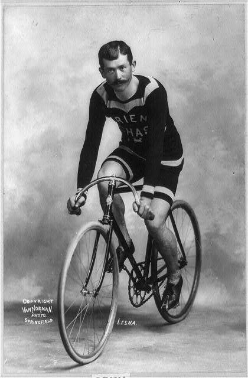
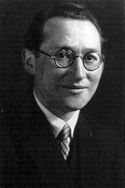

## Bienvenue à PSY1703

Aujourd'hui, nous allons commencer à regarder les comportements familiers avec un regard nouveau.

::: {.notes}
Accueillir le groupe à la porte si possible. Laisser cette diapositive affichée pendant l'installation.
:::

## Qui suis-je?

- **Baccalauréat** en psychologie, sciences comportementales et sociologie — McGill
- **Maîtrise** en psychiatrie sociale et transculturelle — McGill
- **Doctorat** en psychologie sociale — UQAM
- **Stage doctoral** en neurosciences sociales — Max-Planck-Institut, Berlin
- **Recherche postdoctorale** sur les identités sociales — New York University

**Aujourd'hui : professeur adjoint à l'UQAR, où je développe le Labo SAGE**

::: {.notes}
Présenter brièvement le parcours McGill–UQAM–Berlin–NYU–UQAR. Mentionner qu'il s'agit de ma deuxième expérience d'enseignement, mais de ma première prestation complète de PSY1703. Limiter cette partie et la présentation du laboratoire à environ douze minutes.

[Sources]
- Thériault, R. Curriculum vitae, 2026. Fichier local `cv_fr.pdf`.
:::

## Le Labo SAGE

::: {.columns}
::: {.column width="60%"}
**Soi · Altruisme · Groupes · Empathie**

Nous étudions comment les personnes :

- se comprennent;
- prennent soin des autres;
- évoluent au sein des groupes.

[Découvrir le Labo SAGE](https://labosage.com/fr/) · [Voir mes publications](https://remi-theriault.com/publications/)
:::

::: {.column width="40%"}
{fig-alt="Logo du Labo SAGE : un cœur anatomique relié à un cerveau par une ligne continue." width="500"}
:::
:::

::: {.notes}
Présenter le laboratoire comme un milieu de recherche en développement à l'UQAR. Donner un exemple concret plutôt que d'énumérer les publications. Mentionner les possibilités futures pour les personnes qui souhaiteraient découvrir la recherche.

[Sources]
- Laboratoire SAGE. (2026). https://labosage.com/fr/
- Thériault, R. (2026). Page personnelle et liste de publications. https://remi-theriault.com/
:::

## Faisons connaissance

Chaque personne partage, une à la fois :

- votre nom;
- votre motivation à prendre ce cours;
- un loisir ou un intérêt.

Prenons le temps de mieux nous connaître.

## Ce cours cherche des explications

Au fil du trimestre, nous étudierons comment les personnes :

- se perçoivent et interprètent les autres;
- s'influencent mutuellement;
- développent des relations;
- agissent au sein de groupes et entre les groupes.

::: {.notes}
[Sources]
- Plan de cours officiel PSY1703-04, automne 2026, objectifs et contenu.
- Vallerand, R. J. (2021). Les fondements de la psychologie sociale (3e éd.), chapitre 1.
:::

## Le manuel nous servira de point d'ancrage

::: {.columns}
::: {.column width="42%"}
{fig-alt="Photographie de la couverture de la troisième édition du manuel Les fondements de la psychologie sociale." height="560"}
:::

::: {.column width="58%"}
**Les fondements de la psychologie sociale** 
3e édition, sous la direction de Robert J. Vallerand

- Disponible à la **Coop de l'UQAR**
- Lectures préparatoires liées aux quiz
- Définitions, recherches classiques et applications
:::
:::

::: {.credit}
Photographie : Rémi Thériault (2026) · Couverture : Chenelière Éducation
:::

::: {.notes}
Montrer l'exemplaire physique. Préciser que le manuel soutient le cours sans remplacer les activités, les explications et les exemples vus en classe.

[Sources]
- Vallerand, R. J. (dir.). (2021). Les fondements de la psychologie sociale (3e éd.). Chenelière Éducation.
:::

## Ouvrons le plan de cours

Je vais maintenant partager le document officiel à l'écran.

Repérons ensemble :

- la façon de se préparer chaque semaine;
- les évaluations et leurs dates;
- les règles qui protègent l'équité du groupe;
- les ressources et les moyens de me joindre.

::: {.notes}
Quitter temporairement les diapositives et ouvrir le PDF du plan de cours. Ne pas lire chaque ligne : s'arrêter sur les décisions qui changent concrètement la préparation et la réussite.

[Sources]
- Plan de cours officiel PSY1703-04, automne 2026.
:::

## Les dates qui structurent le trimestre

| Évaluation | Date | Pondération |
|---|---:|---:|
| Examen 1 | 29 septembre | 25 % |
| Examen 2 | 10 novembre | 30 % |
| Examen 3 | 15 décembre | 35 % |
| Quiz de lecture | 15 septembre–8 décembre | 10 % |

::: {.notes}
[Sources]
- Plan de cours officiel PSY1703-04, automne 2026, échéancier des évaluations.
:::

## Connectez-vous à Wooclap

::: {.columns}
::: {.column width="62%"}
1. **Scannez le code QR**, ou
2. allez sur [wooclap.com](https://www.wooclap.com/) et entrez **STBKYAN** dans le bandeau supérieur, ou
3. envoyez **\@STBKYAN** au **(855) 910-9662**.

**Gardez l'onglet ouvert** : les questions apparaîtront au fil du cours. Entre deux questions, l'écran d'attente est normal.
:::

::: {.column width="38%"}
{fig-alt="Code QR permettant de rejoindre l'événement Wooclap du cours." width="430"}
:::
:::

Sans appareil? Vous pouvez [emprunter un ordinateur portable à la bibliothèque](https://biblio.uqar.ca/espaces-et-equipements/reserver-un-equipement).

::: {.notes}
Faire les questions essentielles de prise en main et de connaissance du groupe tirées du fichier questions-wooclap.md. Utiliser un seul événement pour toute la séance; fermer chaque vote ou revenir aux diapositives pendant les blocs magistraux. Réafficher cette diapositive au besoin pour les reconnexions. Si l'emprunt d'un portable n'est pas possible sur le moment, offrir une réponse sur papier, une discussion avec une personne voisine ou un vote à main levée selon la question.

[Sources]
- Wooclap. (2026). Create your first event in Wooclap. https://docs.wooclap.com/en/articles/4713362-create-your-first-event-in-wooclap
- Wooclap. (2026). How to present an event and participate in it. https://docs.wooclap.com/en/articles/674864-how-to-present-an-event-and-participate-in-it
- Bibliothèque de l'UQAR. Espaces et équipements : réserver un équipement. https://biblio.uqar.ca/espaces-et-equipements/reserver-un-equipement
:::

## Une pause qui nous ressemble (Pause 1)

Pendant la pause, vous pourrez proposer :

- une chanson appropriée au contexte de la classe;
- une photo de votre animal à afficher avec votre autorisation.

**Retour à 14 h 20.**

Envoyez vos suggestions à **Remi_Theriault@uqar.ca** 
Objet suggéré : **PSY1703 — pause**

::: {.notes}
Demander une autorisation explicite avant d'afficher une photo et ne pas la republier.
:::

# Une même image, plusieurs réalités

## Que voyez-vous?

::: {.columns}
::: {.column width="58%"}
{fig-alt="Photographie d'une robe dont les bandes sont perçues bleu et noir par certaines personnes, et blanc et or par d'autres." height="610"}
:::

::: {.column width="42%"}
Votez **individuellement** dans Wooclap avant d'en discuter.

Quelles couleurs voyez-vous principalement?
:::
:::

::: {.credit}
Photographie : Cecilia Bleasdale (2015) · [Source scientifique](https://pmc.ncbi.nlm.nih.gov/articles/PMC5812438/figure/F1/)
:::

::: {.notes}
La photographie est chargée à distance depuis PubMed Central. L'article source indique l'avoir reproduite avec permission de Cecilia Bleasdale. Si l'image ne charge pas, ouvrir le lien « Source scientifique ».

[Sources]
- Aston, S., & Hurlbert, A. (2017). What #theDress reveals about the role of illumination priors in color perception and color constancy. Journal of Vision, 17(9), 4.
- Photographie : Cecilia Bleasdale (2015), reproduite dans l'article avec permission.
:::

## Explorez votre interprétation

Rejoignez votre équipe à l'avant ou à l'arrière de la salle.

1. Discutez des raisons possibles de votre perception.
2. Cherchez des intérêts, des expériences ou des caractéristiques que vous avez en commun.
3. Choisissez une personne porte-parole pour présenter vos hypothèses au groupe-classe.

::: {.notes}
Consignes adaptées au déroulement du 1er septembre 2026. Les échanges ont d'abord porté sur des facteurs biologiques, puis l'enseignant a invité les équipes à chercher des points communs psychologiques et des intérêts. Cette intervention fait partie du dispositif de création d'identité; les points communs trouvés ne prouvent pas qu'ils expliquent la perception.
:::

## Une perception différente peut être sincère

Le même stimulus peut soutenir des expériences perceptives différentes.

En contexte social, nos interprétations peuvent ensuite être renforcées par la discussion avec les personnes qui nous ressemblent.

::: {.notes}
Séparer clairement l'explication perceptive de la robe des mécanismes proprement sociaux observés pendant la discussion.

La robe réelle était bleue et noire. La photographie rend l'éclairage ambigu : le système visuel doit estimer quelle part de la lumière vient de l'objet et quelle part vient de l'illumination. Des hypothèses différentes sur l'éclairage peuvent donc soutenir des perceptions différentes.

[Sources]
- Gegenfurtner, K. R., Bloj, M., & Toscani, M. (2015). The many colours of “the dress”. Current Biology, 25(13), R543–R544.
- Lafer-Sousa, R., Hermann, K. L., & Conway, B. R. (2015). Striking individual differences in color perception uncovered by “the dress” photograph. Current Biology, 25(13), R545–R546.
:::

# Réussir son trimestre

## Le Centre d'aide à la réussite

Services, gestion du temps, stratégies d'étude, prévention du plagiat et rédaction.

::: {.notes}
Intervention du 1er septembre : 15 h à 15 h 25, suivie d'une pause jusqu'à 15 h 35. L'enseignant la désigne CRÉ dans son bilan; intitulé officiel à confirmer avant de renommer la diapositive. Le bloc magistral avait déjà commencé avant l'intervention et a repris ensuite; son point d'interruption exact reste à documenter.
:::

## Pause 2

Pendant la pause, vous pourrez proposer :

- une chanson appropriée au contexte de la classe;
- une photo de votre animal à afficher avec votre autorisation.

**Retour à 15 h 35.**

Envoyez vos suggestions à **Remi_Theriault@uqar.ca** 
Objet suggéré : **PSY1703 — pause**

::: {.notes}
Demander une autorisation explicite avant d'afficher une photo et ne pas la republier.
:::

# Comprendre les comportements sociaux

## Une observation quotidienne peut devenir une expérience

::: {.columns}
::: {.column width="63%"}
À la fin du XIXe siècle, **Norman Triplett** observe que des cyclistes semblent performer différemment en présence d'autres cyclistes.

Il transforme cette observation en comparaison systématique : c'est l'un des premiers jalons expérimentaux de la psychologie sociale.
:::

::: {.column width="37%"}
{fig-alt="Photographie de 1898 montrant le cycliste français Lucien Lesna sur une bicyclette de course." height="475"}
:::
:::

::: {.credit}
Lucien Lesna, cycliste de l'époque · George H. Van Norman, v. 1898 · Library of Congress · aucune restriction connue
:::

::: {.notes}
Raconter l'étude plutôt que d'énumérer toute la chronologie. Préciser que la présentation moderne de Triplett comme « première expérience » fait partie de l'histoire conventionnelle de la discipline. La photographie sert à situer l'époque : elle ne représente ni Triplett ni les personnes ayant participé à son étude.

[Sources]
- Triplett, N. (1898). The dynamogenic factors in pacemaking and competition. *American Journal of Psychology, 9*, 507–533.
- Vallerand, R. J. (2021). *Les fondements de la psychologie sociale* (3e éd.), chapitre 1, p. 9–10.
- Van Norman, G. H. (v. 1898). *Lesna*. Library of Congress, LC-USZ62-99752. https://www.loc.gov/pictures/item/90708743/ (aucune restriction connue sur la publication).
:::

## Le « gros bon sens » ne suffit pas

> « Qui se ressemble s'assemble. »
> « Les contraires s'attirent. »

Deux explications opposées peuvent sembler également évidentes **après coup**.

La psychologie sociale transforme l'intuition en questions que l'on peut examiner systématiquement.

::: {.notes}
Faire voter : laquelle de ces deux affirmations leur paraît la plus vraie? Souligner que la facilité à produire une explication plausible ne constitue pas une preuve. Cette diapositive répond à l'ouverture du chapitre 1 sur les limites de l'intuition.

[Sources]
- Vallerand, R. J. (2021). *Les fondements de la psychologie sociale* (3e éd.), chapitre 1, p. 3–4.
:::

## La psychologie sociale étudie l'influence d'autrui

Elle étudie **scientifiquement** comment autrui — réellement présent, imaginé ou implicite — influence nos **pensées**, nos **émotions** et nos **comportements**.

::: {.notes}
Cette formulation courte est alignée sur la définition classique présentée par le manuel. Expliquer oralement que le chapitre ajoute aussi les caractéristiques d'autrui, les stimuli sociaux et les caractéristiques personnelles de l'individu.

[Sources]
- Vallerand, R. J. (2021). *Les fondements de la psychologie sociale* (3e éd.), chapitre 1, p. 5–6.
:::

## Autrui n'a pas besoin d'être dans la pièce

::: {.columns}
::: {.column width="33%"}
### Présence réelle

Je parle devant un groupe qui m'observe.
:::

::: {.column width="33%"}
### Présence imaginée

J'anticipe ce que mes proches penseraient de mon choix.
:::

::: {.column width="33%"}
### Présence implicite

Une norme guide mon comportement, même lorsque personne ne regarde.
:::
:::

::: {.notes}
Demander un exemple supplémentaire pour chaque forme de présence. Ne pas laisser entendre que ces catégories sont toujours mutuellement exclusives.

[Sources]
- Vallerand, R. J. (2021). *Les fondements de la psychologie sociale* (3e éd.), chapitre 1, p. 5–6.
:::

## Kurt Lewin relie théorie, expérience et action

::: {.columns}
::: {.column width="68%"}
- Le comportement résulte du rapport entre **personne et situation**.
- Une théorie doit produire des questions que l'on peut **mettre à l'épreuve**.
- La recherche peut aussi éclairer des **problèmes sociaux réels**.
:::

::: {.column width="32%"}
{fig-alt="Portrait photographique en noir et blanc du psychologue Kurt Lewin." height="430"}
:::
:::

::: {.credit}
Kurt Lewin · photographie : auteur inconnu · domaine public · Store norske leksikon
:::

::: {.notes}
Présenter Lewin comme figure fondatrice sans transformer cette séance en histoire exhaustive. Revenir à C = f(P, S). Si le temps manque, intégrer oralement cette diapositive à celle de la formule et la sauter ici.

[Sources]
- Lewin, K. (1936). *Principles of Topological Psychology*.
- Vallerand, R. J. (2021). *Les fondements de la psychologie sociale* (3e éd.), chapitre 1, p. 12–13.
- Store norske leksikon. *Kurt Lewin*. Photographie par un auteur inconnu, domaine public. https://snl.no/Kurt_Lewin
:::

## La personne et la situation façonnent le comportement

$$C = f(P, S)$$

**Comportement** = fonction de la **Personne** et de la **Situation**

Une même personne peut agir différemment selon la situation — et deux personnes peuvent interpréter différemment la même situation.

::: {.notes}
Introduire Kurt Lewin sans développer ici toute l'histoire de la discipline. Préciser au besoin que `C = f(P, S)` est une adaptation pédagogique française de sa notation historique `B = f(P, E)` : *behavior* dépend de la personne et de l'environnement.

[Sources]
- Lewin, K. (1936). Principles of Topological Psychology.
- Vallerand, R. J. (2021). *Les fondements de la psychologie sociale* (3e éd.), chapitre 1, p. 12–13.
:::

## Un même comportement peut s'expliquer à plusieurs niveaux

::: {.columns}
::: {.column width="25%"}
### Personnel

Attitudes, buts, émotions
:::

::: {.column width="25%"}
### Interpersonnel

Relations entre personnes
:::

::: {.column width="25%"}
### Groupal

Normes et dynamique du groupe
:::

::: {.column width="25%"}
### Intersociétal

Cultures et rapports sociaux
:::
:::

Une explication gagne souvent à relier **plus d'un niveau**.

::: {.notes}
Choisir un seul comportement — par exemple aider une personne — et demander rapidement comment chacun des quatre niveaux pourrait contribuer à l'expliquer. Le schéma est une reformulation originale de la classification du chapitre.

[Sources]
- Vallerand, R. J. (2021). *Les fondements de la psychologie sociale* (3e éd.), chapitre 1, p. 7–8.
:::

## Nous ne réagissons pas seulement aux faits

Nous réagissons aussi à la manière dont nous **interprétons** les faits.

Cette construction de la réalité sociale sera un fil conducteur du trimestre.

::: {.notes}
Revenir à l'activité de la robe : une même image a donné lieu à plusieurs perceptions. Distinguer le parallèle pédagogique avec les interprétations sociales des mécanismes perceptifs propres à la couleur.
:::

## Une discipline construite autour de grandes questions

- Comment la présence d'autrui transforme-t-elle l'action?
- Comment formons-nous nos impressions et nos jugements?
- Pourquoi nous conformons-nous parfois au groupe?
- Comment les relations entre groupes deviennent-elles coopératives ou conflictuelles?

::: {.notes}
Cette diapositive peut remplacer une longue chronologie si le CAR dépasse le temps prévu.

[Sources]
- Vallerand, R. J. (2021). Les fondements de la psychologie sociale (3e éd.), chapitre 1.
:::

# Une discipline en évolution et en application

## Trois influences ont marqué la discipline

**Les rôles sociaux** orientent les attentes.  
**Le renforcement** modifie la probabilité d'un comportement.  
**La cognition** organise notre interprétation du monde social.

::: {.notes}
Présenter ces influences comme trois exemples parmi plusieurs. Le chapitre aborde également l'échange social, la théorie du champ et les approches évolutionnistes. Couper cette diapositive avant les précédentes si le temps manque.

[Sources]
- Vallerand, R. J. (2021). *Les fondements de la psychologie sociale* (3e éd.), chapitre 1, p. 21–24.
:::

## La discipline continue de se transformer

- processus **automatiques** et mesures implicites;
- comparaison des **cultures** et internationalisation;
- neurosciences et interactions entre le **biologique et le social**;
- réplications, transparence et **science ouverte**;
- applications à des problèmes collectifs concrets.

::: {.notes}
Donner uniquement un aperçu. La mesure, la reproductibilité et la science ouverte seront reprises au cours 2. Si le temps manque, passer directement à la diapositive sur les milieux d'application.

[Sources]
- Vallerand, R. J. (2021). *Les fondements de la psychologie sociale* (3e éd.), chapitre 1, p. 16–18 et 24–25.
:::

## La psychologie sociale agit dans de nombreux milieux

Santé · éducation · travail · justice · environnement · médias · politiques publiques

::: {.notes}
Prévoir ultérieurement deux exemples québécois et une publication personnelle pertinente.
:::

## La psychologie positive relie recherche et intervention

Ce domaine transversal étudie les conditions qui favorisent le **fonctionnement optimal** des personnes, des groupes et des organisations.

**Un exemple appliqué en français : huit pistes pour la pratique clinique**

- considérer aussi ce qui va bien;
- soutenir motivation, forces et résilience;
- favoriser autocompassion, liens sociaux et mentalité de croissance.

[Lire l'article de Miglianico, Thériault et collègues](https://remi-theriault.com/papers/Miglianico_et_al_2024.pdf)

::: {.notes}
**Diapositive facultative — utiliser seulement si le temps le permet.** Elle ne doit pas être présentée comme un détour servant à remplir du temps, mais comme un exemple concret de passage de la recherche à l'intervention.

La psychologie positive n'est pas simplement un « offshoot » de la psychologie sociale : c'est un domaine transversal nourri notamment par la psychologie sociale, la motivation, la personnalité, la clinique et la psychologie organisationnelle.

L'article de Miglianico et collègues décrit huit pratiques. La diapositive les regroupe en trois ensembles pour demeurer lisible; préciser que la liste affichée est une synthèse et inviter les personnes intéressées à consulter l'article complet.

Le second article est plus spécialisé. Il mobilise les critiques contemporaines de la psychologie positive afin d'examiner les forces et limites du modèle dualiste de la passion et de proposer des pistes d'amélioration. Le mentionner brièvement, sans enseigner le modèle à ce stade.

[Sources]
- Miglianico, M., Thériault, R., Lavoie, B., Labelle, P., Joussemet, M., Veilleux, M., Lambert, J., & Bertrand-Dubois, D. (2024). Pratiques cliniques inspirées par la recherche en psychologie positive. *Psychologie Française, 69*(1), 85–94. https://doi.org/10.1016/j.psfr.2022.06.004
:::

## Ce que vous devriez retenir aujourd'hui

1. Le comportement ne s'explique pas uniquement par la personnalité.
2. La situation et son interprétation façonnent l'action.
3. La psychologie sociale transforme ces questions en objets scientifiques.

::: {.notes}
Faire le billet de sortie Wooclap avant d'ouvrir la période de questions.
:::

## Pour le 8 septembre

- Lecture : **chapitres 1 et 2 du manuel**
- Noter une affirmation psychologique entendue cette semaine
- Se demander : **comment pourrait-on la tester?**

::: {.notes}
[Sources]
- Plan de cours officiel PSY1703-04, automne 2026, séance 2.
:::
