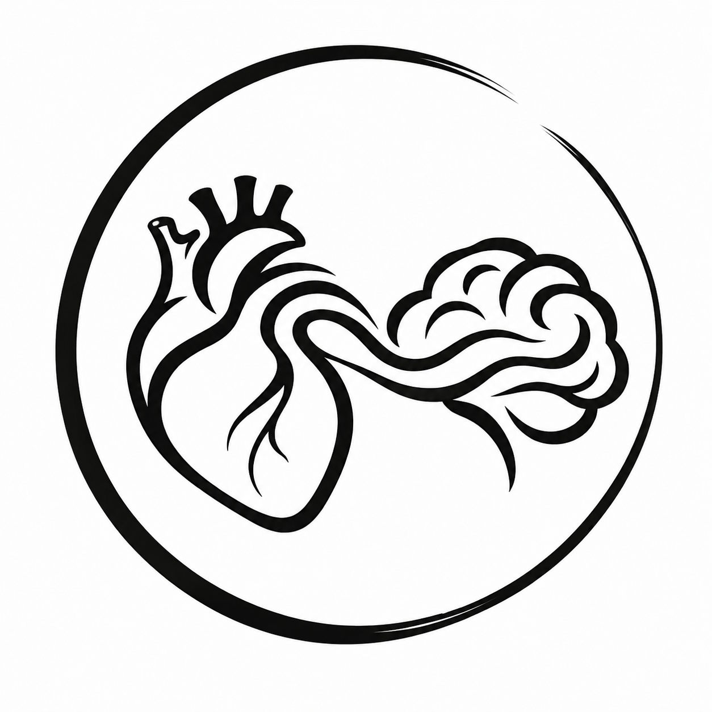
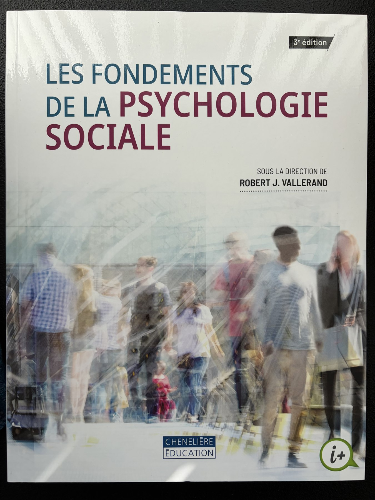
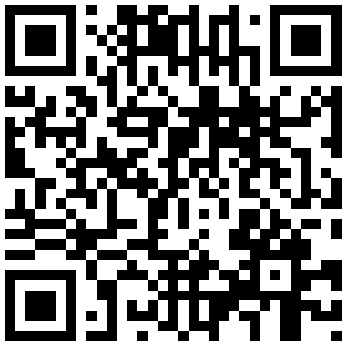

## Bienvenue à PSY1703

Aujourd'hui, nous allons commencer à regarder les comportements familiers avec un regard nouveau.

::: {.notes}
Accueillir le groupe à la porte si possible. Laisser cette diapositive affichée pendant l'installation.
:::

## Qui suis-je?

- **Baccalauréat** en psychologie, sciences comportementales et sociologie — McGill
- **Maîtrise** en psychiatrie sociale et transculturelle — McGill
- **Doctorat** en psychologie sociale — UQAM
- **Stage doctoral** en neurosciences sociales — Max-Planck-Institut, Berlin
- **Recherche postdoctorale** sur les identités sociales — New York University

**Aujourd'hui : professeur adjoint à l'UQAR, où je développe le Labo SAGE**

::: {.notes}
Présenter brièvement le parcours McGill–UQAM–Berlin–NYU–UQAR. Mentionner qu'il s'agit de ma deuxième expérience d'enseignement, mais de ma première prestation complète de PSY1703. Limiter cette partie et la présentation du laboratoire à environ douze minutes.

[Sources]
- Thériault, R. Curriculum vitae, 2026. Fichier local `cv_fr.pdf`.
:::

## Le Labo SAGE

::: {.columns}
::: {.column width="60%"}
**Soi · Altruisme · Groupes · Empathie**

Nous étudions comment les personnes :

- se comprennent;
- prennent soin des autres;
- évoluent au sein des groupes.

[Découvrir le Labo SAGE](https://labosage.com/fr/) · [Voir mes publications](https://remi-theriault.com/publications/)
:::

::: {.column width="40%"}
{fig-alt="Logo du Labo SAGE : un cœur anatomique relié à un cerveau par une ligne continue." width="500"}
:::
:::

::: {.notes}
Présenter le laboratoire comme un milieu de recherche en développement à l'UQAR. Donner un exemple concret plutôt que d'énumérer les publications. Mentionner les possibilités futures pour les personnes qui souhaiteraient découvrir la recherche.

[Sources]
- Laboratoire SAGE. (2026). https://labosage.com/fr/
- Thériault, R. (2026). Page personnelle et liste de publications. https://remi-theriault.com/
:::

## Ce cours cherche des explications

Au fil du trimestre, nous étudierons comment les personnes :

- se perçoivent et interprètent les autres;
- s'influencent mutuellement;
- développent des relations;
- agissent au sein de groupes et entre les groupes.

::: {.notes}
[Sources]
- Plan de cours officiel PSY1703-04, automne 2026, objectifs et contenu.
- Vallerand, R. J. (2021). Les fondements de la psychologie sociale (3e éd.), chapitre 1.
:::

## Le manuel nous servira de point d'ancrage

::: {.columns}
::: {.column width="42%"}
{fig-alt="Photographie de la couverture de la troisième édition du manuel Les fondements de la psychologie sociale." height="560"}
:::

::: {.column width="58%"}
**Les fondements de la psychologie sociale** 
3e édition, sous la direction de Robert J. Vallerand

- Disponible à la **Coop de l'UQAR**
- Lectures préparatoires liées aux quiz
- Définitions, recherches classiques et applications
:::
:::

::: {.credit}
Photographie : Rémi Thériault (2026) · Couverture : Chenelière Éducation
:::

::: {.notes}
Montrer l'exemplaire physique. Préciser que le manuel soutient le cours sans remplacer les activités, les explications et les exemples vus en classe.

[Sources]
- Vallerand, R. J. (dir.). (2021). Les fondements de la psychologie sociale (3e éd.). Chenelière Éducation.
:::

## Ouvrons le plan de cours

Je vais maintenant partager le document officiel à l'écran.

Repérons ensemble :

- la façon de se préparer chaque semaine;
- les évaluations et leurs dates;
- les règles qui protègent l'équité du groupe;
- les ressources et les moyens de me joindre.

::: {.notes}
Quitter temporairement les diapositives et ouvrir le PDF du plan de cours. Ne pas lire chaque ligne : s'arrêter sur les décisions qui changent concrètement la préparation et la réussite.

[Sources]
- Plan de cours officiel PSY1703-04, automne 2026.
:::

## Les dates qui structurent le trimestre

| Évaluation | Date | Pondération |
|---|---:|---:|
| Examen 1 | 29 septembre | 25 % |
| Examen 2 | 10 novembre | 30 % |
| Examen 3 | 15 décembre | 35 % |
| Quiz de lecture | 15 septembre–8 décembre | 10 % |

::: {.notes}
[Sources]
- Plan de cours officiel PSY1703-04, automne 2026, échéancier des évaluations.
:::

## Connectez-vous à Wooclap

::: {.columns}
::: {.column width="62%"}
1. **Scannez le code QR**, ou
2. allez sur [wooclap.com](https://www.wooclap.com/) et entrez **STBKYAN** dans le bandeau supérieur, ou
3. envoyez **\@STBKYAN** au **(855) 910-9662**.

**Gardez l'onglet ouvert** : les questions apparaîtront au fil du cours. Entre deux questions, l'écran d'attente est normal.
:::

::: {.column width="38%"}
{fig-alt="Code QR permettant de rejoindre l'événement Wooclap du cours." width="430"}
:::
:::

Sans appareil? Vous pouvez [emprunter un ordinateur portable à la bibliothèque](https://biblio.uqar.ca/espaces-et-equipements/reserver-un-equipement).

::: {.notes}
Faire les questions essentielles de prise en main et de connaissance du groupe tirées du fichier questions-wooclap.md. Utiliser un seul événement pour toute la séance; fermer chaque vote ou revenir aux diapositives pendant les blocs magistraux. Réafficher cette diapositive au besoin pour les reconnexions. Si l'emprunt d'un portable n'est pas possible sur le moment, offrir une réponse sur papier, une discussion avec une personne voisine ou un vote à main levée selon la question.

[Sources]
- Wooclap. (2026). Create your first event in Wooclap. https://docs.wooclap.com/en/articles/4713362-create-your-first-event-in-wooclap
- Wooclap. (2026). How to present an event and participate in it. https://docs.wooclap.com/en/articles/674864-how-to-present-an-event-and-participate-in-it
- Bibliothèque de l'UQAR. Espaces et équipements : réserver un équipement. https://biblio.uqar.ca/espaces-et-equipements/reserver-un-equipement
:::

## Faisons connaissance

Quelques questions rapides sur :

- votre année et votre programme;
- vos projets professionnels;
- votre expérience de la recherche;
- ce qui vous aiderait à apprendre.

Il n'y a pas de « bonne » réponse : cela m'aide à mieux adapter le cours au groupe.

## Notre première question

> Pourquoi les gens font-ils ce qu'ils font?

Répondez dans Wooclap avec la première explication qui vous vient à l'esprit.

::: {.notes}
Faire émerger les explications liées à la personne, à la situation, à l'interprétation et aux normes. Cette question prépare directement C = f(P, S).
:::

## Qu'associez-vous à la psychologie sociale?

Nuage de mots Wooclap

::: {.notes}
Faire apparaître le nuage, relever deux ou trois familles d'idées, puis annoncer que le cours permettra d'en préciser les contours.
:::

# Partie 1

## La psychologie sociale étudie l'influence d'autrui

Elle cherche à comprendre comment nos pensées, nos émotions et nos comportements sont influencés par la présence **réelle, imaginée ou implicite** des autres.

::: {.notes}
La formulation définitive devra être vérifiée dans les pages 5 à 7 du chapitre 1 avant publication.

[Sources]
- Vallerand, R. J. (2021). Les fondements de la psychologie sociale (3e éd.), chapitre 1, section « La psychologie sociale : définitions et caractéristiques ».
:::

## La personne et la situation façonnent le comportement

$$C = f(P, S)$$

**Comportement** = fonction de la **Personne** et de la **Situation**

Une même personne peut agir différemment selon la situation — et deux personnes peuvent interpréter différemment la même situation.

::: {.notes}
Introduire Kurt Lewin sans développer ici toute l'histoire de la discipline.

[Sources]
- Lewin, K. (1936). Principles of Topological Psychology.
:::

## Nous ne réagissons pas seulement aux faits

Nous réagissons aussi à la manière dont nous **interprétons** les faits.

Cette construction de la réalité sociale sera un fil conducteur du trimestre.

::: {.notes}
Transition vers la pause, puis vers l'activité de la robe. Le CAR arrivera à 15 h.
:::

## Une pause qui nous ressemble

Pendant la pause, vous pourrez proposer :

- une chanson appropriée au contexte de la classe;
- une photo de votre animal à afficher avec votre autorisation.

**Retour à 14 h 30.**

Envoyez vos suggestions à **Remi_Theriault@uqar.ca** 
Objet suggéré : **PSY1703 — pause**

::: {.notes}
Demander une autorisation explicite avant d'afficher une photo et ne pas la republier.
:::

# Une même image, plusieurs réalités

## Que voyez-vous?

::: {.columns}
::: {.column width="58%"}
{fig-alt="Photographie d'une robe dont les bandes sont perçues bleu et noir par certaines personnes, et blanc et or par d'autres." height="610"}
:::

::: {.column width="42%"}
Votez **individuellement** dans Wooclap avant d'en discuter.

Quelles couleurs voyez-vous principalement?
:::
:::

::: {.credit}
Photographie : Cecilia Bleasdale (2015) · [Source scientifique](https://pmc.ncbi.nlm.nih.gov/articles/PMC5812438/figure/F1/)
:::

::: {.notes}
La photographie est chargée à distance depuis PubMed Central. L'article source indique l'avoir reproduite avec permission de Cecilia Bleasdale. Si l'image ne charge pas, ouvrir le lien « Source scientifique ».

[Sources]
- Aston, S., & Hurlbert, A. (2017). What #theDress reveals about the role of illumination priors in color perception and color constancy. Journal of Vision, 17(9), 4.
- Photographie : Cecilia Bleasdale (2015), reproduite dans l'article avec permission.
:::

## Explorez votre interprétation

En groupe :

1. Décrivez ce que vous voyez, sans chercher à convaincre.
2. Imaginez pourquoi une même image produit plusieurs perceptions.
3. Observez ce que la catégorie « Bleus » ou « Ors » change dans vos échanges.

::: {.notes}
Voir le fichier activite-robe.md. Il s'agit d'une simulation inspirée du paradigme des groupes minimaux, et non d'une démonstration expérimentale de celui-ci.
:::

## Une perception différente peut être sincère

Le même stimulus peut soutenir des expériences perceptives différentes.

En contexte social, nos interprétations peuvent ensuite être renforcées par la discussion avec les personnes qui nous ressemblent.

::: {.notes}
Séparer clairement l'explication perceptive de la robe des mécanismes proprement sociaux observés pendant la discussion.

La robe réelle était bleue et noire. La photographie rend l'éclairage ambigu : le système visuel doit estimer quelle part de la lumière vient de l'objet et quelle part vient de l'illumination. Des hypothèses différentes sur l'éclairage peuvent donc soutenir des perceptions différentes.

[Sources]
- Gegenfurtner, K. R., Bloj, M., & Toscani, M. (2015). The many colours of “the dress”. Current Biology, 25(13), R543–R544.
- Lafer-Sousa, R., Hermann, K. L., & Conway, B. R. (2015). Striking individual differences in color perception uncovered by “the dress” photograph. Current Biology, 25(13), R545–R546.
:::

# Réussir son trimestre

## Le Centre d'aide à la réussite

Services, gestion du temps, stratégies d'étude, prévention du plagiat et rédaction.

::: {.notes}
Horaire confirmé : 15 h à 15 h 30. Présenter la personne invitée, puis reprendre simplement le cours où il avait été interrompu. Le matériel sera présenté directement par le CAR.
:::

# Partie 2

## Une discipline construite autour de grandes questions

- Comment la présence d'autrui transforme-t-elle l'action?
- Comment formons-nous nos impressions et nos jugements?
- Pourquoi nous conformons-nous parfois au groupe?
- Comment les relations entre groupes deviennent-elles coopératives ou conflictuelles?

::: {.notes}
Cette diapositive peut remplacer une longue chronologie si le CAR dépasse le temps prévu.

[Sources]
- Vallerand, R. J. (2021). Les fondements de la psychologie sociale (3e éd.), chapitre 1.
:::

## Trois influences ont marqué la discipline

**Les rôles sociaux** orientent les attentes.  
**Le renforcement** modifie la probabilité d'un comportement.  
**La cognition** organise notre interprétation du monde social.

::: {.notes}
Valider les formulations et exemples dans les pages 21 à 24 du chapitre 1.

[Sources]
- Vallerand, R. J. (2021). Les fondements de la psychologie sociale (3e éd.), chapitre 1, section « Les influences théoriques ».
:::

## La psychologie sociale agit dans de nombreux milieux

Santé · éducation · travail · justice · environnement · médias · politiques publiques

::: {.notes}
Prévoir ultérieurement deux exemples québécois et une publication personnelle pertinente.
:::

## Ce que vous devriez retenir aujourd'hui

1. Le comportement ne s'explique pas uniquement par la personnalité.
2. La situation et son interprétation façonnent l'action.
3. La psychologie sociale transforme ces questions en objets scientifiques.

::: {.notes}
Faire le billet de sortie Wooclap avant d'ouvrir la période de questions.
:::

## Pour le 8 septembre

- Lecture : **chapitres 1 et 2 du manuel**
- Noter une affirmation psychologique entendue cette semaine
- Se demander : **comment pourrait-on la tester?**

::: {.notes}
[Sources]
- Plan de cours officiel PSY1703-04, automne 2026, séance 2.
:::
