## Pratique de quiz sur Wooclap {#connexion-quiz}



**Quiz test — 5 minutes · individuel et non noté.**

## Quiz test — 5 minutes

**Essai individuel, non noté, sur le cours 1.**

L'objectif : essayer le fonctionnement et la **connexion avec votre identifiant UQAR** avant le premier quiz évalué.

Pour chaque quiz, arrivez avec un **téléphone ou un ordinateur portable bien chargé** : une batterie déchargée pourrait vous empêcher de le compléter.

::: {.notes}
Commencer directement par le quiz test, comme le quiz prévu en début de séance le 15 septembre. Prévoir cinq minutes de réponse. Questions et corrigé à préparer dans la conversation du cours 1; aucun questionnaire administrable n'est encore inclus ici. Le quiz test utilise le même événement Wooclap LTJTCPR que les deux rondes de consolidation. Ne pas confondre ce test avec les neuf QCM formatifs de la séance.
:::

## Retour sur le quiz test

**Correction expliquée**, puis questions sur le fonctionnement.

- Qu'est-ce qui rend une réponse correcte?
- Quelles consignes faut-il clarifier avant le vrai quiz?

**Quiz du 15 septembre : durée envisagée de 10 minutes**, soit deux fois celle de cet essai.

::: {.notes}
Cinq minutes pour correction et questions. Les dix minutes concernent la durée, pas nécessairement le nombre de questions. Le vrai quiz sera deux fois plus long; ne pas annoncer cette durée comme définitivement arrêtée. Présenter la correction du test préparé dans la conversation du cours 1.
:::

## Quiz et examen — quoi préparer?

**15 septembre — Quiz 1 : chapitres 1–2 et cours 1–2.**

**29 septembre — Examen 1 (25 %) : chapitres 1–4 et cours 1–4.**

Les notions enseignées en cours **peuvent** être évaluées même si elles ne figurent pas dans le manuel, mais en général je m'en tiens au manuel et aux diapositives.

Toute autre ressource ou lien externe n'est pas matière à examen.

::: {.notes}
Périmètre de l'examen 1 explicitement confirmé : cours 1–4. Chapitre 3 à lire pour le 15 septembre, mais hors quiz 1. Les détails présents uniquement dans les articles cités ne sont pas évaluables. Approfondissements facultatifs non exigibles par leur seule présence dans les diapos.
:::

## Plan de cours modifié

Des modifications ont été demandées par le **Département**.

Nous allons brièvement parcourir les différences avec la version précédente.

::: {.notes}
Ouvrir la version révisée et comparer les passages concernés.
:::

## Trois acquis visés

- Formuler une **hypothèse vérifiable** et mesurer ses variables.
- Distinguer **description, association et causalité**.
- Améliorer une étude : **méthode, éthique et transparence**.

::: {.notes}
Objectifs de séance proposés à partir du plan officiel, p. 2–3 : décrire les méthodes, évaluer leurs forces et limites, appliquer les concepts. Exercices formatifs; aucun quiz noté aujourd'hui. Lectures annoncées : chapitres 1 et 2.
:::

# Partie 1 — Construire et interpréter une étude

## Retour sur l'activité de la robe

Nous avons observé des perceptions différentes, puis discuté en équipes.

**Question de recherche :** discuter avec des personnes du même avis modifie-t-il notre certitude?

Une expérience vécue peut susciter une question sans suffire à y répondre.

::: {.notes}
Source : bilan interne du cours 1. Un renforcement des convictions a été rapporté qualitativement; aucun effet causal démontré. Les résultats de cohorte restent dans Wooclap/Box. Ne pas inférer de différences de personnalité entre Bleus et Ors à partir des ressemblances recherchées.
:::

## De la théorie à une hypothèse vérifiable

Une **théorie** propose une explication; une **hypothèse** en tire une prédiction à vérifier.

**Exemple :** la certitude augmente davantage après une discussion avec des personnes du même avis qu'après une réflexion individuelle.

Quel résultat contredirait cette prédiction?

::: {.notes}
Vallerand et Chénard-Poirier (2021), p. 29–32. Exemple hypothétique original. Une étude ne prouve pas définitivement une théorie. Faire préciser comparaison et mesure; les hypothèses peuvent aussi naître d'observations ou de résultats contradictoires.
:::

## Les étapes d'une recherche

1. Formuler les hypothèses.
2. Choisir la méthode de recherche.
3. Choisir les mesures.
4. Analyser les données.
5. Interpréter les résultats.

Puis : communiquer les méthodes et les résultats, vérifier, réviser.

Les décisions éthiques accompagnent toute la démarche.

::: {.notes}
Source : Vallerand et Chénard-Poirier (2021), p. 28–29. Présenter la démarche comme itérative : les résultats peuvent susciter de nouvelles questions. Distinguer exploration et mise à l'épreuve d'une prédiction préalable.
:::

## Définir ce que l'on mesure

| Concept | Exemple d'opérationnalisation |
|---|---|
| Certitude | Réponse de 0 à 100 à une question précise |
| Condition de discussion | Cinq minutes en groupe ou cinq minutes seul |
| Changement | Score après moins score avant |

Une définition opérationnelle rend la procédure explicite.

::: {.notes}
Source : Vallerand et Chénard-Poirier (2021), p. 32–34, 45–51.

Exemples proposés pour une étude fictive. Le score n'épuise pas le concept de certitude. La durée de cinq minutes est un choix illustratif, pas le minutage reconstitué du cours 1.
:::

## Variables indépendante et dépendante

Dans notre **expérience proposée** :

- **VI (variable indépendante) — l'intervention, ce que l'on manipule :** discussion ou réflexion individuelle.
- **VD (variable dépendante) — les résultats, ce que l'on mesure :** changement du score de certitude.

Une caractéristique simplement mesurée n'est pas une manipulation.

::: {.notes}
Source : Vallerand et Chénard-Poirier (2021), p. 32. Distinguer l'expérience proposée de l'activité réelle du cours 1. La couleur perçue n'y était pas assignée par l'enseignant. Dans un devis corrélationnel, parler de variables mesurées plutôt que de leur attribuer automatiquement un rôle causal.
:::

## La qualité d'une mesure

**Fidélité :** la mesure est-elle suffisamment cohérente et reproductible dans des conditions comparables?

**Validité :** les éléments disponibles soutiennent-ils l'interprétation du score pour l'usage visé?

Une mesure peut être cohérente et mal représenter le concept recherché.

::: {.notes}
Exemple oral : mesurer systématiquement la fréquence des prises de parole ne mesure pas nécessairement la certitude. Source : Vallerand et Chénard-Poirier (2021), p. 32–34. Fidélité temporelle : stabilité des scores si le phénomène reste stable. Fidélité interjuges : accord entre personnes qui codent; cohérence interne : convergence des items d’une échelle. Ne pas confondre stabilité du score et absence de changement réel.
:::

## Cinq familles de mesures

| Famille | Exemple original | Point de vigilance |
|---|---|---|
| Verbale | Certitude déclarée de 0 à 100 | Présentation de soi |
| Implicite | Temps de réponse à des associations | Interprétation du score |
| Physiologique | Fréquence cardiaque pendant l'échange | Activation non spécifique |
| Comportementale | Nombre de prises de parole | Parler n'est pas être certain |
| Non réactive | Traces d'usage d'un espace commun | Sens de la trace et vie privée |

::: {.notes}
Source : Vallerand et Chénard-Poirier (2021), p. 45–51. Ces exemples ne sont pas cinq mesures interchangeables de certitude. Les mesures implicites n'offrent pas une lecture directe d'une personne; la fréquence cardiaque ne révèle pas une émotion unique. Non réactif ne signifie pas exempt d'enjeux éthiques. Le chapitre traite aussi des mégadonnées, p. 47–48 : volume, fréquence, compétences d'analyse et consentement. Ne pas en faire une sixième famille; le mode de collecte ne détermine pas le construit mesuré. Exemple non réactive : niveau d'usure sur le plancher au musée en face de différentes toiles ou statues. Quantité de déchets sur le sol suite à un nouvel affichage invitant au recyclage et composte.
:::

## Atelier 1 — Comment mesurer l’appartenance?

**8 minutes · Trouvez un binôme de votre équipe Blancs-Ors ou Bleus-Noirs.**

Une équipe de recherche veut mesurer le **sentiment d’appartenance à un groupe**. Elle propose de compter les prises de parole.

Sur papier ou dans vos notes, écrivez :

1. Une **question exacte**, avec ses choix de réponse, pour mesurer l’appartenance.
2. Une raison pour laquelle **parler peu ne signifie pas nécessairement se sentir exclu**.
3. Un deuxième indice à recueillir et **sa limite**.

Une personne rédige; l’autre vérifie ce que chaque mesure permet de conclure.

::: {.notes}
Guide interne : guide-animation-ateliers.md, atelier 1. Minutage : 1 min formation, 1 min réflexion individuelle, 3 min en binôme, 3 min retour avec deux propositions. Un trio dans chaque équipe si nombre impair; aucun déplacement obligatoire. Exemple de question : « En ce moment, je me sens membre à part entière de ce groupe », de 1 pas du tout d’accord à 7 tout à fait d’accord. Proposition à évaluer, pas échelle validée. Prises de parole, présence et appartenance ne sont pas interchangeables. Introduire la triangulation au retour : confronter plusieurs indices sans supposer qu’ils mesurent tous le même construit. Exemples fictifs; aucune réponse personnelle à remettre. Source conceptuelle : Vallerand et Chénard-Poirier (2021), p. 45–51.
:::

## Lire une différence de moyennes

Dans un **exemple fictif**, le changement moyen de certitude est :

- discussion : **+12 points**;
- réflexion individuelle : **+4 points**.

L'écart des changements moyens est de **8 points**.

Que manque-t-il pour évaluer ce résultat?

::: {.notes}
Source conceptuelle : Vallerand et Chénard-Poirier (2021), p. 51. Chiffres inventés pour le calcul, aucune donnée de classe. Réponses : taille des groupes, dispersion, incertitude, devis, qualité de la mesure. Une moyenne ne décrit pas chaque personne. En rappel oral : médiane = valeur centrale une fois les scores ordonnés. Test t et analyse de variance comparent des moyennes sous leurs hypothèses; pas de calcul technique exigé ici. Une interaction signifie que l'effet d'une variable dépend du niveau d'une autre, p. 35 et 51; approfondissement facultatif.
:::

## Lire une corrélation

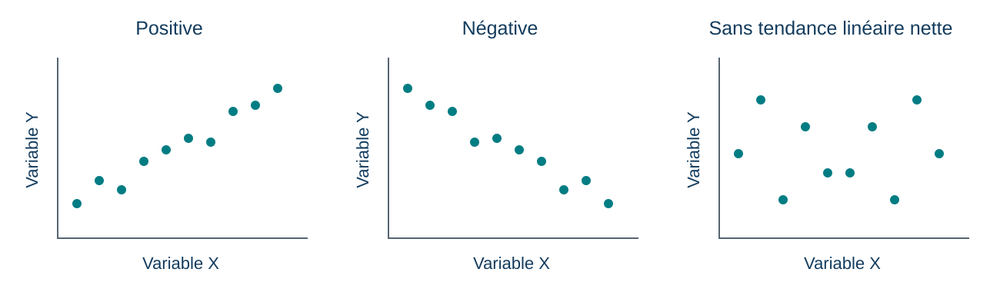{fig-alt="Trois nuages de points fictifs : relation linéaire positive, négative et sans tendance linéaire nette." width="1300"}

Le signe de **r** donne la direction; sa valeur absolue décrit la force de l'association linéaire.

::: {.credit}
Schéma original pour PSY1703 · Données fictives, sans résultat de cohorte
:::

::: {.notes}
Source : Vallerand et Chénard-Poirier (2021), p. 52. r varie entre −1 et +1; r proche de zéro n'exclut pas une relation non linéaire. Le schéma illustre les directions sans afficher de coefficients calculés. Corrélation positive ne signifie pas souhaitable; négative ne signifie pas nuisible. Aucun nuage ne permet à lui seul une inférence causale. Le modelage par équations structurales n'est pas développé : même un modèle cohérent avec les associations ne prouve pas sa direction causale.
:::

## Signification statistique et importance

Une petite valeur **p** indique une incompatibilité des données avec le modèle statistique testé.

Elle ne donne ni la probabilité que l'hypothèse soit vraie, ni la taille de l'effet.

Examiner aussi **l'ampleur, l'incertitude et le devis**.

::: {.notes}
Complément : American Statistical Association (2016), principes 1, 2 et 5, https://www.amstat.org/asa/files/pdfs/p-valuestatement.pdf. Cette formulation précise la présentation introductive du manuel, p. 51. Sous l'hypothèse nulle et les autres hypothèses du modèle, p correspond à la probabilité d'une statistique au moins aussi extrême que celle observée. Ne pas dire que p = 0,01 signifie 1 % de risque que notre conclusion soit fausse. Pas de formules à mémoriser dans cette séance.
:::

## Pause 1 — 10 minutes

Envoyez vos suggestions de **chansons** ou photos de **votre animal de compagnie** directement sur Wooclap :



## Association et causalité

Si l'appartenance et la participation varient ensemble :

- l'appartenance pourrait influencer la participation;
- la participation pourrait renforcer l'appartenance;
- un autre facteur pourrait influencer les deux.

**L'association seule ne permet pas de choisir entre ces explications.**

::: {.notes}
Source : Vallerand et Chénard-Poirier (2021), p. 38–39, 52.

Exemple original, sans données. Un climat accueillant pourrait influencer les deux variables. Aucun coefficient ni résultat empirique n'est supposé ici.
:::

## Tester l'effet d'une discussion

**Répartition aléatoire** entre deux conditions :

| Discussion en groupe | Réflexion individuelle |
|---|---|
| Mesure avant | Mesure avant |
| Cinq minutes de discussion | Cinq minutes de réflexion |
| Mesure après | Mesure après |

Même consigne de mesure; comparer les changements.

::: {.notes}
Source : Vallerand et Chénard-Poirier (2021), p. 34–35.

Devis fictif, à discuter plutôt qu'à administrer comme recherche. VI : condition assignée; VD : changement de certitude. La répartition aléatoire réduit les différences systématiques initiales en moyenne, sans garantir des groupes identiques. Les échanges créent aussi une dépendance des observations au sein des groupes : approfondissement facultatif.
:::

## Deux usages du hasard

**Échantillonnage aléatoire :** qui est sélectionné dans une population?

**Assignation aléatoire :** qui reçoit quelle condition dans l'étude?

Le premier concerne la sélection; le second aide à comparer les conditions.

::: {.notes}
Source : Vallerand et Chénard-Poirier (2021), p. 34, 40.

Une expérience avec volontaires peut avoir une assignation aléatoire sans échantillon représentatif. Introduire la distinction avec un exemple oral simple.
:::

## Quatre devis à distinguer

| Devis | Ce qui permet de le reconnaître |
|---|---|
| Expérimental en laboratoire | Manipulation et assignation aléatoire dans un contexte contrôlé |
| Expérimental sur le terrain | Manipulation et assignation aléatoire en milieu naturel |
| Quasi expérimental | Intervention ou événement étudié sans assignation aléatoire |
| Corrélationnel | Relations entre variables mesurées, sans manipulation |

::: {.notes}
Source : Vallerand et Chénard-Poirier (2021), p. 34–39. Le lieu seul ne définit pas le devis. Exemple original de quasi-expérience : une classe adopte une nouvelle activité, une autre garde sa pratique; comparer avant/après sans les avoir assignées au hasard. Les différences initiales et les événements concomitants restent des explications rivales. Une série temporelle interrompue multiplie les mesures avant/après, sans supprimer automatiquement ces limites.
:::

## Trois questions de validité

**Construit :** mesure-t-on bien ce que l'on prétend mesurer?

**Interne :** peut-on attribuer l'effet à la manipulation?

**Externe :** à quelles personnes et situations le résultat peut-il s'appliquer?

::: {.notes}
Source : Vallerand et Chénard-Poirier (2021), p. 32–34. Une variable confondue varie avec la condition et peut expliquer le résultat. Exemple : discussion de dix minutes contre réflexion d'une minute. Distinguer le réalisme psychologique de la simple ressemblance de surface avec la vie quotidienne, p. 35. Une expérience de laboratoire n'est pas automatiquement sans portée hors laboratoire.
:::

## Atelier 2 — Réparez cette étude

**12 minutes · Même binôme; inversez les rôles.**

**Étude fictive :** les Blancs-Ors discutent 10 minutes et les Bleus-Noirs réfléchissent seuls 2 minutes. On mesure ensuite leur certitude, de 0 à 100 pour les premiers et de 1 à 5 pour les seconds.

L’équipe veut savoir si **discuter augmente davantage la certitude que réfléchir seul**.

Écrivez un protocole corrigé en **quatre lignes** :

1. Comment répartir les personnes entre les conditions?
2. Que font-elles, et pendant combien de temps?
3. Quelle même question poser avant et après?
4. Quels changements comparer?

::: {.notes}
Guide interne, atelier 2 : 1 min lecture individuelle, 5 min rédaction, 2 min vérification avec un autre binôme de la même équipe, 4 min débreffage. Scénario fictif, pas description du cours 1. Attendus : assignation aléatoire aux conditions indépendante de l’équipe, mêmes durées et consignes comparables, même mesure de certitude avant/après, comparaison des changements moyens. Distinguer équipes servant à l’atelier et conditions du protocole imaginé. Ne pas administrer l’étude. Demander pour chaque correction quelle explication concurrente elle réduit. Le hasard ne garantit pas des groupes identiques; une étude dans cette classe ne représente pas toute l’humanité. Source conceptuelle : Vallerand et Chénard-Poirier (2021), p. 33–40.
:::

## Réduire les biais

| Risque | Amélioration possible |
|---|---|
| Les volontaires diffèrent de la population visée | Diversifier le recrutement et décrire l'échantillon |
| Les personnes devinent la réponse attendue | Consignes neutres et questions sur leur compréhension |
| L'expérimentateur influence les réponses | Standardiser les consignes; masquer la condition si possible |

::: {.notes}
Source : Vallerand et Chénard-Poirier (2021), p. 55–56. Ces précautions réduisent certains risques sans les faire disparaître. Dans notre exemple, l'enseignant pourrait encourager davantage une condition. Les valeurs influencent aussi le choix des questions; elles ne doivent pas conduire à sélectionner les résultats, p. 57–58.
:::

## Connectez-vous à Wooclap {#connexion-ronde-1}



**Ronde 1** · Les questions sont présentées dans Wooclap.

[Reprendre le cours après la ronde](#suite-ronde-1)

::: {.notes}
Basculer vers Wooclap pour les questions et la correction. Les diapositives suivantes conservent les questions pour les archives publiques, sans QR. Au retour, utiliser le lien pour reprendre le cours sans les parcourir.
:::

## Wooclap — Ronde 1 · Hypothèse

**Q1. Quelle proposition est la plus directement vérifiable?**

A. Les groupes ont une énergie particulière. 
B. Après cinq minutes de discussion, le score de certitude augmente davantage qu'après cinq minutes seul. 
C. L'être humain est fondamentalement social.

::: {.notes}
Réponse attendue : B. Population, procédure et mesure restent à préciser. A et C peuvent susciter une réflexion, mais ne définissent pas ici un test suffisamment précis. La ronde 1 regroupe Q1–Q6, à la fin de la Partie 1. Recueillir les réponses puis débreffer les erreurs communes.
:::

## Wooclap — Ronde 1 · Mesure

**Q2. Le score de 0 à 100 est…**

A. une opérationnalisation de la certitude; 
B. une preuve que la certitude est mesurée sans erreur; 
C. une mesure directe de la personnalité.

::: {.notes}
Réponse : A. Faire expliquer pourquoi la précision numérique ne garantit ni fidélité ni validité. Revenir à l'exemple de participation si nécessaire.
:::

## Wooclap — Ronde 1 · Construit

**Q3. Compter les prises de parole suffit-il à mesurer la certitude?**

A. Oui, parce que le comptage est précis. 
B. Oui, si deux observateurs obtiennent le même compte. 
C. Non, la prise de parole peut refléter autre chose que la certitude.

::: {.notes}
Réponse : C. L'accord entre observateurs concerne la fidélité; il ne suffit pas à établir la validité de construit. Demander quel autre facteur influence la prise de parole. Source : Vallerand et Chénard-Poirier (2021), p. 32–34.
:::

## Wooclap — Ronde 1 · Devis

**Q4. Deux classes existantes suivent des activités différentes, sans assignation au hasard. On compare leurs progrès avant/après. Le devis est…**

A. quasi expérimental; 
B. expérimental avec assignation aléatoire; 
C. nécessairement exempt de variables confondues.

::: {.notes}
Réponse : A. Les classes peuvent déjà différer au départ; le prétest aide à le documenter sans tout contrôler. Source : Vallerand et Chénard-Poirier (2021), p. 37–38. Exemple original.
:::

## Wooclap — Ronde 1 · Conclusion

**Q5. Appartenance et participation sont associées. Que conclure?**

A. L'appartenance cause la participation. 
B. La participation cause l'appartenance. 
C. Elles varient ensemble; la direction causale reste à établir.

::: {.notes}
Réponse : C. Faire proposer une troisième variable. Q1–Q6 forment une seule ronde, suivie du débreffage.
:::

## Wooclap — Ronde 1 · Hasard

**Q6. Des volontaires sont répartis au hasard entre deux conditions. Cela décrit…**

A. un échantillon nécessairement représentatif; 
B. une assignation aléatoire; 
C. une absence garantie de toute différence initiale.

::: {.notes}
Réponse : B. Le recrutement de volontaires demeure distinct de l'assignation. Le hasard ne garantit pas l'identité des groupes dans un échantillon donné.
:::

# Partie 2 — La science ouverte et au-delà {#suite-ronde-1}

## Pourquoi trouve-t-on si souvent ce que l’on attend?

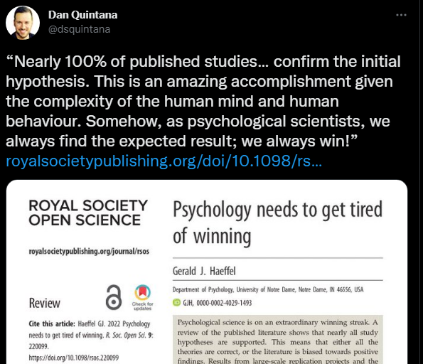{fig-alt="Capture de Dan Quintana présentant la critique de Gerald Haeffel en 2022." height="540" fig-align="center"}

Si seuls les résultats attendus circulent, quelle image de la recherche obtient-on?

::: {.credit}
Capture conservée de PSY7104 (2022) · Dan Quintana, à propos de [Haeffel (2022)](https://doi.org/10.1098/rsos.220099).
:::

::: {.notes}
Lire la capture comme une critique de la sélection des publications : son pourcentage rhétorique n'est pas une estimation actuelle de toute la psychologie. Introduire la crise de réplicabilité : des tentatives de réplication ne retrouvent pas les résultats attendus; un échec isolé ne prouve ni fraude ni inexistence d'un phénomène. Répéter avec de nouvelles données se distingue de recalculer avec les mêmes données.
:::

## La confirmation poussée jusqu’à la satire

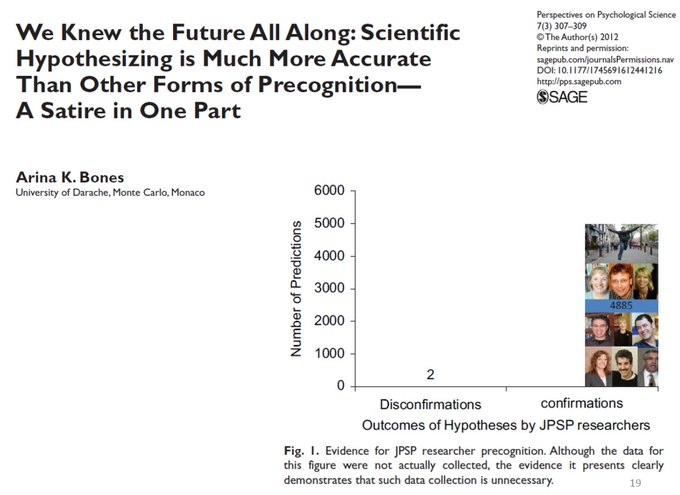{fig-alt="Article satirique présentant un déséquilibre caricatural entre hypothèses confirmées et infirmées." height="560" fig-align="center"}

**Satire : ces nombres ne sont pas des données empiriques.**

::: {.credit}
Arina K. Bones (2012) · Image reprise de PSY7104 (2022).
:::

::: {.notes}
Intermède facultatif d'une minute. Conserver l'humour de la présentation originale; demander où disparaissent les hypothèses non soutenues. Ne pas utiliser le graphique pour estimer un taux de réplication ou de confirmation.
:::

## Où les résultats peuvent-ils se déformer?

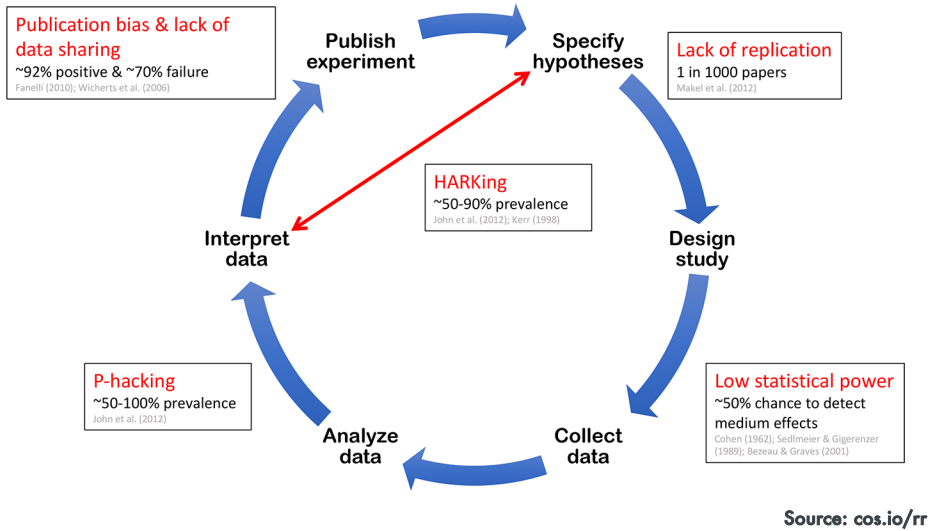{fig-alt="Cycle de recherche annoté : sélection des publications, faible puissance, p-hacking et HARKing." height="580" fig-align="center"}

Les chiffres incrustés sont **historiques**; retenons les mécanismes.

::: {.credit}
Schéma COS, source indiquée sur l’image : cos.io/rr · Archive utilisée en 2022.
:::

::: {.notes}
Suivre les flèches : hypothèses, devis, collecte, analyse, interprétation, publication. Les références incrustées datent de 1962 à 2012 et renvoient à des indicateurs/populations différents; ne pas les additionner ni les présenter comme des taux actuels ou universels. Définir oralement p-hacking et HARKing à la diapositive suivante. La faible puissance réduit la probabilité de détecter un effet donné; pas de calcul requis.
:::

## Des choix qui changent l’histoire racontée

- **Sélectionner** la mesure, l'exclusion ou l'analyse qui donne le résultat souhaité : risque de *p-hacking*.
- Présenter une explication imaginée **après les résultats** comme une prédiction préalable : *HARKing*.
- Rapporter seulement les études qui « fonctionnent » : **biais de publication**.

::: {.notes}
Exemples : multiplier les VD, omettre des conditions, exclusions opportunistes, arrêter la collecte selon p, reclasser les résultats décevants en pilotes. Des exclusions justifiées et des règles d'arrêt planifiées peuvent être légitimes; le problème est la sélection opportuniste et non déclarée. Exploration et fraude ne sont pas synonymes.
:::

## La science ouverte

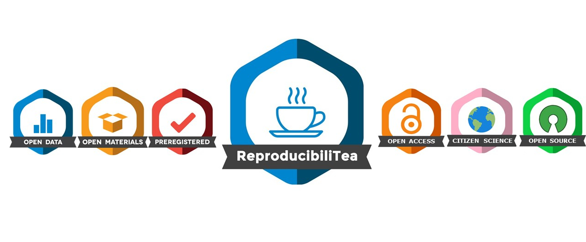{fig-alt="Visuel ReproducibiliTea : données, matériel, préenregistrement, libre accès, science citoyenne et code ouvert." height="420" fig-align="center"}

Rendre le travail **accessible, compréhensible et vérifiable**.

::: {.credit}
[Visuel ReproducibiliTea](https://i0.wp.com/vusci.blog/wp-content/uploads/2020/04/rtea-3-2-e1587204530638.jpg) · Image conservée de PSY7104 (2022).
:::

::: {.notes}
Traduire brièvement les libellés; l'ouverture concerne plus que les données. Les icônes ne constituent pas un classement de qualité. Transition : comment appliquer ces idées à notre étude fictive?
:::

## Pause 2 — 10 minutes

Envoyez vos suggestions de **chansons** ou photos de **votre animal de compagnie** directement sur Wooclap :



## Mise des données, matériels et code en ligne

Pour comprendre notre étude de discussion, une autre équipe aurait besoin :

- des consignes et des questions exactes;
- des règles de recrutement, d'assignation et de traitement des réponses;
- des étapes d'analyse, avec le code lorsqu'il existe.

Le partage des données dépend du consentement et des risques d'identification.

::: {.notes}
Reprise du titre et de l'argument précédent, en remplacement de la longue citation anglaise de Wiggins et Christopherson (2019). Distinguer reproduire une analyse avec les mêmes données et répliquer une étude avec de nouvelles données. Un code accessible aide la vérification mais ne garantit pas qu'il est correct. Pour l'activité de classe, partager questions et procédure suffit; aucun export individuel à publier.
:::

## Confirmatoire ou exploratoire?

**Préenregistrer :** dater un plan d'hypothèses, de méthode et d'analyses avant de les mettre à l'épreuve.

**Explorer :** chercher d'autres régularités, puis les présenter comme des pistes à tester.

On peut modifier le plan : il faut documenter **ce qui change et pourquoi**.

::: {.credit}
[COS — Préenregistrement](https://www.cos.io/initiatives/prereg)
:::

::: {.notes}
Adaptation de « Tag confirmatoire vs. exploratoire » (2022). L'exploration est utile et légitime; le préenregistrement clarifie la chronologie, sans certifier la qualité du devis. Exemple : l'analyse par couleur perçue apparaît après l'examen des résultats; la déclarer exploratoire et envisager une nouvelle étude. Une justification écrite après coup ne transforme pas une découverte en prédiction préalable.
:::

## L’importance de la réflexion a priori

Avant de recueillir des réponses :

- Quelle observation pourrait contredire notre idée?
- Notre mesure répond-elle réellement à la question?
- Comment comparerons-nous les conditions et traiterons-nous les réponses manquantes?

**Préparer le plan permet aussi de l’améliorer.**

::: {.notes}
Adaptés au premier cycle. Conserver sa critique de la pression à commencer vite : le temps consacré à la théorie, aux mesures et à l'analyse a de la valeur. La citation attribuée à Lincoln n'est pas reprise. Demander un exemple de décision à prendre avant la collecte, sans enseigner ici les détails d'un plan statistique.
:::

## Les rapports enregistrés

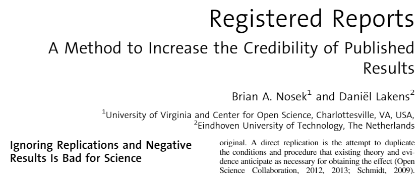{fig-alt="Titre de l’article de Nosek et Lakens sur les Registered Reports." height="230" fig-align="center"}

1. Des pairs évaluent la question et le protocole **avant les résultats**.
2. La revue peut accorder une **acceptation de principe**.
3. La revue publie l'étude conforme aux conditions convenues, **quel que soit le résultat**.

::: {.credit}
Nosek et Lakens (2014), capture reprise de 2022 · [Fonctionnement du format — COS](https://www.cos.io/initiatives/registered-reports)
:::

::: {.notes}
Distinguer préenregistrement (plan daté) et rapport enregistré (évaluation préalable et engagement éditorial conditionnel). L'acceptation n'est pas automatique : respect du protocole approuvé, contrôles de qualité et transparence des écarts. Faire rappeler ce qu'est une hypothèse vérifiable.
:::

## Une place pour les hypothèses non soutenues

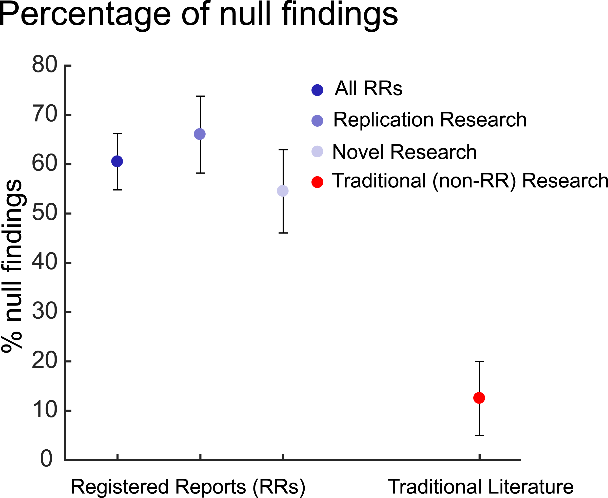{fig-alt="Pourcentages d’hypothèses non soutenues dans les rapports enregistrés de réplication et de recherche originale, comparés à des estimations de la littérature traditionnelle." height="570" fig-align="center"}

::: {.credit}
[Allen et Mehler (2019), figure 1](https://doi.org/10.1371/journal.pbio.3000246) · CC BY · Graphique source du montage présenté en 2022.
:::

::: {.notes}
La figure reprend le graphique mobilisé dans magic.png, téléchargé à la source pour éviter sa légende erronée. Les 153 et 143 sont des hypothèses issues, respectivement, de réplications et de recherches originales dans des rapports enregistrés; pas deux groupes RR/traditionnel. La littérature traditionnelle repose sur des estimations antérieures (5–20 %). Comparaison historique exploratoire, pas démonstration causale. Un résultat non significatif ne prouve pas l'absence d'effet.
:::

## « Big Teams Science »

{fig-alt="Capture historique du Psychological Science Accelerator avec une carte de son réseau." height="500" fig-align="center"}

Plusieurs équipes appliquent un protocole commun et étudient des populations variées.

::: {.credit}
Psychological Science Accelerator · Capture conservée de PSY7104 (2022).
:::

::: {.notes}
Reprise du titre, de la carte et de l'idée de 2022. Les compteurs de la capture ne décrivent pas le réseau actuel. Relier à la validité externe et à la réplication. Coordonner consignes, traductions et recrutement demande du travail; multiplier les sites ne rend pas automatiquement l'échantillon représentatif du monde.
:::

## Une étude ouverte peut-elle trop généraliser?

Une étude préenregistrée auprès de volontaires d'une seule université partage ses données et ses analyses.

Elle conclut : **« Les humains deviennent plus certains après une discussion. »**

La transparence suffit-elle à justifier cette conclusion?

**La population étudiée et la population visée doivent être distinguées.**

::: {.credit}
Exemple fictif
:::

::: {.notes}
Deux minutes : demander à qui les résultats s'appliquent et quelles informations manquent. L'ouverture facilite la vérification mais ne suffit pas à établir la généralisation. Un échantillon restreint n'est pas sans valeur : les conclusions doivent correspondre à ce qu'il permet de soutenir. Relier à la validité externe. L'exemple illustre une manifestation du MASKing, dont la définition dépasse le seul échantillonnage.
:::

## MASKing — un terme à retenir

:::: {.columns}
::: {.column width="34%"}
**Making Assumptions based on Skewed Knowledge**

Fonder sa démarche sur des connaissances biaisées ou peu représentatives : théories, échantillons ou méthodes.
:::

::: {.column width="66%"}
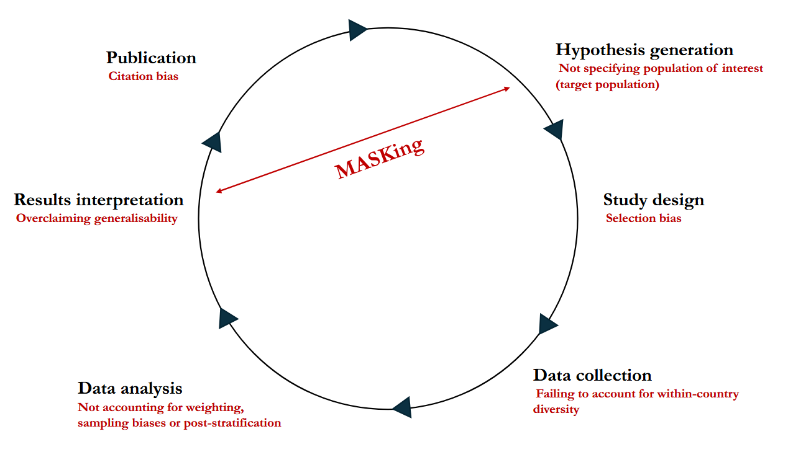{fig-alt="Cycle du MASKing : population cible non précisée, sélection, diversité négligée, analyses, généralisation excessive et biais de citation." width="100%" fig-align="center"}
:::
::::

::: {.credit}
[Ghai, **Thériault**, et al. (2025), figure 1](https://doi.org/10.1038/s44271-024-00179-1)
:::

::: {.notes}
Trois minutes. Terme exigible : mémoriser MASKing et son développement anglais « Making Assumptions based on Skewed Knowledge », expliquer l'idée et reconnaître un exemple. Le concept proposé par Ghai, Thériault et collègues désigne une démarche fondée, parfois involontairement, sur des connaissances biaisées ou non représentatives; il ne se réduit pas à la taille de l'échantillon et ne constitue pas une quatrième catégorie de validité. Sur la figure, commenter population visée, personnes étudiées et portée des conclusions. Pondération et poststratification : ni explication technique ni mémorisation exigées pour cette séance. Article de perspective proposant un cadre conceptuel, pas estimation expérimentale d'un effet. La lecture intégrale de l'article n'est pas exigée; les éléments enseignés ici peuvent être évalués.
:::

## L’importance de changements structurels

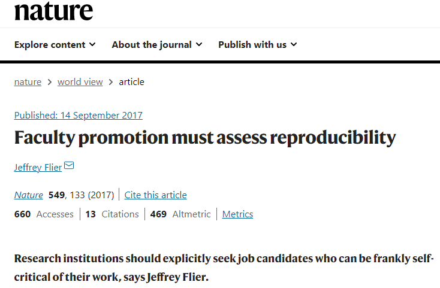{fig-alt="Tribune de Jeffrey Flier en 2017 proposant d’évaluer la reproductibilité dans les promotions universitaires." height="350" fig-align="center"}

Que devrait-on valoriser dans une carrière scientifique?

La rigueur des méthodes, les réplications, le partage et les corrections méritent aussi du temps et de la reconnaissance.

::: {.credit}
Jeffrey Flier, *Nature* (2017), tribune · Capture reprise de PSY7104 (2022).
:::

::: {.notes}
La science ouverte ne suffit pas à elle seule. Proposition normative : valoriser les pratiques et la formation au-delà du volume de publications et du prestige de la revue. La capture est une tribune de 2017, pas un constat selon lequel toutes les universités appliquent déjà cette politique. Exemple de discussion : récompenser la correction transparente d'une erreur plutôt que son camouflage.
:::

## L’ouverture doit protéger les personnes

- Participation libre, consentement éclairé et risques réduits.
- Vie privée protégée, même lorsqu'on partage la méthode.
- Duperie : justification et évaluation éthique préalable, puis débreffage adapté.

::: {.notes}
Vallerand et Chénard-Poirier (2021), p. 56–57; EPTC 2 (2022), art. 3.7A–3.7B, https://ethique.gc.ca/fra/tcps2-eptc2_2022_chapter3-chapitre3.html. Ne pas confondre confidentialité et anonymat. En recherche assujettie, l'évaluation par le CER précède la mise en œuvre. Toute modification aux exigences de consentement exige notamment risque minimal et protection du bien-être. Le débreffage prévoit le retrait des données lorsque possible, réaliste et approprié. Retirer un prénom ne suffit pas à garantir l'anonymat.
:::

## Atelier 3 — Que peut-on honnêtement annoncer?

**10 minutes · Même binôme.**

**Cas fictif :** une étude auprès de volontaires d’une université ne soutient pas l’hypothèse prévue. Après avoir vu les résultats, l’équipe retire des réponses et obtient un résultat qui la soutient. Le motif des retraits n’est pas indiqué.

Elle annonce : **« Notre hypothèse est confirmée chez les humains. »**

Rédigez un compte rendu prudent en **trois phrases** :

1. Ce qu’il faut préciser sur les exclusions et leur chronologie.
2. À qui la conclusion pourrait s’appliquer, et ce qui reste incertain.
3. Ce qu’on pourrait partager pour vérifier l’étude sans identifier les personnes.

::: {.notes}
Guide interne, atelier 3 : 1 min lecture, 4 min rédaction, 1 min échange avec un autre binôme, 4 min retour. Ne pas inventer le motif des exclusions. Attendus : indiquer qu’elles ont été choisies après examen des résultats, demander justification et analyses avec/sans exclusions; conclusion exploratoire et limitée par recrutement, devis et mesures; partager protocole, questions, décisions et code, évaluer séparément le partage des données. Une exclusion peut être légitime. Relier la généralisation excessive au MASKing sans réduire le concept à l’échantillonnage. Faire rappeler oralement Making Assumptions based on Skewed Knowledge. Cet atelier précède la ronde 2.
:::

## Connectez-vous à Wooclap {#connexion-ronde-2}



**Ronde 2** · Les questions sont présentées dans Wooclap.

[Reprendre le cours après la ronde](#suite-ronde-2)

::: {.notes}
Basculer vers Wooclap pour les questions et la correction. Les diapositives suivantes conservent les questions pour les archives publiques, sans QR. Au retour, utiliser le lien pour reprendre le cours sans les parcourir.
:::

## Wooclap — Ronde 2 · Rapport enregistré

**Q7. Qu’ajoute un rapport enregistré au simple préenregistrement?**

A. La garantie que l'hypothèse sera confirmée. 
B. La suppression de toute analyse exploratoire. 
C. L'évaluation préalable du protocole et une acceptation de principe sous conditions.

::: {.notes}
Réponse : C. Le simple préenregistrement date le plan; le rapport enregistré y ajoute l'évaluation préalable et l'engagement éditorial conditionnel. Ni l'un ni l'autre ne garantit un résultat positif. Source : https://www.cos.io/initiatives/registered-reports. Faire voter sur Q7–Q9, puis débreffer ensemble.
:::

## Wooclap — Ronde 2 · Transparence

**Q8. Quelle pratique soutient la transparence?**

A. Distinguer les analyses prévues des explorations ajoutées. 
B. Ne rapporter que les résultats attendus. 
C. Publier les noms des personnes pour rendre les données crédibles.

::: {.notes}
Réponse : A. B masque une partie de l'information; C ne garantit rien et expose les personnes. Enchaîner la question sur le partage, puis débreffer la ronde.
:::

## Wooclap — Ronde 2 · Partage

**Q9. Un export contient des noms et des réponses individuelles. Pour partager la méthode, on devrait d'abord…**

A. déposer l'export complet sur le site du cours; 
B. partager les questions et le protocole, puis examiner séparément les conditions de partage des données; 
C. supprimer seulement la colonne des prénoms et tout publier.

::: {.notes}
Réponse : B. Retirer un prénom ne garantit pas l'anonymat. L'export réel du cours 1 reste dans Box/Wooclap. Aucun export individuel n'est nécessaire à cette activité.
:::

## Trois questions à poser devant une étude {#suite-ronde-2}

1. **Qu'a-t-on mesuré ou manipulé?**
2. **Quelle conclusion le devis permet-il?**
3. **Que faudrait-il améliorer, protéger ou rendre explicite?**

::: {.notes}
Source : Vallerand et Chénard-Poirier (2021), p. 53–55.

Synthèse orale avec un exemple déjà vu. Pas de billet de sortie obligatoire. Si fatigue, conclure directement ici, puis afficher la prochaine séance.
:::

## Prochaine séance

**15 septembre — Le soi** (**chapitre 3**)

**Quiz 1 en début de séance** 
Chapitres 1–2 et cours 1–2.

**Examen 1 : 29 septembre, 25 %** 
Chapitres 1 à 4 et matière des séances 1 à 4.

## Des références maison sur la science ouverte

[**Rémi Thériault (2025)** — *L’importance de la science ouverte en recherche en psychologie*](https://doi.org/10.31234/osf.io/758dx). Fragments : Revue de psychologie.

[**Ghai, Thériault, et al. (2025)** — *A manifesto for a globally diverse, equitable, and inclusive open science*](https://doi.org/10.1038/s44271-024-00179-1). Communications Psychology, 3, article 16.

Pour approfondir : [guide long de Rémi Thériault sur les bonnes pratiques et la science ouverte](https://remi-theriault.com/files/science_ouverte.pdf).

**Références complémentaires : lecture non exigée pour l'examen.**

::: {.notes}
La citation abrégée met volontairement en évidence la contribution du professeur. Auteurs du manifeste : Sakshi Ghai, Rémi Thériault, Patrick Forscher, Yuichi Shoda, Moin Syed, Arathy Puthillam, Hu Chuan Peng, Dana Basnight-Brown, Asifa Majid, Flavio Azevedo et Leher Singh. Le guide long vise initialement le doctorat; il est proposé uniquement comme ressource facultative.
:::

# Pour approfondir

## Étudier des traces et des études existantes

| Approche | Travail réalisé |
|---|---|
| Étude de cas | Comprendre en profondeur un cas dans son contexte |
| Analyse de contenu | Coder systématiquement des messages ou des documents |
| Analyse archivistique | Examiner des données déjà disponibles |
| Méta-analyse | Synthétiser quantitativement les résultats de plusieurs études |

::: {.notes}
Source : Vallerand et Chénard-Poirier (2021), p. 42–45. Une méta-analyse dépend de la qualité et de la sélection des études incluses; elle ne transforme pas des associations en causes. Enquêtes et entrevues : formulation, mémoire et échantillonnage comptent, p. 39–40. Simulation/jeu de rôles : réactions à une situation construite, p. 40–42. Le cas historique de Stanford est discuté avec des critiques dans le manuel; ne pas le présenter comme une démonstration incontestable.
:::

## Préenregistrement et tailles d’effet : une comparaison historique

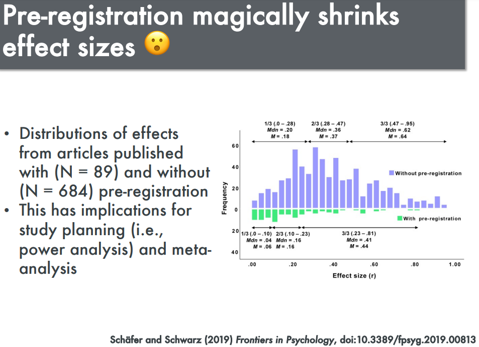{fig-alt="Montage de 2019 comparant des distributions de tailles d’effet avec et sans préenregistrement." height="460" fig-align="center"}

::: {.credit}
[Schäfer et Schwarz (2019)](https://doi.org/10.3389/fpsyg.2019.00813) · Montage conservé de PSY7104 (2022).
:::

::: {.notes}
Réserve, hors parcours prévu. Utiliser précisément comme exercice de lecture critique du titre « magically shrinks ». Les N sont des effets, pas nécessairement autant d'études indépendantes. Des différences d'études, de sujets ou de sélection peuvent contribuer à l'écart; pas de réduction garantie ni de causalité démontrée par le seul préenregistrement. Le résultat est historique, pas une description générale actuelle.
:::

## Quelques solutions possibles

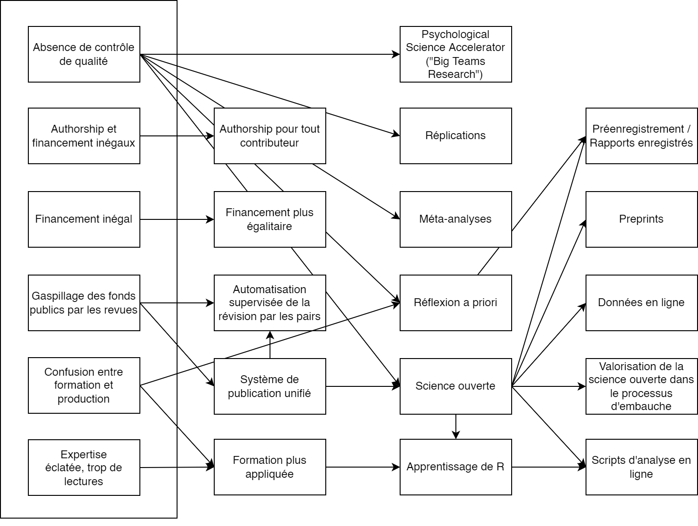{fig-alt="Schéma de Rémi Thériault reliant des propositions de réforme des pratiques scientifiques." height="580" fig-align="center"}

::: {.credit}
Rémi Thériault · Schéma original de PSY7104 (2022).
:::

::: {.notes}
Réserve, hors parcours prévu. Schéma conservé intégralement comme trace de l'argumentaire de 2022, pas modèle causal validé. Trop dense pour une lecture exhaustive en classe; sélectionner un lien à discuter si le temps le permet. Les propositions sur les institutions et la formation dépassent les acquis exigés aujourd'hui.
:::
