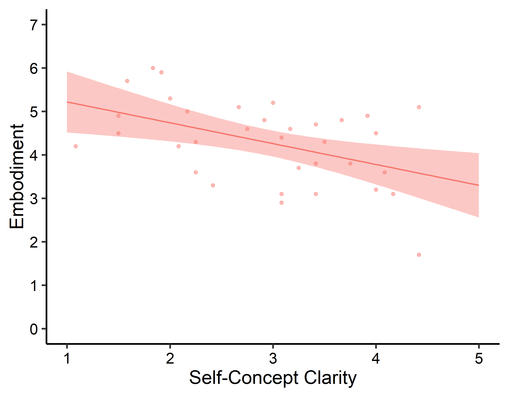
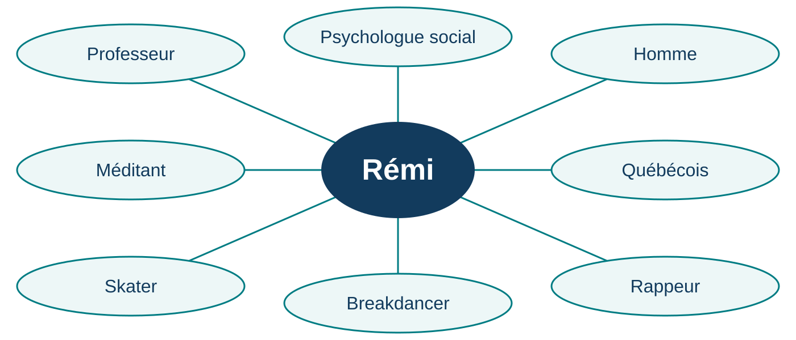
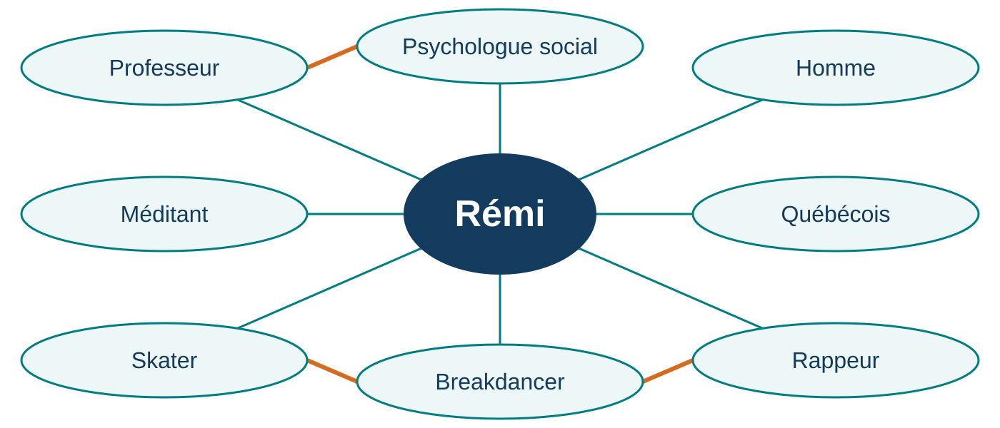
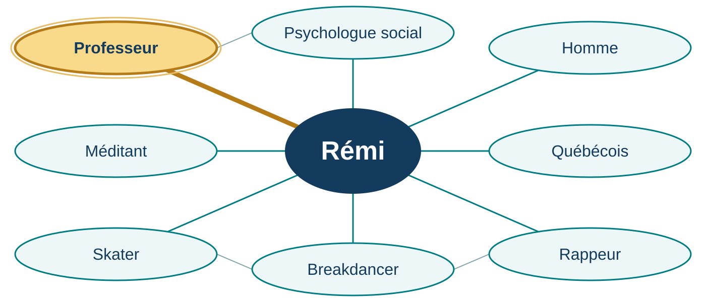
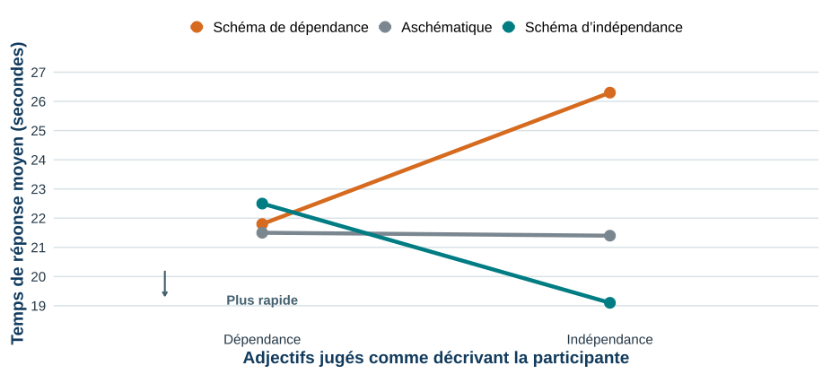
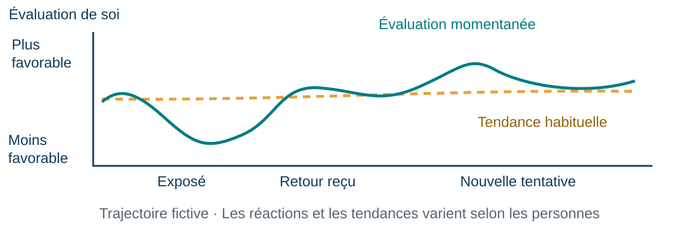
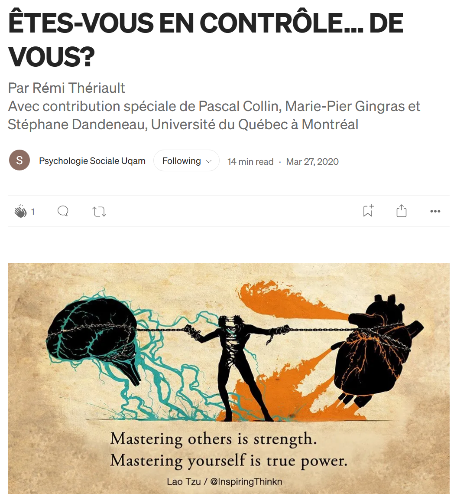

## Quiz de lecture 1 — 1,25 %

**Chapitres 1–2 et cours 1–2 · Travail individuel**



::: {.notes}
Réserver le début de la séance au quiz, avant toute discussion du chapitre. Les questions évaluées et leur corrigé demeurent dans Box; ne pas les inclure dans cette source publique. Source des modalités : plan officiel, calendrier et section Quiz de lecture. Prévision : dix minutes, à confirmer avec les consignes finales. Le périmètre chapitres 1–2 et cours 1–2 est celui annoncé dans les pages et diapositives actuelles; le chapitre 3 est exclu du quiz 1.
:::

## Quiz et examen — quoi préparer?

**22 septembre — Quiz 2 (1,25 %) : chapitre 3 et cours 3.**

Les **8 meilleurs quiz sur 10** comptent pour **10 %** de la note finale.

**29 septembre — Examen 1 (25 %) : chapitres 1–4 et cours 1–4.**

- 50 % des questions viendront du matériel du **cours** vu en classe
- 50 % des questions viendront du matériel du **manuel** (même si la matière n'a PAS été vue en classe)

Certaines notions enseignées en cours **peuvent** être évaluées même si elles ne figurent pas sur les diapositives et qu'il s'agisse de quelque chose dont nous avons simplement discuté. Cependant, en majorité, je m'en tiens au manuel et aux diapositives. Toute autre ressource ou lien externe n'est pas matière à examen.

## Mes stratégies d’étude du bac 1/2 : comprendre la structure

**Avant de lire : parcourir le chapitre du début à la fin.**

::: {.columns}
::: {.column width="48%"}
### À l’échelle du chapitre

Repérer la longueur, les titres, les sous-titres et les grandes parties, sans encore lire le détail.
:::
::: {.column width="48%"}
### À l’échelle d’une section

Refaire ce survol avant de lire; y revenir pendant la lecture pour situer sa progression.
:::
:::

**Chapitre → sections → idées → détails**

La lecture vient remplir une structure que l’on commence déjà à connaître.

L'idée est d'aider à comprendre la **hiérarchie des concepts** : les concepts de plus haut niveaux sont généralement plus importants.

::: {.notes}
Méthode personnelle de Rémi, formulée à partir de son témoignage. « Mapping » : reconnaissance de la structure avant lecture, puis à l’échelle des sections. Ne pas présenter comme une méthode universelle ni comme un protocole expérimental validé. Capsule de cinq minutes au total pour les trois diapositives.
:::

## Mes stratégies d’étude du bac 2/2 : scanner et faire le tri

1. **Lecture RAPIDE :** (ne perdez pas de temps sur les détails; comprenez l'essentiel)
2. **Distinguez ce qui est IMPORTANT, de ce qui ne l'est pas**
3. **Distinguez ce qui est AUTONOME, de ce qui ne l'est pas** (ce qui est logique ou qui vient à l'esprit facilement)
4. **SIMPLIFIEZ tout ce qui reste ** (listes à puces, trucs mnémotechniques; essayez de conserver aussi peu d'information que possible)
5. **BOUCLEZ la BOUCLE ** (organisez et regroupez les éléments de manière à se faire une idée claire de la vue d'ensemble, de la façon dont les thèmes ou les idées s'articulent entre eux et dans quel ordre, ainsi que des « limites » du contenu)
6. **MÉMORISEZ ce qu'il reste**

::: {.notes}
Traduction adaptée des étapes SPEED read, IMPORTANT et AUTONOMOUS. Interprétation de « autonomous » : logique ou facilement accessible, plutôt que travail autonome. La rapidité sert ici à saisir l’essentiel; revenir aux passages nécessaires à la compréhension. Ces conseils ne changent pas le périmètre annoncé des évaluations. Étapes personnelles SIMPLIFY, CLOSE THE BUCKLE et MEMORIZE. « Simplifier » vise une représentation concise qui conserve les distinctions importantes, pas la suppression des nuances nécessaires. Éventuellement illustrer oralement avec un exemple de sa propre pratique.
:::

## Enregistrer les diapositives en PDF

Pour conserver une copie et faciliter la prise de notes :

1. Ouvrez le **menu « hamburger »** (trois barres) des diapositives.
2. Cliquez sur **Tools**.
3. Choisissez **PDF Export Mode**.
4. Appuyez sur **Ctrl + P** (ou **⌘ + P** sur Mac).
5. Choisissez **Enregistrer au format PDF**, ajustez le nombre de **pages par feuille**, puis enregistrez.

::: {.notes}
Montrer la procédure à l'écran. Le nombre de pages par feuille et le libellé de la destination PDF dépendent du navigateur et du système; consulter les paramètres supplémentaires si nécessaire. Vérifier l'aperçu avant d'enregistrer. La copie PDF conserve la version du jour : consulter le site pour les mises à jour ultérieures.
:::

## Plan de la séance

1. **Le soi comme contenu** — soi corporel, concept de soi, schémas et estime de soi
2. **Le soi comme processus et ses conséquences** — conscience de soi, efficacité, contrôle et compassion
3. **Les sources du soi** — apprendre à se connaître par soi-même et par les autres

**Pour commencer : expérimenter son corps et se représenter soi-même.**

::: {.notes}
Organisation pédagogique fondée sur Vallerand (2021), p. 63 : contenu, conscience de soi, conséquences intrapersonnelles et interpersonnelles, puis déterminants. Les processus et stratégies prioritaires précèdent les sources afin qu’ils soient traités même si le temps manque. La clarté et l’autocompassion sont des ouvertures identifiées; elles ne remplacent pas le noyau du manuel.
:::

## Voir l’expérience {#video-rhi}

::: {style="display: flex; justify-content: center;"}

:::

::: {.notes}
Lecture manuelle; arrêter la vidéo avant de quitter la diapo. La vidéo n’est pas jouable dans une copie PDF. Repérer avec le groupe ce qui est vu, ressenti et inféré. La vidéo illustre le protocole : les réactions montrées ne sont pas une comparaison contrôlée de résultats. Référence de la recherche : https://doi.org/10.1177/17470218221078858.
:::

## Soi corporel vs soi conceptuel

**Soi corporel** : l’expérience de son corps comme sien, situé ici, capable d’agir.

**Soi conceptuel** : ce que l’on se représente à propos de soi.

« Cette main est la mienne » et « je suis habile de mes mains » concernent le même corps, sous deux angles différents.

::: {.notes}
Krol, Thériault, Olson, Raz et Bartz (2020), https://doi.org/10.1177/0146167219879126. Corporel/conceptuel n’est pas un synonyme de contenu/processus : des processus construisent et actualisent les représentations corporelles comme conceptuelles. Employer « conceptuel » plutôt que « mental » évite de laisser entendre que l’expérience corporelle serait dépourvue de dimensions psychologiques.
:::

## Un concept de soi peut être plus ou moins clair

**Clarté du concept de soi** : des croyances sur soi clairement définies, cohérentes entre elles et relativement stables dans le temps.

**Clarté** : « Est-ce que je sais comment je me décris? »

**Estime** : « Quelle valeur est-ce que je m’accorde? »

Un portrait clair n’est pas nécessairement favorable, exact ou immuable.

La clarté est **associée au bien-être**.

::: {.notes}
Définition de Campbell et al. (1996), reprise dans Krol, Thériault, Olson, Raz et Bartz (2020). Les liens avec le bien-être appartiennent à la littérature sur la clarté; notre étude de 2020 examine surtout son association avec la malléabilité corporelle. Ne pas présenter cette étude comme une intervention démontrant qu’augmenter la clarté améliore le bien-être.
:::

## Clarté du soi et sentiment de propriété de corps {#krol-resultats}

::: {.columns}
::: {.column width="65%"}
{width="797" height="620" fig-alt="Figure originale de l’étude 2 : nuage de points montrant une association négative entre clarté du concept de soi et le sentiment de propriété de corps lors de l’illusion d’échange corporel, avec droite de régression et bande de confiance à 95 %."}
:::
::: {.column width="33%"}
**Horizontal** : clarté du concept de soi.

**Vertical** : sentiment que le corps vu est le sien.

Une clarté plus faible est associée à un sentiment de propriété de corps plus fort.

:::
:::

::: {.credit}
Krol, Thériault, Olson, Raz et Bartz (2020), figure 3. Original fourni par Rémi Thériault.
:::

::: {.notes}
Présenter oralement les deux expériences de Krol et al. (2020) en une phrase : main en caoutchouc, puis échange corporel. La tendance générale relie une clarté plus faible à un sentiment de propriété de corps plus fort. Chaque point représente une personne; la bande représente l’intervalle de confiance à 95 % autour de la droite moyenne. Les axes originaux anglais sont conservés et traduits à droite. Source : https://doi.org/10.1177/0146167219879126.
:::

# Le soi comme contenu

## Deux façons d’étudier le soi

| **Le soi comme contenu** | **Le soi comme processus** |
|---|---|
| Ce que je me représente à propos de moi | Les activités par lesquelles je prends conscience de moi et j’agis |
| Concept de soi, schémas, estime de soi | Attention à soi, régulation, présentation de soi |

**Le « moi » connu et le « je » connaissant sont deux angles sur une même personne.**

::: {.notes}
Vallerand (2021), p. 63. Le manuel inclut également les soi possibles dans le contenu; ils ne sont pas développés dans cette séance. Corporel/conceptuel ne recouvre pas contenu/processus : nous pouvons avoir des représentations du corps et des processus qui les élaborent.
:::

## Le concept de soi : que contient-il?

**« Ensemble des représentations sur soi. »**

::: {.credit}
Vallerand (2021), glossaire, p. 439 — définition citée.
:::

| Contenu | Exemple |
|---|---|
| Trait que je m’attribue | « Je suis persévérante. » |
| Valeur ou conviction | « L’entraide est importante pour moi. » |
| Rôle ou appartenance | « Je suis étudiante en psychologie. » |
| Représentation corporelle | « Je me trouve grande. » |

::: {.notes}
Vallerand (2021), p. 63–64 et 439. Les traits de personnalité sont des tendances relativement durables; les traits que l’on s’attribue sont des représentations, pas nécessairement une mesure objective de ces tendances. Définition exacte courte du glossaire; exemples originaux.
:::

## Qui suis-je? · 10 réponses (4 minutes)

Sur une feuille (ou votre ordinateur, votre téléphone), écrivez **10 réponses** à la question « Qui suis-je? », en commençant par **« Je suis… »**.

Écrivez ce qui vous vient, sans chercher le portrait idéal.

**Gardez votre liste : nous y reviendrons.** Vous choisissez ce que vous partagez.

::: {.notes}
Quatre minutes d’écriture individuelle. Version abrégée à 10 réponses, inspirée des 20 énoncés présentés par Vallerand (2021), p. 64. Aucune collecte, aucun score de personnalité; ne pas faire de la complétion une performance. Autoriser à passer un élément ou à travailler sur un personnage fictif. Le partage éventuel sera volontaire. Prévoir papier ou notes personnelles.
:::

## Les schémas sur le soi

**Des connaissances organisées, issues de nos expériences, qui orientent le traitement de l’information sur soi.**

« Être sportive me définit. »

Cette dimension relie des souvenirs, des attentes et des façons d’interpréter une nouvelle expérience.

**Le concept de soi désigne les représentations; les schémas expliquent leur organisation et leur influence.**

::: {.credit}
Vallerand (2021), p. 67–69 et glossaire, p. 447 — définition synthétisée.
:::

::: {.notes}
Un schéma n’est pas un simple adjectif ni un synonyme de personnalité. Reprendre une réponse de l’exercice et demander quels souvenirs ou comportements lui sont associés. Être schématique ou aschématique se définit relativement à une dimension particulière, pas à la personne dans son ensemble.
:::

## Une carte de mon soi

{width="1300" fig-alt="Rémi au centre, relié à huit facettes. Aucun lien transversal n’est encore affiché entre les facettes."}

**Ces éléments du soi sont-ils reliés entre eux?**

::: {.notes}
Première étape : laisser proposer quelques associations avant d’avancer. Carte originale inspirée des exemples fournis dont celui de Jennifer Bartz. Relier à Vallerand (2021), p. 63–64, 72 et 77–79.
:::

## Des facettes reliées entre elles {#soi-liens}

{width="1300" fig-alt="La même carte avec trois liens supplémentaires : professeur et psychologue social, skater et breakdancer, breakdancer et rappeur."}

**Quelle facette devient saillante lorsque j’enseigne?**

::: {.notes}
Deuxième étape : les liens apparaissent, les positions restent identiques. Commenter brièvement les associations entre enseignement et psychologie sociale, pratiques corporelles, puis breakdance et rap. Poser ensuite la question de la saillance avant d’avancer.
:::

## Quand j’enseigne {#soi-professeur-saillant}

{width="1300" fig-alt="Même réseau du soi de Rémi. La facette Professeur est mise en évidence en doré, avec son lien vers Rémi épaissi. Les autres facettes restent visibles."}

**En classe, ma facette « professeur » devient saillante.**

::: {.notes}
Avancer depuis la carte précédente : la disposition reste identique, seule la facette professeur est mise en évidence. Expliquer « saillante » : particulièrement présente à l’esprit dans ce contexte. Revenir en arrière si utile pour comparer. Les trois liens transversaux illustrent les associations professeur–psychologue social, skater–breakdancer et breakdancer–rappeur.
:::

## Une étude classique : les schémas sur le soi

**Markus (1977)** · Des étudiantes sont sélectionnées selon leur rapport à l’indépendance : schéma d’indépendance, de dépendance, ou absence de schéma marqué.

Elles voient des adjectifs et indiquent **« moi » / « pas moi »**. On mesure notamment le temps de réponse.

Par exemple : **indépendante, autonome, conformiste, dépendante**.

**Pour quels adjectifs répondra-t-on « moi » le plus rapidement?**

::: {.notes}
Texte primaire : https://web.stanford.edu/~hazelm/cgi-bin/wordpress/wp-content/uploads/2011/02/1977_Markus_Self-Schemata-and-Processing-Information-About-the-Self.pdf. Étude 1, 48 étudiantes sélectionnées, trois groupes de 16. Les schémas préexistants servent à sélectionner les groupes : ils ne sont pas attribués au hasard. Prédiction individuelle, puis résultat sur la diapo suivante. Relier explicitement une définition à une opération de mesure.
:::

## Quand l’information correspond à notre schéma

{width="1250" fig-alt="Reconstitution du profil de latence de Markus 1977. Les participantes ayant un schéma de dépendance répondent plus lentement aux adjectifs d’indépendance; celles ayant un schéma d’indépendance y répondent plus rapidement; le profil aschématique varie peu."}

**Un adjectif correspondant au schéma est traité plus rapidement.**

::: {.credit}
Markus (1977), étude 1, figure 1. Reconstitution graphique; valeurs approximativement relevées de la figure originale.
:::

::: {.notes}
Comparer la prédiction au résultat. Le graphique redessine le panneau des jugements « moi » de la figure 1; les valeurs ont été relevées approximativement et servent à montrer le profil, pas à refaire les analyses. Le groupe aschématique ne présente pas cette différenciation de vitesse. L’étude comprend aussi des tâches de production d’exemples comportementaux et de prévision de comportements. DOI 10.1037/0022-3514.35.2.63.
:::

## Quand le « nous » entre dans le soi

| Se définir par… | Exemple |
|---|---|
| Un trait personnel | « Je suis curieuse. » |
| Une relation | « Je suis l’amie de cette personne. » |
| Une appartenance collective | « Je fais partie des Bleus / des Ors. » |

**Que change une appartenance dans ce qui compte pour nous?**

::: {.notes}
Vallerand (2021), p. 63–65, 72 et 77–79. Exemples fictifs, sauf les équipes créées en classe. L’identité sociale concerne la place des appartenances dans la définition de soi; ne pas classer les personnes de façon exclusive. Les Bleus/Ors sont une identité pédagogique intentionnelle, sans inférence de personnalité. Revenir à la carte : une institution ou un collectif peut aussi devenir une appartenance signifiante.
:::

## L’estime de soi

**L’évaluation subjective, positive ou négative, que l’on fait de soi-même.**

::: {.columns}
::: {.column width="50%"}
**Un jugement global**

« Dans l’ensemble, je suis satisfait de moi. »
:::
::: {.column width="50%"}
**Une attitude envers soi-même**

« J’ai une attitude positive vis-à-vis de moi-même. »
:::
:::

**Ici, on évalue la personne dans son ensemble, pas seulement un comportement.**

::: {.credit}
Vallerand (2021), p. 64–67 et tableau 3.2 — items de l’échelle de Rosenberg.
:::

::: {.notes}
Source : Vallerand (2021), p. 64–67, tableau 3.2. Items tirés de la validation canadienne-française de l’échelle d’estime de soi dispositionnelle de Rosenberg (Vallières et Vallerand, 1990). Distinguer l’estime de soi globale d’une évaluation particulière : ne pas aimer une prise de parole ne suffit pas à définir la valeur que la personne s’accorde dans son ensemble. Les mesures situationnelles peuvent aussi inclure des domaines momentanément saillants, comme l’apparence ou le regard d’autrui.
:::

## L’estime de soi : préciser de quoi on parle

| Distinction | Exemple de question |
|---|---|
| Globale ou propre à un domaine | Ma valeur générale ou ma satisfaction comme étudiante? |
| Disposition ou état | Habituellement ou après cet exposé? |
| Individuelle, relationnelle ou collective | Moi, ma place dans une relation ou mon appartenance? |

**Une réaction située ne résume pas la personne.**

::: {.notes}
Source : Vallerand (2021), chapitre 3, p. 64–67. Les mesures explicites et implicites constituent une autre distinction abordée dans le manuel; ne pas présenter une mesure indirecte comme accès au vrai soi. Le narcissisme ne se réduit pas à une estime de soi élevée.
:::

## L’estime de soi au fil des événements

{width="1200" fig-alt="Illustration fictive : l’évaluation de soi fluctue autour d’une tendance habituelle, après un exposé, une rétroaction et une nouvelle tentative. Aucune donnée réelle."}

**Un moment de déception suffit-il à décrire une disposition?**

::: {.notes}
Vallerand (2021), p. 65–66. Inspiration pédagogique : Blais, cours 3 (2020), diapos 47–49. Visuel original, valeurs et événements fictifs. La tendance habituelle peut évoluer; les réactions aux événements varient. Ne pas présenter le tracé comme une mesure ou un résultat expérimental.
:::

## Quand une image de soi est menacée

**Se reconnaître de la valeur** et **se croire supérieur aux autres** sont distincts.

Dans les expériences de **Bushman et Baumeister (1998)**, l’association du **narcissisme et d’une insulte** s’accompagne d’une agressivité particulièrement élevée envers l’auteur de l’insulte.

::: {.credit}
Bushman et Baumeister (1998), https://doi.org/10.1037/0022-3514.75.1.219.
:::

::: {.notes}
Deux expériences distinguent mesures d’estime et de narcissisme, puis réaction à une insulte ou à un éloge. Dans ces expériences, l’estime de soi seule ne prédit pas l’agression. Référence vérifiée : https://pubmed.ncbi.nlm.nih.gov/9686460/. Les formulations fournies des diapositives de Blais sont trop générales si elles sont appliquées à toute haute estime de soi. Préciser le narcissisme et la menace, sans prétendre que le narcissisme masque toujours une faible estime. Aucun diagnostic ni assimilation directe entre une mesure d’agression en laboratoire et toute violence réelle.
:::

## Retour à vos 10 réponses (3 min)

1. **Reliez deux ou trois éléments** qui se renforcent, se recoupent ou deviennent saillants ensemble.

2. Ensuite, repérez :

- une caractéristique, un rôle ou une appartenance;
- une description de vous-même;
- une éventuelle évaluation de vous-même.

**Que révèle la forme de votre réseau, au-delà de chaque réponse prise séparément?**

::: {.notes}
Accorder deux ou trois minutes. Les traits représentent des associations subjectives, pas nécessairement des relations permanentes. Proposer quelques critères : mêmes activités, mêmes valeurs, mêmes personnes ou mêmes contextes. Demander ensuite si une facette semble particulièrement centrale ou si certaines forment un petit ensemble. Aucun partage obligatoire.
:::

## Connectez-vous à Wooclap {#connexion-ronde-1}



**Ronde 1** · Les questions sont présentées dans Wooclap.

[Reprendre après la ronde : pause de 10 minutes](#pause-1)

## Ronde 1 · Décrire ou évaluer?

« Je suis membre de l’équipe de débat. » Cette phrase exprime surtout :

A. Une description de soi 
B. Une évaluation de sa valeur 
C. Une preuve de compétence en débat

::: {.notes}
W01 — Réponse A. Appartenance exprimée dans le concept de soi; la phrase seule n’établit ni la valeur personnelle ni la compétence. Réflexion individuelle 30 secondes, vote, puis débreffage. Masquer les résultats pendant le vote.
:::

## Ronde 1 · Ce qu’une phrase permet de conclure

« Je me sens déçu de moi après cet exposé. » Que peut-on conclure?

A. La personne a toujours une faible estime de soi 
B. Elle exprime une évaluation négative dans cette situation 
C. Son exposé était objectivement mauvais

::: {.notes}
W02 — Réponse B. Distinguer l’évaluation exprimée, sa généralisation à la personne et la qualité mesurée de l’exposé. Ne pas supposer que l’émotion rapporte fidèlement une performance objective. 30 secondes de réflexion avant vote, puis discussion.
:::

## Pause 1 — 10 minutes {#pause-1}



# Le soi comme processus et ses conséquences

## Le soi comme processus : porter attention à soi

**Conscience de soi** : état dans lequel l’attention se porte sur des aspects de soi-même.

Le contenu devient alors un objet d’attention : une valeur, une émotion, une apparence, un comportement.

**« Je suis patiente » est une représentation. « Je remarque mon impatience » est une activité d’attention à soi.**

::: {.credit}
Vallerand (2021), p. 81–83 et glossaire, p. 439 — définition synthétisée.
:::

::: {.notes}
Distinguer cette définition opérationnelle de la conscience phénoménale (éprouver subjectivement quelque chose). Le témoin peut servir de métaphore contemplative, pas de preuve d’une entité séparée. La courte section du manuel sur le soi comme processus introduit ensuite ses conséquences; elle ne réduit pas toute la matière pertinente à deux pages.
:::

## La théorie de l’autodétermination {visibility="hidden"}

Trois besoins dans la théorie de l’autodétermination :

- **Autonomie** : agir avec un sentiment de choix.
- **Compétence** : se sentir capable de progresser.
- **Appartenance sociale** : se sentir relié aux autres.

**Dans un cours, qu’est-ce qui pourrait rendre la participation plus autonome?**

::: {.notes}
Source : Vallerand (2021), chapitre 3, p. 90. Présentation introductive. Autonomie ne signifie pas agir seule; une activité peut être choisie pour sa valeur, même sans plaisir immédiat. Ne pas promettre qu’une seule action satisfait nécessairement les trois besoins.
:::

## Porter attention à soi : privé ou public?

| **Conscience de soi privée** | **Conscience de soi publique** |
|---|---|
| Attention aux aspects de soi peu visibles pour autrui : pensées, émotions, valeurs | Attention aux aspects susceptibles d’être observés ou évalués par autrui |
| « Suis-je en accord avec ce que je dis? » | « Quelle impression est-ce que je donne? » |

**On peut éprouver les deux dans la même situation.**

::: {.credit}
Vallerand (2021), p. 81–83 et glossaire, p. 439–440 — définitions synthétisées.
:::

::: {.notes}
Privée ne signifie pas être seul. L’attention à soi peut être suscitée par la situation ou refléter des différences individuelles. Demander une situation où l’attention passe d’une valeur personnelle à l’image donnée.
:::

## La présentation de soi

**Les conduites par lesquelles on influence l’image que les autres se font de nous.**

**Stratégique :** orienter l’impression produite.

Alex met en avant son expérience de bénévolat auprès d’une nouvelle équipe.

**Authentique :** présenter aux autres des aspects réels de soi pour se faire connaître.

Ces deux intentions peuvent coexister.

::: {.credit}
Vallerand (2021), p. 100–104 et glossaire, p. 446 — définitions synthétisées.
:::

::: {.notes}
Source : Vallerand (2021), chapitre 3, p. 100–104. La présentation stratégique n’implique pas un mensonge; l’authenticité n’oblige pas à tout révéler. L’autosurveillance concerne l’ajustement de sa présentation aux indices sociaux : ne pas opposer moralement personnes fausses et honnêtes.
:::

## Se sentir mieux ou mieux réguler son action?

**Baumeister : « Rethinking Self-Esteem »**

Augmenter l’estime de soi ne garantit pas, à lui seul, une amélioration des comportements ou des compétences.

D’où sa proposition : accorder davantage de place au **contrôle de soi**.

**Cela ne signifie pas que l’estime de soi est sans bénéfices.**

::: {.credit}
Baumeister, « Rethinking Self-Esteem »; mise en perspective : Orth et Robins (2022).
:::

::: {.notes}
Texte de vulgarisation et de positionnement fourni par Rémi, Stanford Social Innovation Review, p. 34–41; la couverture porte Winter 2005. Baumeister y défend le contrôle de soi et reconnaît certains bénéfices de l’estime, notamment bonheur et initiative. Ne pas confondre sa proposition d’intervention avec une démonstration que tout contrôle ou toute autocompassion surpasse toute estime pour tous les résultats. Actualisation : Orth et Robins (2022), https://doi.org/10.1037/amp0000922, synthèse d’études longitudinales rapportant des bénéfices prospectifs de l’estime dans plusieurs domaines; pas un essai randomisé d’intervention ni une preuve que toute hausse artificielle produit ces bénéfices. Distinguer corrélations, prédictions longitudinales et efficacité des interventions.
:::

## Le contrôle de soi

::: {.columns}
::: {.column width="58%"}
**Réguler ses réponses lorsqu’une impulsion entre en conflit avec un but.**

« Je veux terminer cette lecture, mais j’ai envie de consulter mon téléphone. »

Éloigner le téléphone ou modifier ses notifications peut changer la difficulté de la situation.

**Le contrôle de soi inclut les stratégies que l’on met en place.**
:::
::: {.column width="42%"}
[{width="540" fig-alt="Capture du billet Êtes-vous en contrôle… de vous?, par Rémi Thériault, avec une illustration sur la maîtrise de soi."}](https://medium.com/@psychologie.sociale.uqam/%C3%AAtes-vous-en-contr%C3%B4le-de-vous-f5fbdf81b7eb){target="_blank" rel="noopener noreferrer"}
:::
:::

::: {.notes}
Vallerand (2021), p. 93–95; de Ridder et al. (2012), DOI 10.1177/1088868311418749. Définition de travail distincte de celle, plus large, de l’autorégulation. Exemple original, sans promesse d’efficacité universelle. La capture mène au billet de vulgarisation de Rémi Thériault, « Êtes-vous en contrôle… de vous? » (2020). L’étude de Mischel suit pour illustrer une manipulation expérimentale de l’attention.
:::

## Contrôle de soi : déplacer son attention

**Mischel, Ebbesen et Zeiss (1972)** · Des enfants peuvent obtenir une récompense moins appréciée maintenant ou attendre pour une récompense préférée.

::: {.fragment}
| Attention centrée sur les récompenses | Distraction externe ou pensée agréable |
|---|---|
| Attente plus courte | Attente plus longue |
:::

**La stratégie utilisée fait partie du contrôle de soi.**

::: {.notes}
https://doi.org/10.1037/h0032198; texte primaire archivé : https://communities.pacificu.edu/wp-content/uploads/sites/1534/2023/05/Cognitive-and-Attentional-Mechanisms-in-Delay-of-Gratification.pdf. Synthèse qualitative des manipulations des expériences de 1972, pas de valeurs chiffrées reconstruites. La distraction n’est pas toujours utile : détourner son attention de la tentation diffère de se distraire de la tâche visée. Il ne s’agit pas ici des corrélations longitudinales entre attente et réussite ultérieure; aucun destin scolaire ne se déduit de ce test. Faire anticiper le résultat avant de révéler le tableau.
:::

## « Je peux le faire » : l’autoefficacité

**Une croyance dans sa capacité à réaliser une tâche précise.**

« Je peux formuler une question claire » diffère de « Je suis une personne de valeur ».

Quatre sources possibles :

- expériences de réussite;
- observation d’autres personnes;
- persuasion verbale;
- indices émotionnels et physiologiques.

::: {.credit}
Vallerand (2021), p. 89 et glossaire, p. 438 — définition synthétisée.
:::

::: {.notes}
Source : Vallerand (2021), chapitre 3, p. 89. Bandura tel que présenté dans le chapitre. Croyance spécifique, distincte d’une capacité objectivement mesurée et de l’estime de soi globale. Demander quel type d’expérience permettrait de mieux estimer sa capacité. Définition reformulée du glossaire p. 438 : croyance de pouvoir agir efficacement dans une tâche donnée.
:::

## L’autocompassion face à une difficulté

Se traiter avec compréhension et bienveillance lorsque l’on souffre ou rencontre une difficulté.

- **Bienveillance envers soi** : répondre à sa difficulté avec compréhension.
- **Humanité commune** : reconnaître que les difficultés font partie de la vie humaine.
- **Pleine conscience** : reconnaître l’expérience sans s’y laisser entièrement absorber.

Exemple : **« Cet exposé a été difficile. Je peux reconnaître ma déception et préparer la suite. »**

::: {.notes}
Modèle de Neff (2023), https://self-compassion.org/wp-content/uploads/2023/01/Neff-2023.pdf. L’autocompassion permet de reconnaître une erreur sans réduire la personne à cette erreur. Exemple original. Ne pas confondre compassion avec absence de responsabilité ou de standards.
:::

## Estime, efficacité, contrôle et compassion pour soi

| Notion | Question centrale |
|---|---|
| **Estime de soi** | Quelle valeur est-ce que je m’accorde? |
| **Autoefficacité** | Est-ce que je me crois capable de réaliser cette tâche? |
| **Contrôle de soi** | Comment réguler une impulsion qui s’oppose à mon but? |
| **Autocompassion** | Comment me traiter lorsque je rencontre une difficulté? |

**Se valoriser, se croire capable, se réguler et se traiter avec bienveillance sont distincts.**

::: {.notes}
Tableau de consolidation après les définitions, pas introduction simultanée de quatre notions. Terme du manuel : autoefficacité (Vallerand, p. 89 et glossaire p. 438). Contrôle de soi : composante de l’autorégulation, plus large; autocompassion : ouverture selon Neff (2023), https://doi.org/10.1146/annurev-psych-032420-031047. Ces quatre notions ne sont pas quatre composantes parallèles du soi comme contenu.
:::

## Atelier — quatre pistes pour Andréa

Andréa reçoit une note beaucoup plus faible qu’elle l’espérait. Elle pense :

> « Je ne suis peut-être pas faite pour l’université. »

Elle veut préparer le prochain examen, mais elle évite ses notes et consulte son téléphone dès qu’elle commence.

**Comment l’aider sans choisir à sa place?**

::: {.notes}
Lire la situation sans commencer à proposer des solutions. Toutes les équipes travaillent sur le même cas, mais à partir de pistes différentes. Andréa est un personnage fictif. La situation combine volontairement jugement global, croyance de capacité, conflit avec une distraction et réaction à la difficulté.
:::

## Atelier — concevoir une intervention (8 minutes)

En équipe de **3 ou 4**, choisissez une piste pour augmenter soit :

1. **Estime de soi**
2. **Autoefficacité**
3. **Contrôle de soi**
4. **Autocompassion**

Proposez **une intervention concrète**, puis expliquez :

- ce qu’Andréa pourrait **faire ou se dire**;
- **comment** votre piste pourrait l’aider.

**Une personne porte-parole partage votre proposition.**

::: {.notes}
Atelier de vingt minutes : deux minutes pour présenter le cas et répartir les pistes, huit minutes de conception en équipes de trois ou quatre, six minutes de partage et quatre minutes de débreffage. Répartir les quatre pistes aussi également que possible; plusieurs équipes peuvent recevoir la même. Lors du partage, regrouper les propositions par piste et faire ressortir les mécanismes : valeur globale, croyance de capacité dans une tâche, aménagement de l’impulsion ou de la situation, attitude envers soi dans la difficulté. Inviter les équipes à combiner les idées après avoir défendu leur piste. Changer la composition ou la taille des équipes est possible pour favoriser de nouvelles interactions; préserver toutefois les appartenances Bleus/Ors et les accommodements de proximité.
:::

## Connectez-vous à Wooclap {#connexion-ronde-2}



**Ronde 2** · Les questions sont présentées dans Wooclap.

[Reprendre après la ronde : pause de 10 minutes](#pause-2)

## Ronde 2 · Valeur personnelle

Après un résultat décevant, quelle phrase concerne le plus directement l’**estime de soi**?

A. « Ce résultat ne détermine pas ma valeur comme personne. » 
B. « Je vais éloigner mon téléphone pendant vingt minutes. » 
C. « Je vais refaire un exercice semblable avec une rétroaction. »

::: {.notes}
W03 — Réponse A. La phrase A porte sur l’évaluation globale de sa valeur; B cible le contrôle de soi et C peut soutenir l’autoefficacité. Demander pourquoi chacune pourrait néanmoins être utile à la même personne.
:::

## Ronde 2 · Se croire capable

Quelle intervention cible le plus directement l’**autoefficacité** d’Andréa pour le prochain examen?

A. Lui rappeler que toute personne mérite le respect 
B. Lui proposer un exercice semblable, graduel, accompagné d’une rétroaction 
C. Bloquer automatiquement toutes les applications de son téléphone

::: {.notes}
W04 — Réponse B. Une expérience de maîtrise graduée et informative soutient directement la croyance de pouvoir réussir cette tâche. A concerne la dignité et C aménage surtout une difficulté de contrôle de soi. Réflexion individuelle, vote, puis justification.
:::

## Ronde 2 · Répondre à une difficulté

Une personne reconnaît sa déception sans se dénigrer, puis reprend son travail malgré son envie de l’éviter. Quelles dimensions sont illustrées?

A. Autocompassion et contrôle de soi 
B. Narcissisme et comparaison sociale 
C. Estime de soi élevée et compétence démontrée

::: {.notes}
W05 — Réponse A. L’attitude face à la difficulté et la régulation de l’action sont distinguées. L’exemple n’établit ni son niveau d’estime globale ni sa compétence. Vote individuel, puis demander quelle partie de l’énoncé correspond à chaque notion.
:::

## Ronde 2 · Ajuster son action

Une personne révise un passage, puis vérifie si elle comprend mieux la notion. Cette dernière étape illustre :

A. Le second test dans la boucle d’autorégulation 
B. Une mesure de sa valeur personnelle 
C. Une preuve que les autres l’apprécient

::: {.notes}
Source : Vallerand (2021), chapitre 3, p. 93–94. W06 — Réponse A. Elle compare le résultat au but de compréhension. Si le but n’est pas atteint, elle peut ajuster sa démarche. Réflexion individuelle 30 secondes, vote, puis débreffage.
:::

## Pause 2 — 10 minutes {#pause-2}



# Les sources du soi

## D’où viennent nos idées sur nous-mêmes?

| Source | Question que l’on peut se poser |
|---|---|
| **Introspection** | Que ressens-je? Qu’est-ce que je pense? |
| **Observation de ses comportements** | Qu’est-ce que mes actions m’apprennent? |
| **Autrui** | Que me renvoient les autres? À qui me comparer? |
| **Souvenirs autobiographiques** | Quel récit est-ce que je fais de mon passé? |
| **Culture** | Quels rôles et quelles façons d’être sont valorisés? |

::: {.credit}
Organisation inspirée du cours de Sullivan; liens avec Vallerand (2021), p. 69–79 et 84–85.
:::

::: {.notes}
La liste de cinq sources est un repère pédagogique inspiré de l’exemple fourni par Rémi; ce n’est pas le découpage exact du manuel. Les sources se recoupent. Introspection : observation de ses pensées et sentiments. Ne pas supposer un accès transparent aux causes de tout comportement.
:::

## Théorie de l’autoperception (Bem)

Nous pouvons **inférer nos attitudes à partir de nos comportements et de leur contexte**.

« J’ai proposé mon aide plusieurs fois; peut-être que je suis serviable. »

Selon Bem, nos comportements deviennent particulièrement informatifs lorsque :

- nos indices internes sont **faibles ou ambigus**;
- une **pression extérieure** n’explique pas déjà l’action.

**Aider volontairement ou parce qu’on l’exige : même indice?**

::: {.credit}
Vallerand (2021), p. 69–70 et glossaire, p. 449 — définition synthétisée.
:::

::: {.notes}
Source : Vallerand (2021), chapitre 3, p. 69–70. Théorie de l’autoperception de Bem, telle que présentée dans le manuel. Il ne s’agit pas de prétendre que toutes les attitudes proviennent de l’observation du comportement. Ajouter la recherche d’informations diagnostiques : une tâche un peu difficile peut mieux renseigner sur ses capacités qu’une réussite garantie (Trope, p. 70–71).
:::

## Une expérience sur l’autoperception

**Chaiken et Baldwin (1981)** · Des questionnaires rendent saillants des comportements passés favorables ou défavorables à l’écologie.

::: {.fragment}
| Attitude préalable | Résultat de la manipulation |
|---|---|
| Peu définie | L’attitude exprimée varie dans le sens des comportements évoqués |
| Bien définie | Ce même effet n’est pas observé |
:::

**Ce que je me rappelle de mes actions peut informer ce que je pense de moi.**

::: {.notes}
https://www.mcgill.ca/social-intelligence/files/social-intelligence/Chaiken_Baldwin_1981.pdf. N = 80 présents aux deux séances. « Bien définie » est opérationnalisé par la cohérence affective-cognitive préalable; cette caractéristique n’est pas manipulée. Ce sont les comportements rendus saillants par le questionnaire qui varient expérimentalement. Demander une prédiction sur la sensibilité des deux groupes avant de révéler oralement le tableau; ne pas assimiler absence d’effet détecté et impossibilité absolue de changement.
:::

## Le regard des autres est interprété

« Mes collègues me demandent d’expliquer les consignes. »

Je peux y voir de la compétence… ou simplement de la disponibilité.

**L’autovérification : rechercher une confirmation de l’idée que l’on a déjà de soi.**

Confirmer son idée de soi et rechercher une image plus favorable peuvent conduire à des choix différents.

::: {.notes}
Source : Vallerand (2021), chapitre 3, p. 72–75. Interactionnisme symbolique et autovérification, tels que présentés dans le chapitre. Reprendre deux interprétations de l’atelier. Confirmation et exactitude sont distinctes. Le sociomètre est un modèle liant l’estime de soi aux indices d’acceptation sociale, pas une mesure de la valeur objective.
:::

## La comparaison sociale : dans quel but?

**Évaluer ses opinions ou capacités en se comparant à autrui.**

| But | Point de comparaison possible |
|---|---|
| M’évaluer | Une personne aux conditions semblables |
| M’améliorer | Une personne qui réussit mieux |
| Me revaloriser | Une personne qui réussit moins bien |

**Comparer vers le haut peut inspirer ou décourager. Le sens dépend du contexte.**

::: {.credit}
Vallerand (2021), p. 71–72 et glossaire, p. 439 — définition synthétisée.
:::

::: {.notes}
Source : Vallerand (2021), chapitre 3, p. 71–72. Festinger et développements présentés dans le manuel. Conserver oralement l’exemple 7/10 comparé à 5/10 ou 9/10. Les directions ne déterminent pas mécaniquement les émotions; importance du domaine, proximité et possibilité de progresser comptent.
:::

## Une expérience : qui se trouve en face de moi?

**Morse et Gergen** · Des candidats à un emploi rencontrent un autre candidat joué par un complice.

::: {.fragment}
| Présentation du complice | Variation de l’estime de soi rapportée |
|---|---|
| Soignée, assurée, préparée | Baisse |
| Négligée, désorientée | Hausse |
:::

**La comparaison modifie l’évaluation de soi sans modifier les qualifications du candidat.**

::: {.notes}
Source primaire : communication originale de 1967, https://files.eric.ed.gov/fulltext/ED019680.pdf; article publié en 1970, DOI 10.1037/h0029862. N = 78 étudiants hommes dans le rapport. Les variations du tableau résument les résultats, sans inventer de valeurs. La présentation est manipulée; le caractère compétitif est également varié. Le protocole repose sur des normes sociales de présentation et ne montre pas que l’apparence révèle la compétence réelle. Ce résultat de contraste n’est pas une loi universelle des comparaisons ascendantes ou descendantes. Avant de révéler le résultat, faire prédire les deux variations.
:::

## Se souvenir de soi : reconstruire son passé

**Les souvenirs autobiographiques** concernent les événements de notre propre vie.

Le **rappel sélectif** peut rendre le récit du passé plus cohérent avec l’image actuelle de soi.

« Maintenant que je me vois comme sociable, quelles rencontres me viennent d’abord en mémoire? »

::: {.credit}
Vallerand (2021), p. 84–85 et glossaire, p. 447 — définition synthétisée.
:::

::: {.notes}
Exemple fictif, pas résultat expérimental. Un souvenir sélectionné n’est pas nécessairement faux; la sélection et la reconstruction peuvent néanmoins orienter le portrait que l’on se fait de soi. Cette fonction mnésique est reliée ici aux sources du soi; le manuel la traite dans les conséquences cognitives.
:::

## Culture et contexte : quelles facettes du soi?

Le soi peut être défini davantage par :

- ses caractéristiques et ses choix personnels (**indépendance**);
- ses relations et ses obligations envers autrui (**interdépendance**).

**Ces orientations varient entre personnes et selon les contextes.**

Une nationalité ne permet pas de déduire le soi d’une personne.

::: {.notes}
Source : Vallerand (2021), chapitre 3, p. 77–79. Le chapitre traite aussi de stabilité et de changement : des croyances peuvent résister au retour reçu, mais des transitions et de nouvelles expériences peuvent les modifier. Relier aux 10 réponses initiales sans essentialiser les cultures.
:::

## Trois acquis à emporter {#synthese}

1. **Distinguer** concept de soi, schémas sur le soi et estime de soi.
2. **Choisir** entre estime de soi, autoefficacité, contrôle de soi et autocompassion pour intervenir dans une situation.
3. **Expliquer** comment les comportements, autrui, les souvenirs et la culture façonnent le soi.

::: {.notes}
Questions et retour sur l’atelier; pas de billet de sortie obligatoire. Le deuxième acquis reflète la priorité donnée aux quatre notions intégrées dans la mise en situation. Les sources forment le dernier acquis et peuvent être résumées si le temps manque, en protégeant Bem et la comparaison sociale.
:::

## Quiz et examen — quoi préparer?

**22 septembre — Quiz 2 (1,25 %) : chapitre 3 et cours 3.**

Les **8 meilleurs quiz sur 10** comptent pour **10 %** de la note finale.

**29 septembre — Examen 1 (25 %) : chapitres 1–4 et cours 1–4.**

- 50 % des questions viendront du matériel du **cours** vu en classe
- 50 % des questions viendront du matériel du **manuel** (même si la matière n'a PAS été vue en classe)

Certaines notions enseignées en cours **peuvent** être évaluées même si elles ne figurent pas sur les diapositives et qu'il s'agisse de quelque chose dont nous avons simplement discuté. Cependant, en majorité, je m'en tiens au manuel et aux diapositives. Toute autre ressource ou lien externe n'est pas matière à examen.

## Pour la prochaine séance

**22 septembre · La cognition sociale**

Lecture : **Vallerand, chapitre 4**

Comment sélectionnons-nous et interprétons-nous l’information sociale?
