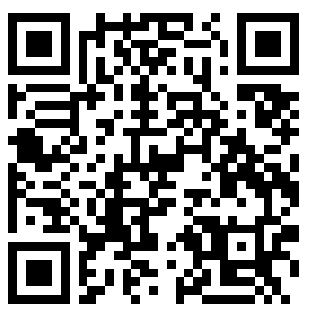

::: {.columns}
::: {.column width="58%"}
Scannez le **code QR**, ou rendez-vous sur [Wooclap](https://app.wooclap.com/UCNTBJY).

**Code de l’évènement : UCNTBJY**

Gardez l’onglet ouvert : les questions apparaitront dans Wooclap au fil de l’activité.
:::

::: {.column width="42%"}
[{fig-alt="QR de connexion à l’évènement Wooclap UCNTBJY" width="480"}](https://app.wooclap.com/UCNTBJY)
:::
:::
