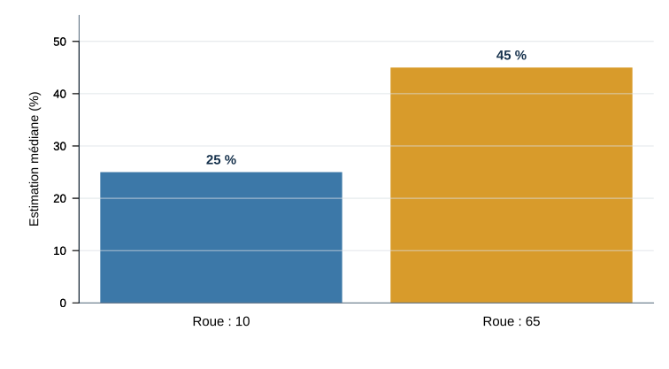

## Quiz de lecture 2 — 1,25 %

**Chapitre 3 et cours 3 · Travail individuel**



::: {.notes}
Réserver dix minutes au début de la séance. Les questions évaluées et leur corrigé demeurent dans Box et ne doivent pas apparaitre dans cette source publique. Vérifier la connexion UQAR avant le début. Le quiz utilise le code PCLEFBG, distinct de l’évènement d’engagement.
:::

## Quiz et examen — quoi préparer?

**6 octobre — Quiz 3 (1,25 %) : chapitre 4 et cours 4.**

Les **8 meilleurs quiz sur 10** comptent pour **10 %** de la note finale.

**29 septembre — Examen 1 (25 %) : chapitres 1–4 et cours 1–4.**

- 50 % des questions viendront du matériel du **cours** vu en classe
- 50 % des questions viendront du matériel du **manuel** (même si la matière n'a PAS été vue en classe)

Certaines notions enseignées en cours **peuvent** être évaluées même si elles ne figurent pas sur les diapositives et qu'il s'agisse de quelque chose dont nous avons simplement discuté. Cependant, en majorité, je m'en tiens au manuel et aux diapositives. Toute autre ressource ou lien externe n'est pas matière à examen.

## Guide d’étude pour l’examen 1 (25 %)

Le **guide d’étude** sera disponible plus tard cette semaine.

L’examen aura lieu le **29 septembre** et portera sur les **chapitres 1–4** et les **cours 1–4**.

- 50 % des questions viendront du matériel du **cours** vu en classe
- 50 % des questions viendront du matériel du **manuel** (même si la matière n'a PAS été vue en classe)

Pour le manuel, tous les termes en gras aux chapitres évalués seront possiblement examinés à l’examen, plus tout autre concept, théorie, processus, ou principe essentiel qui est mise en évidence dans les chapitres.

## Temps supplémentaire aux examens (25 %)

Si vous avez besoin de temps supplémentaire pour les examens, écrivez dès que possible aux **Services à la communauté étudiante — Aide aux besoins particuliers** à :

[abp-examens-rim@uqar.ca](mailto:abp-examens-rim@uqar.ca)

**AUCUN temps supplémentaire ne pourra être accordé sans leur approbation.**

## Trois acquis visés

1. Expliquer comment les **schémas, la cible, le percevant et le contexte** orientent une perception.
2. Situer une impression sur un continuum allant de la **catégorisation** au traitement individualisé.
3. Repérer une **heuristique ou une attente confirmatoire** et choisir une stratégie de vérification.

::: {.notes}
Présenter le fil conducteur : sélectionner, organiser, juger et interagir. Objectifs alignés sur Vallerand (2021), chapitre 4, p. 106 et 110–136.
:::

## Un même évènement, plusieurs lectures

Vous écrivez à une collègue : « Peux-tu m’envoyer ta partie aujourd’hui? »

Elle répond deux heures plus tard : **« D’accord. »**

Que s’est-il passé?

::: {.fragment}
- Elle est contrariée.
- Elle est pressée.
- Elle répond simplement à la demande.
:::

::: {.notes}
Faire produire silencieusement une première interprétation, puis recueillir trois possibilités. Le comportement observé est maigre; l’interprétation mobilise attentes, contexte et buts. Ce cas reviendra dans l’atelier.
:::

# Partie 1 — Sélectionner et organiser

## La cognition sociale

**Étudier les structures et les processus qui nous permettent de percevoir les personnes et de penser à elles.**

Trois opérations pour la séance :

1. **Sélectionner** ce qui reçoit notre attention
2. **Organiser** l’information avec des schémas
3. **Juger** avec des informations limitées
4. **Interagir** avec une cible qui réagit à son tour

::: {.notes}
Source : Vallerand (2021), chapitre 4, p. 108–111 et 131–135. Le traitement de l’information sociale est dynamique : cible, percevant et contexte s’influencent. Faire le lien avec le cours 3 : les schémas sur le soi constituent une famille de schémas.
:::

## Un système dynamique

| **Percevant** | **Contexte** | **Cible** |
|---|---|---|
| Motivation, humeur, distance psychologique | Saillance, amorçage, charge cognitive | Comportement, apparence, culture |

Ces éléments influencent les schémas activés, le rappel, le jugement et la profondeur du traitement.

**La cible peut ensuite réagir au comportement du percevant.**

::: {.notes}
Synthèse originale de la figure 4.1 du manuel, p. 110, sans la reproduire. Le modèle regroupe structure des connaissances, caractéristiques du percevant, de la cible et du contexte, puis dynamique du traitement. Annoncer que chaque composante sera reprise dans la séance.
:::

## L’attention est sélective

Nous ne traitons pas avec la même profondeur tout ce qui est disponible.

Attirent notamment l’attention :

- ce qui est **saillant** ou inattendu;
- ce qui correspond à notre **but actuel**;
- ce qui semble **menaçant ou pertinent** pour nous.

**Ce qui attire l’attention devient souvent surreprésenté dans notre interprétation.**

::: {.notes}
Exemple oral : dans une réunion, une intervention très vive peut dominer le souvenir même si elle est brève. Saillance signifie qu’un élément ressort dans un contexte; elle ne signifie pas automatiquement importance objective.
:::

## Un changement sous nos yeux

::: {style="display: flex; justify-content: center;"}

:::

::: {.notes}
Faire regarder sans annoncer le remplacement. À la fin, demander oralement : « Qu’avez-vous remarqué? » Arrêter la vidéo avant de quitter la diapositive. Vidéo publiée par Daniel Simons, à partir de l’étude de Simons et Levin (1998), https://doi.org/10.3758/BF03208840. Démonstration inspirée de son usage dans le cours de Caroline Blais.
:::

## Le remplacement passe inaperçu

| 1 | 2 | 3 |
|---|---|---|
| Une personne demande son chemin | Une porte bloque brièvement la vue | Une autre personne poursuit la conversation |

**Environ la moitié des passants n’ont pas remarqué le changement de personne.**

::: {.credit}
Simons et Levin (1998)
:::

::: {.notes}
Dans l’étude originale, un expérimentateur demandait son chemin à un passant; deux personnes transportant une porte interrompaient brièvement la vue et un autre expérimentateur prenait sa place. Environ la moitié des passants ont détecté le changement. La démonstration montre qu’un changement important peut échapper à l’attention dans une interaction réelle. Source primaire : Simons et Levin (1998), https://doi.org/10.3758/BF03208840.
:::

## Traitement ascendant et descendant

| Source du traitement | Question |
|---|---|
| **Ascendant** | Quels indices la situation fournit-elle? |
| **Descendant** | Quels schémas, buts et souvenirs organisent ces indices? |

L’impression résulte de leur rencontre, puis dépend de ce qui sera encodé et récupéré.

::: {.notes}
Distinction mise en valeur dans le cours de Caroline Blais et compatible avec Vallerand (2021), p. 108–115. Utiliser le message « D’accord. » : le texte et la ponctuation fournissent les indices ascendants; les attentes et les souvenirs contribuent au traitement descendant. Les deux sources interagissent.
:::

## Les schémas organisent l’expérience

Un **schéma** est une structure de connaissances qui organise ce que nous savons d’un objet, d’une personne, d’un rôle ou d’une situation.

Il aide à :

- orienter l’attention;
- combler des éléments manquants;
- interpréter rapidement;
- guider la mémoire et l’action.

::: {.notes}
Source : Vallerand (2021), p. 111–114. Rappel du cours 3, élargi au traitement social. Les schémas poursuivent un objectif d’économie mentale lorsque l’information est abondante et l’attention limitée.
:::

## Quatre familles de schémas

| Famille | Ce qu’elle organise | Exemple |
|---|---|---|
| **Soi** | Connaissances sur soi | « Je suis méthodique » |
| **Personnes** | Traits associés à une personne ou un prototype | Une personne chaleureuse |
| **Rôles ou groupes sociaux** | Attentes liées à une position ou une catégorie | Le rôle de porte-parole |
| **Évènements** | Séquence habituelle d’une situation | Le scénario d’un restaurant |

::: {.notes}
Source : Vallerand (2021), p. 111–114. Les schémas sur les groupes sociaux peuvent prendre la forme de stéréotypes comprenant des dimensions cognitives, affectives et comportementales. Garder ce point bref : les préjugés seront approfondis au cours 13. Un prototype est une représentation abstraite des caractéristiques typiques d’une catégorie, pas une description de chaque membre.
:::

## Une même personne, différents schémas activés

**Alex coupe la parole pendant une discussion.**

Selon le contexte, ce comportement peut être lu comme :

| Contexte activé | Interprétation possible |
|---|---|
| Urgence | Alex veut éviter une erreur |
| Débat compétitif | Alex veut dominer l’échange |
| Collaboration familière | Alex manifeste son enthousiasme |

**Le comportement ne change pas; le cadre d’interprétation change.**

::: {.notes}
Exemple original. Faire nommer les indices qui permettraient de choisir entre les lectures plutôt que de décider immédiatement laquelle est vraie.
:::

## Accessibilité : ce qui vient facilement à l’esprit

Un concept **accessible** a davantage de chances d’être utilisé pour interpréter une information ambiguë.

L’accessibilité peut venir :

- d’une activation très récente;
- d’un usage fréquent;
- d’un but ou d’une préoccupation du moment.

::: {.notes}
Source : Vallerand (2021), p. 114–115. Exemple : après avoir discuté de compétition, une interruption peut être plus facilement interprétée comme dominatrice. Distinguer accessibilité momentanée et disponibilité chronique.
:::

## Amorçage : une idée rendue momentanément accessible

Une exposition préalable peut faciliter l’utilisation ultérieure d’un concept, parfois sans que ce lien soit le but conscient de la personne.

**Exemple pédagogique :** lire plusieurs mots liés à l’entraide pourrait rendre une interprétation coopérative plus accessible.

::: {.notes}
Source : Vallerand (2021), p. 110, 114 et 127. Exemple hypothétique, pas résultat d’une étude présentée. L’amorçage dépend des procédures et du contexte; éviter les affirmations spectaculaires sur des comportements complexes.
:::

## Quel schéma devient actif?

| Source | Exemple d’influence |
|---|---|
| **Cible** | Comportement, apparence, familiarité |
| **Percevant** | Motivation, humeur, distance psychologique |
| **Contexte** | Saillance, intensité, charge cognitive, amorçage |

**Le même comportement peut donc activer des schémas différents.**

::: {.notes}
Source : Vallerand (2021), p. 115–123. La cible contribue par ses actions et son apparence; le percevant par ses buts, son humeur et la distance psychologique; le contexte par ce qui rend certains indices saillants ou accessibles. Les caractéristiques associées à des catégories sociales peuvent aussi déclencher des attentes stéréotypées.
:::

## Distance psychologique

Un évènement perçu comme **lointain** tend à être représenté de façon plus abstraite.

Un évènement perçu comme **proche** tend à être représenté avec davantage de détails concrets.

**Préparer un voyage l’an prochain :** « découvrir une région »  
**Préparer le départ demain :** horaire, bagages et trajet

::: {.notes}
Source : Vallerand (2021), p. 118–119, théorie des niveaux de construit de Trope et Liberman. La distance peut être temporelle, spatiale, sociale ou liée à la probabilité. L’exemple du voyage adapte celui du manuel.
:::

## Culture et attention au contexte

Certaines traditions culturelles favorisent davantage :

- une perception **analytique**, centrée sur l’objet focal;
- une perception **holistique**, attentive aux relations et au contexte.

**Ces tendances moyennes ne permettent pas de déduire la perception d’une personne.**

::: {.notes}
Source : Vallerand (2021), p. 122–123, synthèse de travaux associés notamment à Nisbett. Le manuel oppose des tendances observées dans plusieurs échantillons nord-américains et est-asiatiques. Éviter d’en faire deux catégories fixes ou d’attribuer un style à une personne d’après son origine.
:::

## Connectez-vous à Wooclap {#connexion-ronde-1}



**Ronde 1** · Consolidation de la partie 1

[Passer à la pause](#pause-1)

::: {.notes}
Emplacement réservé. Les questions, réponses et le débreffage seront construits seulement à l’étape finale avec le quiz Wooclap. Le lien permet de reprendre sans parcourir ultérieurement les diapositives archivées de questions.
:::

## Ronde 1 — questions dans Wooclap

**Sélectionner · Organiser · Vérifier**

Les questions seront affichées dans Wooclap.

::: {.notes}
Ne pas transformer cette diapositive en banque provisoire. Prévoir éventuellement trois questions : attention/saillance, schéma/accessibilité et information qui pourrait contredire une interprétation. À finaliser seulement à l’étape 4.
:::

## Pause 1 — 10 minutes {#pause-1}

Envoyez vos suggestions de **chansons** ou photos de **votre animal de compagnie** directement sur Wooclap.



::: {.notes}
L’activité ouverte de pause sera ajoutée au fichier d’import à l’étape 4. Prévoir réponses multiples, mentions J’aime, images autorisées, compte à rebours de dix minutes et affichage en liste ou en grille; modération désactivée.
:::

## Atelier — l’énigme du « D’accord. » {#atelier}

Votre collègue répond **« D’accord. »** deux heures après votre demande.

En équipe de **3 ou 4**, produisez :

1. **trois interprétations** plausibles;
2. pour chacune, l’**indice** qui vous y conduit;
3. une **question ou observation** qui permettrait de mieux les départager.

**Une personne porte-parole présentera votre meilleur test.**

::: {.notes}
Atelier principal de 22 minutes : 2 minutes de consigne et formation; 9 minutes de production; 7 minutes de partage; 4 minutes de débreffage. Faire varier la composition des équipes tout en respectant les accommodements de proximité. La production attendue est un petit tableau hypothèse–indice–test. Le but n’est pas de trouver la « vraie » humeur de la collègue, mais d’apprendre à générer et discriminer des interprétations.
:::

## Atelier — un canevas pour raisonner

| Interprétation | Indice utilisé | Ce qui la distinguerait des autres |
|---|---|---|
| Elle est contrariée | Réponse brève | Demander si la demande pose un problème |
| Elle est pressée | Délai et brièveté | Vérifier sa charge de travail aujourd’hui |
| Elle répond simplement | Contenu conforme | Comparer à son style habituel de messages |

**Une bonne vérification peut modifier notre première histoire.**

::: {.notes}
Ne révéler le canevas qu’après quelques minutes si les équipes bloquent, ou l’utiliser au débreffage. Souligner que le ton ne se lit pas directement dans un message bref. Plusieurs questions peuvent aussi influencer la relation : privilégier une formulation neutre.
:::

# Partie 2 — Juger avec des informations limitées

## Deux modes de traitement

| Traitement rapide | Traitement plus délibéré |
|---|---|
| Peu d’effort conscient | Davantage d’attention et d’effort |
| S’appuie sur associations et habitudes | Compare plus explicitement les possibilités |
| Utile pour agir vite | Utile lorsque l’enjeu ou l’ambiguïté augmente |

**Le traitement rapide n’est pas toujours erroné; le traitement délibéré n’est pas infaillible.**

::: {.notes}
Source : Vallerand (2021), p. 126–127. Le manuel emploie processus délibérés ou contrôlés et processus automatiques ou implicites. Le temps, la motivation et la capacité influencent la profondeur du traitement.
:::

## Une démonstration collective de l’IAT

Répondez en levant une main aussi rapidement que possible.

- La catégorie de **gauche** correspond à la main gauche.
- La catégorie de **droite** correspond à la main droite.
- Une erreur n’a aucune conséquence. Corrigez simplement votre réponse.

**Nous cherchons à comprendre la tâche, pas à mesurer votre résultat.**

::: {.notes}
Présenter cette activité comme une imitation collective du Test d’association implicite. Aucun temps de réponse individuel n’est enregistré et cette courte séquence ne permet aucune interprétation personnelle. Demander aux étudiantes et étudiants de garder les mains libres et d’éviter de regarder les réponses des autres.
:::

## Entraînement 1

MAIN GAUCHE <strong>CHAT</strong>

MAIN DROITE <strong>CHIEN</strong>

**Deux essais pour prendre le rythme.**

## Essai {data-transition="none"}

MAIN GAUCHE <strong>CHAT</strong>

MAIN DROITE <strong>CHIEN</strong>

MIAOU

## Essai {data-transition="none"}

MAIN GAUCHE <strong>CHAT</strong>

MAIN DROITE <strong>CHIEN</strong>

CHIOT

## Entraînement 2

MAIN GAUCHE <strong>MOI</strong>

MAIN DROITE <strong>AUTRUI</strong>

**Deux nouveaux essais.**

## Essai {data-transition="none"}

MAIN GAUCHE <strong>MOI</strong>

MAIN DROITE <strong>AUTRUI</strong>

JE

## Essai {data-transition="none"}

MAIN GAUCHE <strong>MOI</strong>

MAIN DROITE <strong>AUTRUI</strong>

LEUR

## Premier jumelage

MAIN GAUCHE <strong>CHAT ou MOI</strong>

MAIN DROITE <strong>CHIEN ou AUTRUI</strong>

**Même règle, quatre essais rapides.**

::: {.notes}
Enchaîner les quatre diapositives suivantes rapidement. Observer le groupe sans commenter les différences individuelles.
:::

## Essai {data-transition="none"}

MAIN GAUCHE <strong>CHAT ou MOI</strong>

MAIN DROITE <strong>CHIEN ou AUTRUI</strong>

CHATON

## Essai {data-transition="none"}

MAIN GAUCHE <strong>CHAT ou MOI</strong>

MAIN DROITE <strong>CHIEN ou AUTRUI</strong>

JE

## Essai {data-transition="none"}

MAIN GAUCHE <strong>CHAT ou MOI</strong>

MAIN DROITE <strong>CHIEN ou AUTRUI</strong>

CANIN

## Essai {data-transition="none"}

MAIN GAUCHE <strong>CHAT ou MOI</strong>

MAIN DROITE <strong>CHIEN ou AUTRUI</strong>

EUX

## Jumelage inversé

MAIN GAUCHE <strong>CHAT ou AUTRUI</strong>

MAIN DROITE <strong>CHIEN ou MOI</strong>

**La règle vient de changer. Quatre autres essais.**

::: {.notes}
Laisser quelques secondes pour lire les nouvelles catégories, puis reprendre un rythme rapide.
:::

## Essai {data-transition="none"}

MAIN GAUCHE <strong>CHAT ou AUTRUI</strong>

MAIN DROITE <strong>CHIEN ou MOI</strong>

JE

## Essai {data-transition="none"}

MAIN GAUCHE <strong>CHAT ou AUTRUI</strong>

MAIN DROITE <strong>CHIEN ou MOI</strong>

MIAOU

## Essai {data-transition="none"}

MAIN GAUCHE <strong>CHAT ou AUTRUI</strong>

MAIN DROITE <strong>CHIEN ou MOI</strong>

LEUR

## Essai {data-transition="none"}

MAIN GAUCHE <strong>CHAT ou AUTRUI</strong>

MAIN DROITE <strong>CHIEN ou MOI</strong>

CHIOT

## Qu’avez-vous remarqué?

Dans quel jumelage avez-vous dû réfléchir davantage, même légèrement?

L’IAT compare la facilité avec laquelle une personne classe des stimuli lorsque deux concepts partagent la même réponse.

**Notre démonstration ne mesure aucun effet individuel.** Elle comporte trop peu d’essais, ne mesure pas les temps de réponse et impose le même ordre à tout le groupe.

::: {.notes}
Recueillir quelques impressions. Une hésitation peut venir du changement de règle, de la familiarité avec les mots, de la latéralité ou du fait de regarder les autres. Éviter d’attribuer une préférence implicite à une personne ou au groupe. La véritable tâche utilise beaucoup plus d’essais, enregistre la vitesse et les erreurs, puis compare les blocs.
:::

## Essayer un véritable IAT

Project Implicit propose plusieurs tests en français.

[Accéder à Project Implicit Canada](https://implicit.harvard.edu/implicit/user/demo.canadafr/demo.canadafr.demo.canadafr.2004.001/static/takeatest.html){.btn .btn-primary target="_blank" rel="noopener noreferrer"}

La participation est volontaire. Les résultats demandent une interprétation prudente et peuvent varier d’une passation à l’autre.

::: {.notes}
Le site présente des activités de recherche. Ne pas exiger une participation ni demander aux étudiantes et étudiants de révéler leur résultat. Source consultée : Project Implicit Canada, page « Participer à un test ».
:::

## Un continuum de formation d’impression

1. **Catégorisation initiale** : une catégorie accessible fournit une première lecture.
2. **Catégorisation confirmatoire** : les informations compatibles renforcent cette lecture.
3. **Recatégorisation** : une sous-catégorie ou un nouveau schéma intègre les écarts.
4. **Traitement individualisé** : les attributs particuliers de la personne dominent le jugement.

**Une information difficile à intégrer peut déplacer le traitement vers l’étape suivante.**

::: {.notes}
Source : Vallerand (2021), p. 124–126, continuum de Fiske et collaborateurs. Le traitement individualisé demande généralement davantage de ressources. Le modèle ne dit pas que toute impression parcourt nécessairement les quatre étapes.
:::

## Plusieurs informations, une seule impression

Deux façons de former une impression :

- **modèle algébrique** : combiner les informations avec un poids différent;
- **modèle configurationnel** : interpréter chaque information à la lumière des autres et d’un schéma global.

Une information négative ou inhabituelle peut recevoir davantage de poids parce qu’elle est plus diagnostique.

::: {.notes}
Source : Vallerand (2021), p. 123–125. Anderson représente l’approche algébrique; Asch et les modèles de schémas illustrent l’approche configurationnelle. « Froid » ne prend pas exactement le même sens au milieu d’autres traits différents.
:::

## Une heuristique

Une **heuristique** est une règle de jugement simple qui réduit l’effort nécessaire.

Elle peut donner une réponse utile rapidement, mais certains contextes la rendent prévisible­ment trompeuse.

**Question diagnostique : quelle information remplace-t-on par une information plus facile à utiliser?**

::: {.notes}
Source : Vallerand (2021), p. 127–129. Le manuel retient cinq familles : représentativité, disponibilité, simulation, ancrage et affect. Ne pas présenter les heuristiques comme des défauts de personnalité.
:::

## Disponibilité : « Est-ce que des exemples me viennent facilement? »

Nous pouvons estimer la fréquence ou la probabilité d’un évènement à partir de la **facilité avec laquelle des exemples viennent à l’esprit**.

Cette facilité dépend aussi de :

- la récence;
- la vivacité;
- la répétition médiatique;
- l’expérience personnelle.

**Schwarz et ses collègues (1991) :** après avoir rappelé **6** comportements assurés, les personnes se jugeaient plus assurées qu’après avoir peiné à en rappeler **12**.

::: {.notes}
Exemple relevé dans le cours de Caroline Blais, puis vérifié dans la source primaire : Schwarz et al. (1991), https://doi.org/10.1037/0022-3514.61.2.195. La difficulté de produire douze exemples devient elle-même informative : « si c’est difficile, je dois être moins assuré que je le pensais ». Demander de prédire si 6 ou 12 exemples conduiraient à la cote la plus élevée avant de révéler le résultat. La disponibilité peut être informative lorsque la facilité de rappel reflète bien la fréquence réelle.
:::

## Représentativité : « À quoi ce cas ressemble-t-il? »

Nous pouvons juger qu’un cas appartient à une catégorie parce qu’il ressemble au **prototype** de cette catégorie.

Deux informations risquent alors d’être négligées :

- la fréquence de base des catégories;
- la qualité réelle des indices disponibles.

::: {.notes}
Exemple oral sans personnage stéréotypé : un test imparfait pour une condition rare. La ressemblance est parfois informative, mais doit être combinée aux taux de base et à la validité des indices.
:::

## Simulation : « Puis-je facilement imaginer une autre issue? »

Nous pouvons juger une issue à partir de la facilité avec laquelle nous pouvons **simuler mentalement** ce qui aurait pu arriver.

Une autre issue facile à imaginer peut intensifier :

- le regret après une décision;
- le soulagement d’avoir évité un résultat;
- l’impression qu’un évènement était prévisible.

::: {.notes}
Source : Vallerand (2021), p. 128. L’heuristique par simulation soutient les raisonnements contrefactuels. Exemple oral : rater un train de deux minutes suscite souvent davantage de contrefactuels que le rater de trente minutes.
:::

## Ancrage : partir d’une valeur

Une valeur initiale peut servir de **point de départ**, puis l’ajustement demeure insuffisant.

L’ancre peut venir :

- d’une question;
- d’un prix affiché;
- d’une première estimation;
- même d’une valeur arbitraire.

::: {.notes}
Préparer l’étude de Tversky et Kahneman. Recueillir une prédiction individuelle avant de révéler les résultats : une roue truquée donnant 10 ou 65 devrait-elle influencer une estimation qui ne lui est pas logiquement liée?
:::

## Prédisez le résultat

**Tversky et Kahneman (1974)**

Une roue s’arrête à **10** ou **65**. Les personnes doivent ensuite estimer :

> Quel pourcentage des pays membres de l’ONU se trouve en Afrique?

La valeur arbitraire de la roue influencera-t-elle l’estimation médiane?

::: {.notes}
Faire voter à main levée ou réfléchir individuellement; fermer la prédiction avant les résultats. La formulation historique parlait de nations africaines parmi les Nations Unies. La roue était arrangée pour s’arrêter à 10 ou 65. Ne pas présenter la prédiction pédagogique comme un préenregistrement scientifique.
:::

## Une valeur arbitraire déplace le jugement

{fig-alt="Deux barres : après une roue indiquant 10, l’estimation médiane est de 25 pour cent; après une roue indiquant 65, elle est de 45 pour cent." width="1050"}

**Roue : 10 → estimation médiane : 25 %**  
**Roue : 65 → estimation médiane : 45 %**

::: {.credit}
Redessin original dans R · Valeurs rapportées par Tversky et Kahneman (1974), *Science*, https://doi.org/10.1126/science.185.4157.1124
:::

::: {.notes}
Résultats réels rapportés dans l’article, et non données simulées. Expliquer le profil : les personnes savaient que la roue était aléatoire, mais l’estimation demeurait déplacée vers le nombre initial. L’article regroupe plusieurs démonstrations; la figure reproduit uniquement les deux médianes explicitement rapportées pour cet exemple.
:::

## Pourquoi l’ancre persiste-t-elle?

Une ancre peut :

- fournir un point de départ pour l’ajustement;
- rendre accessibles des informations compatibles;
- sembler pertinente dans une situation incertaine.

**Comparer plusieurs points de référence avant de décider réduit la dépendance à une seule valeur.**

::: {.notes}
Présenter ces mécanismes comme des explications complémentaires développées dans la littérature, pas comme une conclusion unique de l’expérience de 1974. Stratégie concrète : produire d’abord une estimation indépendante ou considérer une ancre opposée plausible.
:::

## Le rôle de l’affect

Nos réactions affectives peuvent fournir rapidement une information de valeur :

- attirant ou repoussant;
- sûr ou menaçant;
- agréable ou désagréable.

L’**heuristique affective** consiste à utiliser cette réaction comme raccourci pour juger un risque, une préférence ou une décision.

::: {.notes}
Source : Vallerand (2021), p. 128–129. Exemple oral : une humeur liée à une journée difficile colore l’évaluation d’un échange ambigu. Ne pas opposer émotion et cognition comme deux systèmes étanches; l’affect fait partie du traitement de l’information.
:::

## Corriger un premier jugement demande des ressources

Réviser une impression devient plus probable lorsque :

- l’enjeu est important;
- une contradiction est visible;
- nous avons du temps et de l’attention;
- une norme nous invite à justifier notre conclusion.

**Ralentir aide surtout si l’on sait quoi vérifier.**

::: {.notes}
Faire le lien avec l’atelier : générer plusieurs hypothèses et chercher un indice discriminant donne une tâche précise au traitement délibéré. La motivation seule ne garantit pas une correction si les mêmes informations sont réutilisées.
:::

## Une boîte à outils de vérification

| Risque | Question à se poser |
|---|---|
| Première impression dominante | Quelle autre explication est plausible? |
| Exemple très mémorable | Quelle est la fréquence de base? |
| Ressemblance convaincante | Quelle est la qualité des indices? |
| Autre issue facile à imaginer | Quelles autres issues étaient réellement possibles? |
| Nombre initial saillant | Quelle estimation ferais-je sans ce nombre? |

::: {.notes}
Tableau de consolidation, non protocole universel. Faire choisir la question la plus utile pour le cas du « D’accord. » : autre explication et qualité des indices.
:::

## Pause 2 — 10 minutes {#pause-2}

Envoyez vos suggestions de **chansons** ou photos de **votre animal de compagnie** directement sur Wooclap.



::: {.notes}
L’activité ouverte de pause sera ajoutée au fichier d’import à l’étape 4 avec les mêmes réglages que la pause 1.
:::

## La vérification confirmatoire

Une attente peut orienter :

- les questions posées;
- les réponses obtenues;
- l’interprétation des réponses;
- ce qui sera retenu ensuite.

**Question utile : qu’est-ce que j’observerais si mon interprétation était fausse?**

::: {.notes}
Source : Vallerand (2021), p. 117 et 131–132. Exemple du manuel : des questions orientées vers l’introversion ou l’extraversion peuvent susciter des réponses qui semblent confirmer l’hypothèse. Ne pas assimiler toute attente à une erreur : certaines attentes résument de l’information valable.
:::

## La cible réagit au percevant

1. Le percevant forme une **attente**.
2. Cette attente modifie son **comportement envers la cible**.
3. La cible réagit à ce comportement.
4. Sa réaction peut sembler confirmer l’attente initiale.

Une **prophétie autoréalisante** transforme ainsi une croyance initialement erronée en interaction qui produit le comportement attendu.

::: {.notes}
Source : Vallerand (2021), p. 131–135, figure 4.4. Donner un exemple prudent : s’attendre à une personne froide, lui parler peu, puis interpréter sa réserve comme une confirmation. Le manuel note que les effets varient et restent généralement modestes; les cibles peuvent résister ou modifier l’interaction.
:::

## Transformer un désaccord en question vérifiable

Au lieu de : **« Tu interprètes mal son message. »**

Essayer :

1. Qu’avons-nous réellement observé?
2. Quelles interprétations concurrentes avons-nous?
3. Quel indice les distinguerait?
4. Comment obtenir cet indice sans détériorer l’échange?

::: {.notes}
Réutiliser une proposition d’équipe. Ce cadre articule cognition sociale et compétence relationnelle, sans supposer qu’une vérification directe soit toujours possible ou souhaitable.
:::

## Connectez-vous à Wooclap {#connexion-ronde-2}



**Ronde 2** · Consolidation de la partie 2

[Reprendre après la ronde](#synthese)

::: {.notes}
Emplacement réservé. Les questions et le fichier d’import seront créés à l’étape 4. Prévoir un délai de récupération après plusieurs diapositives, puis un débreffage centré sur disponibilité, représentativité, ancrage et stratégie de vérification.
:::

## Ronde 2 — questions dans Wooclap

**Disponibilité · Représentativité · Ancrage · Vérification**

Les questions seront affichées dans Wooclap.

::: {.notes}
Ne pas ajouter de questions administrables à cette première version. Cette diapositive maintient l’architecture publique et sera suivie des questions archivées à l’étape 4.
:::

## Trois acquis à emporter {#synthese}

1. Les schémas, la cible, le percevant et le contexte orientent **ce qui devient significatif**.
2. Une impression peut passer de la **catégorisation** à un traitement plus individualisé.
3. Les heuristiques et les attentes se vérifient mieux lorsqu’on cherche une **information discriminante**.

::: {.notes}
Faire revenir au cas initial : distinguer observation, interprétation et test. Demander un exemple de question de vérification à emporter.
:::

## Quiz et examen — quoi préparer?

**6 octobre — Quiz 3 (1,25 %) : chapitre 4 et cours 4.**

Les **8 meilleurs quiz sur 10** comptent pour **10 %** de la note finale.

**29 septembre — Examen 1 (25 %) : chapitres 1–4 et cours 1–4.**

- 50 % des questions viendront du matériel du **cours** vu en classe
- 50 % des questions viendront du matériel du **manuel** (même si la matière n'a PAS été vue en classe)

Certaines notions enseignées en cours **peuvent** être évaluées même si elles ne figurent pas sur les diapositives et qu'il s'agisse de quelque chose dont nous avons simplement discuté. Cependant, en majorité, je m'en tiens au manuel et aux diapositives. Toute autre ressource ou lien externe n'est pas matière à examen.

## Après l’examen

**6 octobre · L’attribution**

Lecture : **Vallerand, chapitre 5**

Comment expliquons-nous les comportements d’autrui et les nôtres?
