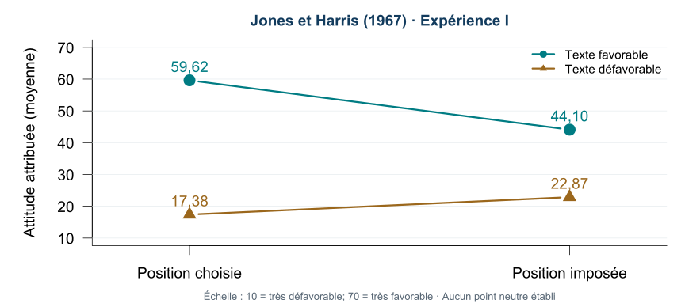

## Quiz de lecture 3 — 1,25 %

**Chapitre 4 et cours 4 · Travail individuel**



::: {.notes}
Réserver 10 minutes. Quiz évalué ECAXDXK, distinct du formatif LNIHHZZ. Vérifier la connexion UQAR avant le début. Questionnaire et clé restent dans Box. Ne pas utiliser le mode de repli collectif des rondes pour ce quiz. Respecter les accommodements.
:::

## Quiz et examen — quoi préparer?

**13 octobre — Quiz 4 (1,25 %) : chapitre 5 et cours 6.**

Les **8 meilleurs quiz sur 10** comptent pour **10 %** de la note finale.

**10 novembre — Examen 2 (30 %) : chapitres 5, 6, 8 et 9 et matière enseignée correspondante.**

Temps alloué : **90 minutes**.

- 50 % des questions portent sur le matériel du **cours** vu en classe.
- 50 % portent sur le matériel du **manuel**, même si la matière n’a pas été vue en classe.

Les notions discutées en classe peuvent aussi être évaluées. Les liens externes ne sont pas des lectures supplémentaires à étudier intégralement; les éléments enseignés sont évaluables.

## Du jugement à l’explication

Cours 4 : **comment je perçois une personne.**

Cours 6 : **pourquoi je pense qu’elle agit ainsi.**

Un même comportement peut recevoir plusieurs explications.

::: {.notes}
3 minutes. Faire rappeler observation versus interprétation sans refaire le cours 4.
:::

## Trois objectifs

1. Distinguer les types d’attributions et les causes proposées.
2. Utiliser consensus, distinction et consistance pour comparer des explications.
3. Relier une explication aux biais, aux émotions et à la motivation.

::: {.notes}
Présenter le parcours : outils, première ronde, pause, enquête en équipe, biais et conséquences, seconde ronde.  Les compléments de lecture se trouvent après les sources.
:::

## Andréa arrive en retard

À une réunion d’équipe, **Andréa arrive 15 minutes après le début**.

Votre première explication?

Notez votre première explication et votre confiance de **0 à 100**.

Gardez cette réponse pour la suite.

::: {.notes}
4 minutes : 45 secondes seul avant tout échange, puis 90 secondes en binôme de proximité et deux réponses. Ne pas demander immédiatement une cause situationnelle : conserver la première explication spontanée. Confiance = assurance dans cette explication, pas probabilité scientifique calibrée. Situation fictive; ne pas solliciter des confidences. Faire de l’erreur attributionnelle fondamentale un fil conducteur. Garder les réponses privées pour comparaison au dossier B et à la synthèse; aucun classement de personnes ou d’équipes.
:::

## Une attribution causale

Une **attribution** est une explication de la cause d’un comportement ou d’un évènement.

« Andréa arrive en retard » : observation.

« Andréa manque de respect » : attribution à une disposition.

::: {.notes}
Distinguer expliquer le retard et inférer une disposition durable. Une explication peut être plausible sans être correcte. Cadre historique présenté par Kelley (1973), qui situe les contributions de Heider.
:::

## Trois questions, trois types d’attributions

**Causale :** pourquoi Andréa est-elle en retard?

**Dispositionnelle :** que suggère ce comportement sur ses traits?

**De responsabilité :** dans quelle mesure lui attribue-t-on le blâme?

::: {.notes}
Manuel, p. 140–142; glossaire p. 438. Les trois inférences peuvent s’enchainer, mais ne répondent pas à la même question. Le blâme et le mérite sont des jugements de responsabilité.
:::

## Personne, cible, circonstances

- **Personne** : habitude d’organisation d’Andréa.
- **Cible ou situation particulière** : réunion dont l’horaire est difficile à trouver.
- **Circonstances** : panne du transport ce jour-là.

Plusieurs causes peuvent contribuer au même évènement.

::: {.notes}
Cause interne versus externe est utile, mais ne distingue pas la cible relativement constante d’une circonstance ponctuelle. Kelley (1973), https://doi.org/10.1037/h0034225. Manuel, chapitre 5, p. 148–150; glossaire, p. 440 et 446.
:::

## Expliquer n’est pas excuser

Comprendre une contrainte aide à choisir une action :

- clarifier l’horaire;
- adapter l’organisation;
- discuter d’un engagement non respecté.

**La réponse dépend de l’explication que l’on retient.**

::: {.notes}
Exemple original. Faire distinguer cause, intention et responsabilité : une panne ne nous dit pas si la personne a prévenu l’équipe.
:::

## Comment l’explication se construit

**Théories de l’attribution :** formation des explications.

**Théories attributionnelles :** conséquences des explications.

Heider : nous cherchons à comprendre et à prévoir les actions en reliant la personne à son environnement.

::: {.notes}
Manuel, p. 143–145. Théorie naïve : intentions, efforts et habileté rencontrent les possibilités et difficultés de la situation. Développement historique conceptuel; ne pas le présenter comme une expérience de Heider.
:::

## Quand cherche-t-on une cause?

Des attributions peuvent survenir **spontanément** ou en réponse à une demande.

Une situation inattendue, incertaine ou un échec peut susciter une recherche plus poussée.

Comprendre, prévoir, contrôler; parfois aussi protéger son image.

::: {.notes}
Manuel, p. 143–144. Attributions réactives : demandées ou déclenchées par un besoin d’explication. Désir de contrôle, besoin de structure cognitive et complexité attributionnelle : compléments de lecture.
:::

## Quand une action informe sur une disposition

Une action est plus informative si la personne :

- pouvait choisir autrement;
- connaissait les conséquences;
- avait réellement la capacité d’agir.

Une conduite imposée renseigne moins sur une préférence personnelle.

::: {.notes}
Inférences correspondantes : cadre de Jones et Davis discuté dans Kelley (1973), et testé par Jones et Harris (1967). Conditions préalables à l’inférence d’intention; compléter avec les déterminants présentés ensuite. Manuel, p. 145–147.
:::

## Inférer un trait : quels indices?

Jones et Davis : la correspondance devient plus informative selon :

- le **choix** réel;
- la **désirabilité sociale** de la conduite;
- ses **effets distinctifs**, comparés aux autres choix possibles.

::: {.notes}
Manuel, p. 145–147. Une conduite attendue socialement discrimine moins les dispositions. Effets distinctifs = conséquences propres à l’option choisie; moins elles sont nombreuses, moins les motifs possibles se multiplient. Ne pas confondre avec distinction de Kelley.
:::

## Une conséquence qui départage les choix

Deux stages offrent la même rémunération et le même trajet. Un seul permet de travailler avec des enfants.

Ce choix renseigne davantage sur cet intérêt que si les stages différaient aussi par le salaire, le lieu et l’horaire.

::: {.notes}
Exemple original des effets distinctifs (manuel, p. 146–147). Ce raisonnement suppose que les alternatives sont connues et accessibles; inférence plausible, pas preuve d’un trait.
:::

## Choix ou rôle imposé?

Alex défend une proposition lors d’un débat.

**Cas A :** Alex a choisi cette position.
**Cas B :** la position a été assignée.

Avant de nommer le principe : dans quel cas le discours vous informe-t-il davantage sur son opinion? Quelle information change votre inférence?

::: {.notes}
3 minutes. Exemple original, vote à main levée, réponse A. Un texte imposé peut laisser des indices, mais sa position ne suffit pas à connaitre celle de l’auteur.
:::

## Se connaitre en observant ses actions

**Perception de soi — Bem**

Quand nos indices internes sont peu clairs, nos comportements et leur contexte peuvent nous renseigner sur nos attitudes.

« Je choisis souvent cette activité, même sans récompense : peut-être qu’elle me plait. »

::: {.notes}
Manuel, p. 147–148 et glossaire p. 449. Préciser la condition d’indices internes faibles ou ambigus; ne pas nier toute introspection. Exemple original. Faire le lien avec la connaissance du soi au cours 3.
:::

## Comparer plutôt que deviner

Pour expliquer le retard, chercher des comparaisons :

**D’autres personnes? D’autres réunions? D’autres jours?**

::: {.notes}
Introduire les trois dimensions par les questions, puis leurs noms. Kelley (1973), https://doi.org/10.1037/h0034225. Manuel, chapitre 5, p. 148–150; glossaire, p. 440 et 446.
:::

## Trois indices de covariation

| Indice | Comparaison |
|---|---|
| **Consensus** | D’autres personnes réagissent-elles ainsi à la même cible? |
| **Distinction** | La personne réagit-elle ainsi à d’autres cibles? |
| **Consistance** | La personne réagit-elle ainsi à cette cible à d’autres moments? |

::: {.notes}
Expliquer distinction élevée : le comportement est spécifique à cette cible; consistance élevée : il se répète envers cette même cible. Ne pas confondre variété des cibles et répétition temporelle. Kelley (1973), https://doi.org/10.1037/h0034225. Manuel, chapitre 5, p. 148–150; glossaire, p. 440 et 446.
:::

## Profil orienté vers la personne

Andréa est souvent en retard :

- les autres arrivent à l’heure à cette réunion;
- Andréa arrive aussi en retard à d’autres réunions;
- cela se répète pour cette réunion.

**Consensus faible · distinction faible · consistance élevée**

::: {.notes}
Demander d’abord la cause plausible, puis lire le profil. Attribution à la personne favorisée dans le modèle; il reste possible qu’une contrainte personnelle durable contribue. Kelley (1973), https://doi.org/10.1037/h0034225. Manuel, chapitre 5, p. 148–150; glossaire, p. 440 et 446.
:::

## Profil orienté vers la cible

Pour cette réunion :

- plusieurs personnes sont en retard;
- Andréa est à l’heure à ses autres réunions;
- le retard se répète pour cette réunion.

**Consensus élevé · distinction élevée · consistance élevée**

::: {.notes}
La réunion ou ses propriétés deviennent une explication plausible. Exemple : lieu ou horaire mal indiqué. Le modèle organise une inférence, pas une mesure directe de la cause. Kelley (1973), https://doi.org/10.1037/h0034225. Manuel, chapitre 5, p. 148–150; glossaire, p. 440 et 446.
:::

## Une circonstance ponctuelle

Andréa arrive habituellement à l’heure à cette réunion.

Aujourd’hui, une panne a interrompu le transport.

**Consistance faible : chercher ce qui a changé cette fois-ci.**

::: {.notes}
Ne pas enseigner que consistance faible suffit à prouver quelle circonstance a causé l’effet. Le renseignement sur la panne ajoute un mécanisme concret. Kelley (1973), https://doi.org/10.1037/h0034225. Manuel, chapitre 5, p. 148–150; glossaire, p. 440 et 446.
:::

## Il manque souvent de l’information

Une seule observation ne fournit pas les trois indices.

**Information inconnue ≠ indice faible.**

Quelle comparaison demanderiez-vous avant de conclure?

::: {.notes}
2 minutes de rappel différé sur le cas initial; faire nommer les trois questions sans afficher le tableau précédent. Kelley (1973), https://doi.org/10.1037/h0034225. Manuel, chapitre 5, p. 148–150; glossaire, p. 440 et 446.
:::

## Une autre cause réduit le poids d’un indice

Un vendeur vous complimente.

Le compliment peut refléter une appréciation sincère, mais aussi une incitation à vendre.

**Principe d’ignorement : une cause alternative plausible réduit le poids accordé à une explication.**

::: {.notes}
Principe d’ignorement : terme du manuel (p. 150), correspondant au discounting de Kelley. Ne pas conclure que le vendeur ment ou que deux causes s’annulent. Kelley (1973), https://doi.org/10.1037/h0034225. Manuel, chapitre 5, p. 148–150; glossaire, p. 440 et 446.
:::

## Agir malgré un obstacle

Une personne aide alors que cela lui coute du temps et des efforts.

Un obstacle connu peut rendre la motivation à aider plus informative.

**Principe d’augmentation : l’action malgré un frein renforce une inférence sur une cause facilitante.**

::: {.notes}
Augmentation dans les schémas causaux de Kelley; ce n’est pas une règle permettant de lire la motivation avec certitude. Exemple original. Kelley (1973), https://doi.org/10.1037/h0034225. Manuel, chapitre 5, p. 148–150; glossaire, p. 440 et 446.
:::

## Corriger une première impression demande des ressources

Une lecture cognitive propose :

**Repérer le comportement → inférer une disposition → corriger selon la situation.**

La correction délibérée peut être plus difficile lorsque l’attention est occupée.

::: {.notes}
Manuel, p. 150–153 : approche pragmatique, économie cognitive et modèle de Gilbert. Schéma original résumant un modèle, pas ordre obligé de toute attribution. Rappel différé des indices avant la ronde.
:::

## Connectez-vous à Wooclap {#connexion-ronde-1}



**Ronde 1 · Réflexion individuelle, puis discussion.**

[Reprendre après la ronde](#pause-1)

::: {.notes}
Évènement d’engagement LNIHHZZ. Tester l’accès participant avant la séance. En cas de panne, afficher les questions archivées une par une : 30 secondes seul, vote A/B/C à main levée ou sur papier, discussion puis second vote. Formatif sans points. Le lien de reprise saute uniquement les questions archivées.
:::

## Ronde 1 · Une comparaison temporelle

Andréa est-elle en retard à cette même réunion chaque semaine? Quel indice cherche-t-on?

A. Le consensus. 
B. La consistance. 
C. La distinction.

::: {.notes}
W01 — Réponse B. Même personne, même cible, autres moments : consistance.
:::

## Ronde 1 · Un profil de covariation

Tout le monde rit de ce spectacle; Sam rit rarement d’autres spectacles et rit à chaque représentation de celui-ci. Quelle attribution le profil favorise-t-il?

A. Une propriété du spectacle. 
B. Une disposition de Sam à rire de tout. 
C. Une circonstance exceptionnelle de ce soir.

::: {.notes}
W02 — Réponse A. Consensus, distinction et consistance élevés orientent vers la cible.
:::

## Ronde 1 · Un indice manquant

On ignore si les autres arrivent en retard. Quelle conclusion est justifiée?

A. Le consensus est faible. 
B. Le consensus est élevé. 
C. Le consensus reste inconnu.

::: {.notes}
W03 — Réponse C. L’absence d’information ne donne pas la valeur de l’indice.
:::

## Pause — 10 minutes {#pause-1}

Envoyez vos suggestions de **chansons** ou photos de **votre animal de compagnie** directement sur Wooclap.



::: {.notes}
Dans l’évènement LNIHHZZ, activer la question ouverte de pause : réponses multiples, mentions J’aime, images, compte à rebours de dix minutes; modération désactivée, liste ou grille. Sinon pause libre. Annoncer oralement l’heure du retour. Ne pas publier les propositions ni les photos sans autorisation distincte.
:::

## Atelier : le dossier du retard {#atelier}

**Équipes de trois ou quatre, dans votre équipe Bleus/Ors.**

Produisez :

1. deux explications concurrentes;
2. un tableau des trois indices, avec les inconnues;
3. une question qui départage les explications;
4. un message constructif à Andréa.

**Votre explication permet-elle une prédiction ou une comparaison à vérifier?**

::: {.notes}
25 minutes protégées : 2 minutes consigne, 6 hypothèses, 5 nouveaux indices, 5 rédaction, 7 partage. Une personne porte-parole par équipe; entendre trois équipes, puis synthèse. Proximité et trio au besoin. Aucune expérience personnelle requise.
:::

## Dossier A : ce que vous savez

Andréa a été en retard deux fois à cette réunion.

Les autres personnes arrivent à l’heure.

Vous ne savez rien des autres réunions d’Andréa.

**Quelle information manque avant d’inférer une habitude générale?**

::: {.notes}
Ne pas révéler la réponse immédiatement. Attendu : consensus faible, deux répétitions suggèrent de la consistance mais historique limité, distinction inconnue. Examiner aussi une contrainte de transport spécifique à Andréa. Faire noter une hypothèse de personne et une hypothèse de contexte.
:::

## Dossier B : un nouvel indice

Andréa arrive à l’heure à ses autres réunions.

Cette réunion commence cinq minutes après la fin d’une activité obligatoire située dans un autre bâtiment.

**Reprenez votre première explication et votre confiance.**

Qu’est-ce qui change? Quel trait attribué à Andréa reste à vérifier?

::: {.notes}
Attendu : distinction élevée; profil faible consensus, distinction élevée, répétition envers même cible : interaction personne–cible plausible, pas le profil pur de la cible ni celui de la personne. L’activité obligatoire apporte une contrainte concrète; chercher trajet et possibilités réelles de changement. Faire réviser aussi le message prévu. Comparer réponse initiale et réponse actuelle, sans appeler toute première attribution personnelle une erreur : la contrainte était alors inconnue. Pour analyser l’erreur attributionnelle fondamentale, demander quel poids on donne maintenant à cette contrainte connue et quelles étiquettes personnelles on conserve sans indice suffisant. Changer sa réponse montre ici une révision avec nouvelle information, pas une mesure expérimentale du biais.
:::

## Partager une conclusion révisable

Votre porte-parole présente :

- « Nous pensions que… »
- « Le nouvel indice nous fait privilégier… »
- « Il reste à vérifier… »
- « Nous proposerions… »

::: {.notes}
Demander : « Quel trait avez-vous attribué? Quelle contrainte a changé son interprétation? Que concluriez-vous si cette contrainte était présente pour une autre personne? » Faire comparer une formulation accusatrice et une demande précise. Critères de débreffage : fidélité aux observations, juste classement des indices, hypothèse concurrente, question discriminante et action proportionnée. Vérifier que l’explication ne reformule pas simplement le retard par une étiquette : elle doit permettre une prédiction ou une comparaison. Exemple : une contrainte liée à cette réunion prédit un retard spécifique à cette réunion; une habitude générale conduit à chercher les autres réunions. Aucune note scolaire.
:::

## Jeu de questions : qui parait le plus compétent?

Trois volontaires : **questionneur, répondant, observateur**. Rôles tirés au sort.

Le questionneur choisit **trois questions dont il connait les réponses**.

Le répondant tente d’y répondre. Chacun note ensuite, en privé, son impression de la compétence des deux personnes.

::: {.notes}
10 minutes pour le jeu et le débreffage suivant : 1 minute rôles et consignes, 2 préparation, 2 questions, 1 jugement privé, 4 discussion et transfert. Annoncer avant le jeu que le questionneur choisit les questions et connait les réponses. Questions de connaissances générales, sans information personnelle ni mise en difficulté humiliante. Volontariat, possibilité de passer; l’observateur anime sans jugement public des personnes. Aucun score de cohorte ni collecte de jugements. Illustration pédagogique inspirée de Ross, Amabile et Steinmetz (1977), https://doi.org/10.1037/0022-3514.35.7.485; elle ne garantit pas l’apparition du biais. L’étude originale utilisait dix questions et des rôles assignés aléatoirement. Elle observe notamment chez les répondants et les observateurs une surestimation des connaissances générales des questionneurs malgré l’avantage de leur rôle.
:::

## Le rôle change les possibilités

- Qui choisissait le domaine et la difficulté?
- Que permet réellement d’inférer une bonne réponse?
- Si les rôles étaient inversés, votre jugement changerait-il?

**Distinguer l’avantage du rôle de la compétence générale.**

::: {.notes}
Faire nommer la contrainte connue dès le départ. Éviter de présumer que le groupe a montré le biais : discuter aussi les jugements qui ont tenu compte du rôle. Inversion hypothétique pour le transfert, sans deuxième manche chronométrée. Le cas d’Andréa faisait réviser une attribution avec une information nouvelle; ici, l’avantage situationnel est connu avant le jugement. Transition vers le texte choisi ou imposé. Ross, Amabile et Steinmetz (1977), https://doi.org/10.1037/0022-3514.35.7.485.
:::

## Une étude classique : le texte imposé

Des personnes lisent un texte favorable ou défavorable à Castro.

L’auteur a **choisi** sa position, ou elle lui a été **imposée**.

Les personnes estiment ensuite l’attitude réelle de l’auteur.

::: {.notes}
Présenter le contraste central de l’expérience I; le résultat numérique suivant vient de son tableau 1. Contexte politique historique; l’exercice ne demande aucune opinion sur Castro. Jones et Harris (1967), https://doi.org/10.1016/0022-1031(67)90034-0.
:::

## Votre prédiction

Si la position est imposée, les estimations de l’attitude réelle seront-elles :

A. identiques pour les deux textes;
B. encore différentes selon la position du texte?

**Choisissez avant de voir le résultat.**

::: {.notes}
45 secondes individuellement, vote puis fermer le vote. Consigner seulement une prédiction pédagogique; pas de statistiques de cohorte publiques. Jones et Harris (1967), https://doi.org/10.1016/0022-1031(67)90034-0.
:::

## La position du texte colore encore le jugement

{width="1150" fig-alt="Moyennes de l’expérience I : texte favorable, 59,62 avec choix et 44,10 sans choix; texte défavorable, 17,38 avec choix et 22,87 sans choix. Échelle de 10 à 70."}

::: {.credit}
Moyennes exactes du tableau 1, expérience I · Redessin original dans R · Jones et Harris (1967), p. 6.
:::

::: {.notes}
Le manuel (p. 156) résume le contraste de manière plus catégorique; le tableau original montre une prise en compte partielle de la contrainte. Les personnes tiennent compte de la contrainte, mais donnent encore une attitude davantage conforme au texte même sans choix. Valeurs du tableau 1 de la source primaire, transcription publique consultée sur Scribd : 59,62 et 17,38 avec choix; 44,10 et 22,87 sans choix. Échelle 10–70, sans vrai point neutre selon les auteurs. Aucune barre d’incertitude ajoutée. La figure porte uniquement sur l’expérience I. Sa principale hypothèse d’interaction n’a pas été confirmée; la différence pro–anti persiste sans choix. Ne pas demander de mémoriser ces valeurs. Jones et Harris (1967), https://doi.org/10.1016/0022-1031(67)90034-0.
:::

## Une erreur attributionnelle fondamentale?

On peut accorder trop de poids aux dispositions d’autrui et trop peu aux contraintes.

**Biais de correspondance :** inférer une disposition à partir d’une conduite qui peut être expliquée par la situation.

Pour vérifier :

- quelle liberté d’action avait la personne?
- quel rôle devait-elle remplir?
- quelle contrainte connue change l’interprétation?

::: {.notes}
Le manuel rapproche l’erreur attributionnelle fondamentale de l’inférence de correspondance (p. 155–156); ne pas imposer une séparation terminologique plus forte que la source. Ne pas traiter cette tendance comme une loi universelle.
:::

## Acteur et observateur : l’hypothèse classique

« Moi, j’étais pressé; cette personne est impatiente. »

L’hypothèse acteur–observateur propose davantage de causes situationnelles pour soi, et personnelles pour autrui.

::: {.notes}
Le manuel (p. 159–160) présente l’hypothèse classique et ses mécanismes d’information/attention. La méta-analyse suivante en précise les limites de généralisation.
:::

## Un effet général moins solide qu’attendu

Une méta-analyse de **173 études** trouve une asymétrie moyenne générale très faible.

Le profil dépend notamment du type d’évènement et de sa valence positive ou négative.

**Conserver la distinction des points de vue; éviter une règle universelle.**

::: {.notes}
Malle (2006), https://pubmed.ncbi.nlm.nih.gov/17073526/. Taille moyenne rapportée selon analyses de d = −0,016 à 0,095. La méta-analyse trouve un profil classique pour les évènements négatifs et inversé pour les positifs. Ces chiffres sont des repères enseignants, pas une cible de mémorisation.
:::

## Le contexte culturel change l’attention

Certaines études comparatives trouvent davantage d’attention aux contraintes dans des échantillons japonais que dans des échantillons américains.

Les attentes et la motivation modifient aussi le jugement.

::: {.notes}
Manuel, p. 156–158, présentation secondaire des études comparatives. Décrire des résultats dans des échantillons et tâches; ne pas attribuer une personnalité uniforme à une culture. Les attributions sur la radicalisation dans le manuel sont les explications des répondants, pas les causes établies du phénomène.
:::

## Blâmer après avoir appris le résultat

**Hypothèse du monde juste :** croire que chacun reçoit ce qu’il mérite peut orienter le jugement d’une injustice.

**Biais de connaissance après les faits :** un résultat connu peut sembler avoir été prévisible.

::: {.notes}
Manuel, p. 158–159; glossaire p. 438 et 443. Exemple original : après un vol, affirmer que la victime aurait dû prévoir le danger, en oubliant ce qu’elle savait avant. Identification à la victime peut plutôt mobiliser une recherche de justice.
:::

## Pause — 10 minutes {#pause-2}

Envoyez vos suggestions de **chansons** ou photos de **votre animal de compagnie** directement sur Wooclap.



::: {.notes}
Dans l’évènement LNIHHZZ, activer la question ouverte de pause : réponses multiples, mentions J’aime, images, compte à rebours de dix minutes; modération désactivée, liste ou grille. Sinon pause libre. Annoncer oralement l’heure du retour. Ne pas publier les propositions ni les photos sans autorisation distincte.
:::

## Une explication favorable au soi

Après une réussite : « J’ai de bonnes capacités. »

Après un échec : « Les circonstances étaient défavorables. »

**Biais égocentrique : expliquer plus favorablement ses réussites que ses échecs.**

::: {.notes}
Mezulis et al. (2004), https://pubmed.ncbi.nlm.nih.gov/15367078/. Méta-analyse de 266 études; variabilité selon les échantillons et les contextes culturels. Exemple original. Les explications favorables peuvent parfois être exactes; le biais porte sur le profil systématique.
:::

## Ne pas confondre les biais

| Comparaison | Question |
|---|---|
| Correspondance | Infère-t-on une disposition malgré une contrainte? |
| Acteur–observateur | Explique-t-on différemment soi et autrui? |
| Biais égocentrique | Explique-t-on différemment ses succès et ses échecs? |

::: {.notes}
Faire produire un exemple pour une seule ligne. Distinctions pédagogiques fondées sur Jones et Harris, Malle et Mezulis. Appellations harmonisées avec le chapitre 5 et son glossaire.
:::

## Les causes perçues ont plusieurs dimensions

| Dimension | Question |
|---|---|
| **Lieu** | La cause se situe-t-elle dans la personne ou à l’extérieur? |
| **Stabilité** | La cause devrait-elle persister? |
| **Contrôlabilité** | La personne peut-elle agir sur cette cause? |

**Une cause interne n’est pas forcément contrôlable.**

::: {.notes}
Weiner (1985), https://doi.org/10.1037/0033-295X.92.4.548. Trois dimensions du modèle de motivation et d’émotion. La contrôlabilité concerne une cause perçue; distinguer le contrôle de l’acteur de celui d’autrui si la discussion le nécessite.
:::

## Rendre les dimensions observables

**CDS II — Échelle des dimensions causales**

Après avoir nommé une cause, la situer entre :

- liée à soi ↔ liée à la situation;
- temporaire ↔ durable;
- sous son contrôle ↔ hors de son contrôle.

::: {.notes}
Paraphrases de trois paires du tableau 5.2, manuel p. 142; CDS II (McAuley et al., 1992), version révisée à 12 items. Ce ne sont pas des items littéraux validés en français ni un instrument complet administrable. La révision distingue aussi le contrôle par autrui du contrôle personnel. Aucun score ou diagnostic à calculer.
:::

## Même échec, explications différentes

« Je n’ai pas utilisé une stratégie adaptée. »

« Le système de remise était en panne. »

« Je suis incapable dans tous les domaines. »

**Classez les causes perçues : lieu, stabilité, contrôlabilité.**

::: {.notes}
4 minutes : seul puis binôme. Stratégie : interne, modifiable, contrôle souvent possible mais moyens à préciser. Panne : externe, ponctuelle dans cet énoncé, hors contrôle immédiat de l’étudiant. Incapacité globale : perçue interne et stable, peu contrôlable. Ce sont les croyances du personnage, pas des diagnostics. Weiner (1985), https://doi.org/10.1037/0033-295X.92.4.548.
:::

## Du résultat à l’action : Weiner

**Résultat → explication → dimensions causales → attentes et émotions → action**

Une même note peut donc conduire à des décisions différentes selon la cause perçue.

::: {.notes}
Schéma original du modèle de motivation à l’accomplissement, manuel p. 162–164. Le résultat est d’abord évalué comme succès/échec; émotions générales puis émotions associées aux causes. Lieu lié à l’estime/compétence, stabilité aux attentes, contrôlabilité notamment aux émotions sociales; pas de correspondances exclusives ou automatiques.
:::

## L’émotion dépend aussi de l’interprétation

**Modèle bifactoriel de Schachter**

Activation physiologique + interprétation de sa cause contribuent à l’émotion ressentie.

Un cœur qui accélère peut être interprété différemment selon la situation.

::: {.notes}
Manuel, p. 161–162. Modèle historique. L’expérience classique obtient des résultats plus nets pour l’euphorie que pour la colère; des réplications sont moins concluantes. Ne pas enseigner ces deux facteurs comme une loi suffisante de toute émotion. Exemple original.
:::

## Stabilité et attentes

Une cause perçue comme durable peut faire attendre la répétition du résultat.

Une cause perçue comme temporaire peut laisser attendre un résultat différent.

**Quelle action concrète rendrait la nouvelle explication crédible?**

::: {.notes}
Weiner (1985), https://doi.org/10.1037/0033-295X.92.4.548. La stabilité influence les changements d’attentes; éviter de promettre qu’une reformulation suffit à améliorer la performance. Exemple : comparer une méthode de révision sur des exercices de difficulté semblable.
:::

## Contrôle perçu et relations

La manière d’expliquer une difficulté peut orienter :

- la colère ou la compassion;
- le blâme;
- l’aide proposée.

Avant de juger le contrôle : **quels moyens étaient réellement disponibles?**

::: {.notes}
Weiner (1985), https://doi.org/10.1037/0033-295X.92.4.548. Dans le modèle, les dimensions causales organisent attentes et émotions. Exemple original : retard lié à un choix évitable versus transport interrompu. Ne pas attribuer automatiquement une émotion unique à chaque dimension.
:::

## Une récompense peut changer l’explication

**Motivation intrinsèque :** faire une activité pour le plaisir qu’elle procure.

**Surjustification :** une récompense attendue peut conduire à expliquer une activité aimée par cette récompense.

::: {.notes}
Manuel, p. 165–166, étude du dessin présentée secondairement. Récompense annoncée avant participation : intérêt ultérieur réduit; récompense inattendue ne produit pas le même profil. Ne pas généraliser à toutes les récompenses. Relier perception de soi et ignorement.
:::

## Quand une cause devient globale

**Stabilité :** la cause devrait-elle durer?

**Globalité :** s’applique-t-elle à plusieurs situations?

« Cette méthode a mal fonctionné ici » et « Je suis incapable partout » n’ouvrent pas les mêmes attentes.

::: {.notes}
Manuel, p. 141 et 166–168; glossaire p. 442, 447–448. Globalité est une dimension supplémentaire de la reformulation attributionnelle de la résignation acquise, distincte des trois dimensions de Weiner.
:::

## Résignation et réattribution

Des expériences répétées d’absence de contrôle peuvent diminuer les tentatives d’action.

La **réattribution** vise une explication plus adaptée, accompagnée de moyens concrets de changement.

Stratégie, ressources, aide et contraintes à vérifier ensemble.

::: {.notes}
Manuel, p. 166–168 et 171–172. Résignation acquise : conséquences cognitives, affectives et motivationnelles. Style attributionnel vulnérable et évènements négatifs interagissent; pas de diagnostic individuel à partir d’une phrase. Éviter toujours plus d’effort : après effort maximal et échec répété, cette attribution peut renforcer une inférence d’incapacité. Réattribution distincte de mésattribution physiologique.
:::

## Une rétroaction qui ouvre une action

Au lieu de : **« Tu es désorganisé. »**

« Deux échéances ont été manquées. Quel obstacle s’est répété? Quel changement peut-on essayer? »

**Observation précise → cause à vérifier → action testable.**

::: {.notes}
Application originale du cadre; ne pas affirmer que cette formulation a été directement testée dans les études citées. Faire reprendre le message produit dans l’atelier.
:::

## Connectez-vous à Wooclap {#connexion-ronde-2}



**Ronde 2 · Réflexion individuelle, puis discussion.**

[Reprendre après la ronde](#synthese)

::: {.notes}
Évènement d’engagement LNIHHZZ. Tester l’accès participant avant la séance. En cas de panne, afficher les questions archivées une par une : 30 secondes seul, vote A/B/C à main levée ou sur papier, discussion puis second vote. Formatif sans points. Le lien de reprise saute uniquement les questions archivées.
:::

## Ronde 2 · Une position imposée

Un texte défend une position assignée. Que montre l’étude de Jones et Harris?

A. Les jugements suivent encore en partie la position du texte. 
B. Les personnes ignorent complètement la consigne. 
C. La consigne supprime toute différence de jugement.

::: {.notes}
W04 — Réponse A. La contrainte est prise en compte, mais la correspondance texte–attitude persiste.
:::

## Ronde 2 · Acteur et observateur

Quelle formulation convient le mieux à la synthèse des études présentée?

A. L’asymétrie acteur–observateur est universelle. 
B. L’asymétrie moyenne générale est très faible et dépend du contexte. 
C. Personne ne donne d’explication situationnelle.

::: {.notes}
W05 — Réponse B. Distinguer une hypothèse historique d’un effet général robuste.
:::

## Ronde 2 · Interne et contrôlable

Une fatigue liée à une maladie est une cause interne. Que peut-on conclure?

A. Elle est nécessairement contrôlable. 
B. Elle est nécessairement stable. 
C. Le lieu ne détermine ni le contrôle ni la stabilité.

::: {.notes}
W06 — Réponse C. Trois dimensions distinctes; demander quelles informations supplémentaires les renseigneraient.
:::

## Ronde 2 · Réviser une explication

Après un échec, Jo dit : « Je suis incapable dans tous les domaines. » Quelle réponse ouvre une vérification utile?

A. Confirmer ce trait global. 
B. Identifier les difficultés précises et tester une stratégie adaptée. 
C. Promettre que tout dépend de l’effort.

::: {.notes}
W07 — Réponse B. Une reformulation doit rester crédible et conduire à une action testable; elle ne garantit pas un résultat.
:::

## Trois acquis à emporter {#synthese}

1. Un comportement peut avoir des causes liées à la **personne, à la cible et aux circonstances**.
2. Les **trois indices de covariation** aident à comparer les explications.
3. Une attribution oriente le **jugement, les attentes et l’action**.

::: {.notes}
5 minutes : reprendre l’explication et la confiance notées au début. Faire nommer ce que la contrainte change et ce que l’on peut encore inférer de la personne. Question de transfert : « Quel comportement attribuez-vous vite au caractère, et quelle information de contexte demanderiez-vous? » Utiliser un cas fictif de service à la clientèle ou de débat assigné, sans confidence personnelle. Une réponse par équipe, sans billet de sortie obligatoire. Fil conducteur : prendre en compte le contexte connu sans conclure que la personne ne joue jamais de rôle.
:::

## Quiz et examen — quoi préparer?

**13 octobre — Quiz 4 (1,25 %) : chapitre 5 et cours 6.**

Les **8 meilleurs quiz sur 10** comptent pour **10 %** de la note finale.

**10 novembre — Examen 2 (30 %) : chapitres 5, 6, 8 et 9 et matière enseignée correspondante.**

Temps alloué : **90 minutes**.

- 50 % des questions portent sur le matériel du **cours** vu en classe.
- 50 % portent sur le matériel du **manuel**, même si la matière n’a pas été vue en classe.

Les notions discutées en classe peuvent aussi être évaluées. Les liens externes ne sont pas des lectures supplémentaires à étudier intégralement; les éléments enseignés sont évaluables.

## Pour la prochaine séance

**13 octobre · Cours 7 — Les attitudes · Chapitre 6**

## Sources et état du contenu

[Jones et Harris (1967)](https://doi.org/10.1016/0022-1031(67)90034-0) · [Kelley (1973)](https://doi.org/10.1037/h0034225)

[Weiner (1985)](https://doi.org/10.1037/0033-295X.92.4.548) · [Malle (2006)](https://doi.org/10.1037/0033-2909.132.6.895)

[Ross, Amabile et Steinmetz (1977)](https://doi.org/10.1037/0022-3514.35.7.485) · [Mezulis et al. (2004)](https://doi.org/10.1037/0033-2909.130.5.711)

**Mise à jour : 30 septembre 2026.**

::: {.notes}
Références scientifiques, pas lectures intégrales obligatoires. Vallerand (dir.), Les fondements de la psychologie sociale, 3e éd., chapitre 5, p. 138–174; glossaire, p. 437–449. Les compléments suivants développent les thèmes du manuel sans augmenter le temps de séance prévu. Pas de reproduction d’images ou de pages du manuel; exemples et schéma originaux. Les notes sont publiques.
:::

## Compléments de lecture du chapitre 5

Les thèmes suivants prolongent le parcours de la séance.

Le [guide cumulatif de l’examen 2](../../examens/02/guide.qmd) indique les notions à travailler et l’état des vérifications.

::: {.notes}
Ne pas parcourir obligatoirement ces diapositives en classe. Adapter les développements oraux au temps disponible. Chapitre entier reste lecture associée.
:::

## Pourquoi certaines explications sont plus élaborées

**Désir de contrôle :** vouloir agir sur ce qui arrive.

**Complexité attributionnelle :** élaborer des explications plus riches.

**Besoin de structure cognitive :** rechercher une conclusion claire.

::: {.notes}
Manuel, p. 143–144 et 151; glossaire p. 438–440. Ces dispositions décrivent des tendances, pas des catégories fixes. Économie cognitive : partir d’une cause plausible, approfondir selon le besoin. Approche pragmatique adapte la recherche à la situation.
:::

## Quand l’action nous concerne

**Pertinence hédonique :** l’action a des conséquences pour l’observateur.

**Personnalisme :** l’observateur se sent spécifiquement visé.

Ces interprétations peuvent accentuer l’inférence d’une disposition.

::: {.notes}
Manuel, p. 147; glossaire p. 446. Exemple original : une remarque qui nous gêne versus une remarque que nous croyons dirigée contre nous. Ne pas confondre les deux déterminants motivationnels.
:::

## Imaginer un autre passé

**Raisonnement contrefactuel**

« Si j’avais pris l’autobus précédent… »

Une alternative meilleure peut susciter du regret et préparer une action; une alternative pire peut apporter du soulagement.

::: {.notes}
Manuel, p. 151–153, glossaire p. 447. Alternatives ascendantes/descendantes. Un scénario imaginé n’établit pas la cause réelle. Le regret d’avoir changé une réponse peut conduire à une règle trompeuse consistant à toujours garder le premier choix; pas de conseil automatique sur les examens.
:::

## Un style d’explication à travers les situations

Le **style attributionnel** décrit une manière habituelle d’expliquer les évènements.

L’ASQ utilise des évènements hypothétiques et les dimensions de lieu, de stabilité et de globalité.

Le modèle du **désespoir** relie une vulnérabilité attributionnelle et des évènements négatifs au désespoir, puis aux symptômes dépressifs.

::: {.notes}
Manuel, p. 142–143 et 167; glossaire p. 448. Attributional Style Questionnaire : identifier une cause puis apprécier dimensions pour évènements positifs et négatifs. Aucun item original inventé comme item validé, aucune échelle complète. Optimisme/pessimisme : profils d’attributions; vulnérabilité dans certains modèles, pas diagnostic.
:::

## Blâme personnel et excuses

**Blâme caractériel :** mettre en cause ses traits.

**Blâme comportemental :** mettre en cause une conduite.

Une excuse peut déplacer l’explication vers une cause moins centrale ou extérieure.

::: {.notes}
Manuel, p. 168–169; glossaire p. 438 et 442. Les premiers travaux favorisaient le blâme comportemental; les résultats ultérieurs sont moins uniformes. Ne pas prescrire le blâme aux victimes. Excuses : protection de soi, crédibilité, confiance et possibilité de changement à distinguer; toute explication contextuelle n’est pas une excuse.
:::

## Des effets sur les relations et la santé

Une explication d’un comportement du partenaire peut orienter le blâme et les échanges.

Les styles attributionnels sont aussi étudiés en lien avec le stress, les comportements de santé et l’adaptation.

::: {.notes}
Manuel, p. 169–171, présentation secondaire. Employer langage des associations, sans présenter une reformulation comme traitement ou guérison. Relations : ne pas recommander une interprétation bienveillante qui effacerait un comportement abusif. Causes relationnelles : la relation elle-même comme unité d’explication (p. 151). Effet temporel : recul et perte de détails peuvent changer l’explication (p. 161).
:::

## Mésattribution et réattribution

**Mésattribution :** attribuer une activation physiologique à une autre cause que sa cause réelle.

**Réattribution :** apprendre une explication plus adaptée d’un évènement.

::: {.notes}
Manuel, p. 171–172, glossaire p. 444 et 447. Exemple mésattribution original : attribuer les battements liés à la course à l’anxiété devant une rencontre. Une mésattribution peut modifier l’émotion sans rendre l’explication exacte. Réattribution doit respecter faits et possibilités réelles.
:::
