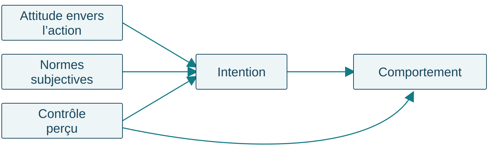
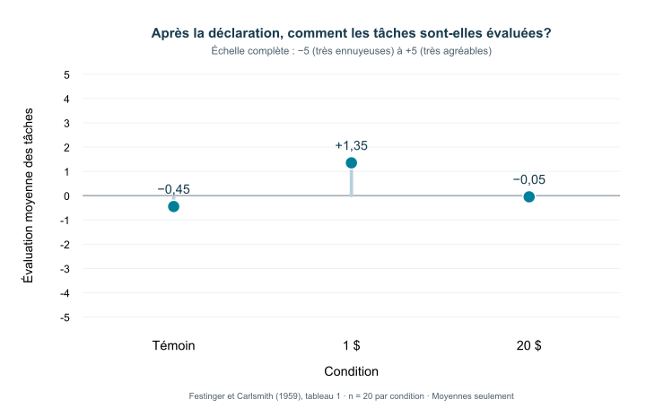

## Quiz de lecture 4 — 1,25 %

**Chapitre 5 et cours 5 · 8 questions · 10 minutes · Travail individuel**





::: {.notes}
10 minutes. Faire ouvrir le quiz avant de lancer le minuteur. Rappeler les accommodements applicables individuellement. Garder les accès du quiz distincts des activités formatives.
:::

## Les prochaines évaluations

**Quiz 5 · 20 octobre · 1,25 %**

8 questions · 10 minutes. Les 8 meilleurs quiz sur 10 comptent pour **10 %**.

**Examen 2 · 10 novembre · 30 %**

Cours **5 à 8** et chapitres **5, 6, 8 et 9**. Répartition annoncée : **50 % cours / 50 % manuel**.

Note : Puisque la plupart des concepts vus dans le cours sont aussi dans le manuel, cela implique que les 50 % des questions associées aux cours seront fort probablement aussi dans le manuel. Ainsi, il est conseillé de donner un peu plus de poids à l’étude des cours plutôt qu’au manuel.

[Guide d’étude de l’examen 2](../../examens/02/guide.qmd)

::: {.notes}
Rappeler les échéances. Préciser oralement le périmètre du quiz 5 selon l’annonce faite à la classe; le lien sera communiqué lorsqu’il sera disponible. Les lectures obligatoires et le partage annoncé restent ceux du cours.
:::

## Plan de la séance

1. **Comprendre une attitude et son lien avec l’action**
2. **Changer d’attitude après avoir agi**
3. **Changer d’attitude en recevant un message**

**Pour commencer :** une personne dit aimer le vélo, mais vient en voiture. Que savons-nous de son attitude? De son déplacement?

::: {.notes}
4 minutes pour les rappels et le plan. Recueillir deux interprétations sans désigner de personne réelle. Distinguer immédiatement une évaluation et une action observée. Ne pas encore demander toute la théorie.
:::

## Comprendre sa correction

Pour chaque difficulté :

1. Repérer **l’opération demandée** : définir, distinguer, appliquer ou expliquer.
2. Relier sa réponse aux **indices du cas**.
3. Formuler une **réponse améliorée** avec un exemple nouveau.

Une question sur votre copie? La consultation individuelle permet d’en discuter.

::: {.notes}
3 minutes au maximum. Présenter les réussites et deux difficultés réellement observées à l’examen en utilisant des exemples nouveaux. Ne pas projeter les questions réutilisables, les copies, les notes individuelles ou les extrêmes de la distribution. Annoncer uniquement des modalités de consultation effectivement offertes. Si aucune difficulté n’est encore documentée, utiliser cette démarche générale sans inventer un bilan.
:::

## Une attitude est une évaluation

Une **attitude** est une évaluation favorable ou défavorable à l’égard d’un objet.

Cet objet peut être une pratique, une personne, un groupe ou une idée.

« Je trouve le transport collectif **souhaitable**. »

L’indice est le jugement porté sur le transport collectif.

::: {.notes}
Définition avant l’application. Le glossaire présente aussi l’attitude comme un affect général envers un objet. Une attitude peut être négative. Contre-exemple : « L’autobus passe à 8 heures » décrit une croyance sans donner à lui seul l’évaluation globale. Une attitude n’est pas nécessairement forte ou entièrement cohérente.
:::

## Évaluer, croire et agir

| Phrase | Information donnée |
|---|---|
| « Le transport collectif est souhaitable. » | Évaluation |
| « Il coute moins cher que ma voiture. » | Croyance |
| « J’ai pris l’autobus mardi. » | Action réalisée |

**L’action seule ne révèle pas directement l’attitude.**

::: {.notes}
Faire justifier chaque classement par un mot de la phrase. Une personne peut prendre l’autobus pour des raisons économiques sans l’apprécier. À l’inverse, elle peut l’apprécier sans pouvoir le prendre. Ne pas conclure à une contradiction morale à partir d’un seul déplacement.
:::

## Croyance, affect et conation

**Croyance** : ce que la personne tient pour vrai à propos de l’objet.

**Affect** : émotion ou sentiment associé à l’objet.

**Conation** : tendance ou préparation à agir à son égard.

Andréa croit que l’autobus est économique, ressent de l’agacement lorsqu’elle attend et envisage de le prendre demain.

::: {.notes}
Le chapitre présente plusieurs modèles de structure. Dans le modèle tripartite classique, on distingue les composantes cognitive, affective et comportementale. Le modèle révisé examine les informations qui contribuent au jugement; ne pas présenter tous ces modèles comme identiques. La conation ne se réduit pas à une action déjà réalisée. Demander quelle information manque encore : notamment le jugement global et le déplacement effectif. Avantages et inconvénients simultanés peuvent donner lieu à une ambivalence.
:::

## Ambivalence ou neutralité?

**Ambivalence** : présence simultanée d’évaluations positives et négatives envers le même objet.

| À propos du télétravail | Évaluation |
|---|---|
| « J’apprécie l’autonomie, mais je déteste l’isolement. » | Positive et négative |
| « Cela m’est indifférent. » | Ni favorable ni défavorable |

Un point médian sur une seule échelle peut masquer cette différence.

::: {.notes}
2 minutes. Distinguer deux évaluations fortes qui coexistent et une absence d’évaluation marquée. Demander quelles questions séparées permettraient d’examiner les aspects positifs et négatifs. Une hésitation dans la réponse ne suffit pas à établir une ambivalence.
:::

## À quoi une attitude peut-elle servir?

- **Connaissance** : organiser et simplifier l’information.
- **Adaptation sociale** : faciliter l’intégration et les relations avec autrui.
- **Expression** : manifester ses valeurs et son identité.
- **Défense du soi** : protéger l’image que l’on a de soi.

Une même attitude peut remplir plusieurs fonctions.

::: {.notes}
2 minutes. Employer les quatre catégories du manuel actuel. La fonction concerne le rôle que joue l’attitude, et non seulement son caractère favorable ou défavorable. Ne pas déduire la fonction de l’objet seul. Pour la défense du soi, exemple fictif : dévaloriser une activité après un échec pour préserver son image de compétence; c’est une hypothèse qui exige des indices.
:::

## Même attitude, fonctions différentes

Deux personnes sont favorables à un jardin collectif.

| Raison exprimée | Fonction illustrée |
|---|---|
| « C’est une façon d’entretenir des liens avec mon voisinage. » | Adaptation sociale |
| « Cela exprime l’importance que j’accorde à l’entraide. » | Expression |

**Quel indice renseigne la fonction, au-delà de l’évaluation favorable?**

::: {.notes}
2 minutes. Cas fictifs. Pointer les liens avec autrui et l’expression d’une valeur. La fonction n’est pas une cinquième composante du comportement planifié. Les catégories peuvent coexister; ces raisons éclairent chacune une fonction sans exclure les autres.
:::

## Attitudes explicites et implicites

Une **attitude explicite** est une évaluation que la personne rapporte consciemment.

Une **attitude implicite** est une évaluation dont l’activation ou l’expression peut échapper au contrôle conscient.

| Mesure | Information recueillie |
|---|---|
| Déclarée | Le jugement que la personne rapporte |
| Indirecte | Un indice de son évaluation dans une tâche |

::: {.notes}
2 minutes. Distinguer l’évaluation et sa mesure. Une réponse déclarée peut être influencée par la présentation de soi. Une mesure indirecte ne donne pas automatiquement accès à une attitude « plus vraie ». Le test d’association implicite compare notamment les temps de réponse entre des associations de catégories et d’évaluations. Un score isolé ne permet pas de diagnostiquer une personne ou de prédire une action particulière. Demander : quelle information collecte-t-on dans chacune des deux approches? Ne pas administrer de test individuel à la classe.
:::

## Rendre l’évaluation observable

**Un item de type Likert** demande le degré d’accord avec un énoncé.

« Prendre la ligne 3 mardi matin pour aller au campus serait une bonne chose. »

**Pas du tout d’accord · Plutôt en désaccord · Ni l’un ni l’autre · Plutôt d’accord · Tout à fait d’accord**

Cette réponse renseigne l’**évaluation déclarée** de l’action.

::: {.notes}
2 minutes. Item original pour l’enseignement, pas échelle validée. Dans une échelle de Likert, plusieurs items peuvent être combinés; un item isolé ne constitue pas à lui seul une échelle validée. Comparer oralement avec « Je compte prendre la ligne 3 mardi », qui mesure une intention, et « J’ai pris la ligne 3 mardi », qui rapporte une action. Un point médian ne permet pas de distinguer à lui seul une attitude neutre et une ambivalence. Les modalités de mesure doivent correspondre au construit et à l’action étudiés. Faire réfléchir sur le libellé, sans recueillir les attitudes personnelles de la classe.
:::

## Un exemple de test d’association implicite

Classer des mots avec deux touches, selon deux associations.

| Bloc | Touche gauche | Touche droite |
|---|---|---|
| A | Fleurs **ou** agréable | Insectes **ou** désagréable |
| B | Insectes **ou** agréable | Fleurs **ou** désagréable |

On compare les **temps de réponse et les erreurs** entre les blocs.

::: {.credit}
Principe illustré d’après [Greenwald, McGhee et Schwartz (1998)](https://doi.org/10.1037/0022-3514.74.6.1464).
:::

::: {.notes}
2 minutes. Illustration du principe, pas administration ni protocole complet. Le classement porte sur les catégories indiquées; les touches partagent une catégorie cible et une catégorie évaluative. Les associations changent entre les blocs. La performance fournit un indice relatif d’association dans cette tâche, pas un accès à une attitude « vraie » ni un diagnostic individuel. Ne pas inventer des temps de réponse ou interpréter un score nul comme une absence de toute attitude. Faire identifier la différence entre les blocs.
:::

## Comparer des informations qui correspondent

« J’aime l’environnement » est une attitude générale.

Pour comprendre un déplacement précis, rapprochons :

| Dimension | Exemple |
|---|---|
| Action | Prendre |
| Cible | La ligne 3 |
| Situation | Pour aller au travail |
| Temps | Mardi matin |

**Quelle est son attitude envers cette action précise?**

::: {.notes}
Distinguer le niveau général de l’objet et le comportement précis. Ne pas promettre une prédiction parfaite même avec une bonne correspondance. Faire reformuler une question : « Comment évalues-tu le fait de prendre la ligne 3 mardi matin pour aller au travail? » plutôt que « Aimes-tu l’environnement? ».
:::

## L’intention précède parfois l’action

**Intention comportementale** : volonté ou projet d’accomplir une action déterminée.

« Je compte prendre la ligne 3 mardi matin. »

**Comportement** : action effectivement réalisée.

« Mardi matin, j’ai pris la ligne 3. »

Une intention ne garantit pas la réalisation de l’action.

::: {.notes}
Demander si « Je trouve les transports durables souhaitables » suffit à établir l’intention : non. Une intention peut ne pas se réaliser si les conditions changent. Ne pas inventer un obstacle dans un cas où aucune information ne le documente.
:::

## Deux autres informations sur l’action

**Normes subjectives** : pression sociale perçue de personnes ou de groupes importants concernant l’action.

« Mes proches m’encouragent à prendre l’autobus. »

**Contrôle comportemental perçu** : perception de sa capacité et des possibilités de réaliser cette action.

« Je pense pouvoir rejoindre l’arrêt à temps. »

::: {.notes}
Faire distinguer chaque exemple de « Je trouve ce trajet agréable », qui indique une attitude. Le contrôle perçu peut être inexact. Un trajet inexistant est une contrainte réelle; croire qu’un trajet est disponible est une perception. Ces deux informations ne sont pas interchangeables.
:::

## Le comportement planifié

{width=1400}

L’intention et les possibilités de réaliser l’action comptent aussi.

::: {.notes}
Schéma simplifié du modèle présenté dans le manuel. Lire une voie à la fois : attitude, normes et contrôle perçu contribuent à comprendre l’intention; l’intention est liée au comportement; le contrôle perçu a aussi une voie vers le comportement. Une flèche n’indique ni une garantie ni que chaque composante pèse également dans toutes les situations. Reprendre le même déplacement précis pour chaque composante.
:::

## Une application de mes recherches

**Identité sociale** : part de la définition de soi liée à l’appartenance à des groupes.

Notre revue propose que ces appartenances puissent orienter les croyances et le poids qu’on leur accorde.

Cela peut concerner l’**attitude**, les **normes subjectives** et le **contrôle perçu**.

::: {.credit}
Pillai et al. (2026), avec Rémi Thériault. *An Identity-Based Approach to Polarization and Public Health*. [Article](https://doi.org/10.1111/spc3.70125).
:::

::: {.notes}
2 minutes. Présenter comme une revue théorique qui rapproche identité sociale et comportement planifié dans le domaine de la santé publique. Ce n’est pas une nouvelle expérience démontrant l’efficacité d’un message. Une appartenance peut influencer les croyances considérées et leur importance relative; cela n’implique pas que les membres d’un groupe pensent tous de la même façon. L’article n’est pas une lecture obligatoire supplémentaire.
:::

## Appliquer le lien avec l’identité sociale

**Cas fictif :** un membre d’un club de plein air envisage une marche mardi midi.

| Ce qu’il dit | Information du modèle |
|---|---|
| « Marcher serait une bonne chose. » | Attitude |
| « Les membres qui comptent pour moi m’encouragent. » | Normes subjectives |
| « Je pense pouvoir suivre le parcours proposé. » | Contrôle perçu |

L’appartenance éclaire le contexte; elle ne garantit ni l’intention ni l’action.

::: {.notes}
2 minutes. Exemple pédagogique original, pas résultat de l’article. Demander quelle phrase établit une pression perçue de personnes importantes. Puis demander ce qui manquerait pour conclure à une intention et à une marche réalisée. Le cas ne permet pas de démontrer que l’appartenance a causé ces croyances. Ne pas solliciter les appartenances politiques ou les décisions de santé personnelles des étudiants.
:::

## Ronde 1 — Retrouver les distinctions



Trois questions, puis une explication des réponses.

[Passer à la pause](#pause-1)

::: {.notes}
8 minutes pour la ronde, après le bloc d’explication. Fermer chaque vote avant le débreffage. Faire expliciter l’indice décisif, puis expliquer l’erreur dominante. Les diapositives suivantes permettent de relire les questions après le cours.
:::

## 1. Quelle information est donnée?

« L’autobus coute moins cher que ma voiture. »

A. Une croyance

B. Un comportement réalisé

C. Une norme subjective

::: {.notes}
Réponse A. L’énoncé indique ce qui est tenu pour vrai sur le cout. Il ne dit ni que la personne a pris l’autobus ni que ses proches l’encouragent. Il ne suffit pas à connaitre l’attitude globale.
:::

## 2. Une intention ou une action?

« Je compte prendre la ligne 3 demain pour aller travailler. »

A. Un déplacement déjà observé

B. Une intention comportementale

C. La preuve qu’aucun obstacle ne surviendra

::: {.notes}
Réponse B. « Je compte » indique un projet. L’action n’a pas encore été observée et les obstacles éventuels restent inconnus. Demander ce qu’il faudrait observer demain pour parler de comportement réalisé.
:::

## 3. Une norme ou un contrôle?

« Les personnes importantes pour moi souhaitent que je covoiture. »

A. Une attitude envers le covoiturage

B. Un contrôle comportemental perçu

C. Une norme subjective

::: {.notes}
Réponse C. L’indice est la pression sociale perçue de personnes importantes. « Je peux rejoindre le départ à temps » indiquerait plutôt le contrôle perçu; « Je trouve cela agréable », l’attitude.
:::

## Pause — 10 minutes {#pause-1}

**10 minutes**

Proposez une chanson ou une photo de votre animal pour la pause.



::: {.notes}
Annoncer oralement l’heure de retour. Maintenir le rituel habituel de chanson et de photo, sans imposer de participation personnelle.
:::

## Exemple résolu — Le contenant de Sam

Sam veut utiliser son contenant à la cafétéria demain.

| Indice du cas | Concept |
|---|---|
| « Ce serait une bonne chose. » | Attitude favorable |
| « Mes amis m’encouragent. » | Normes subjectives |
| « Je peux le mettre dans mon sac. » | Contrôle perçu |
| « Je compte l’apporter demain. » | Intention |

**Demain, il faudra encore observer ce qu’il fait.**

::: {.notes}
4 minutes. Montrer la démarche complète avant l’atelier : nommer l’action précise, relever les indices, associer les concepts, puis marquer ce qui manque. Si le contenant casse, il s’agit d’une contrainte réelle documentée; cela ne permet pas à lui seul de conclure que Sam a changé d’attitude. L’atelier portera sur un autre cas.
:::

## Atelier — Le déplacement d’Andréa

Andréa trouve souhaitable de prendre l’autobus pour se rendre au campus mardi matin.

Ses proches l’encouragent. Elle pense que l’horaire lui permettra d’arriver à temps et prévoit de prendre la ligne 3.

Mardi, elle arrive en voiture.

**Nous n’avons aucune information sur le service ce matin-là.**

::: {.notes}
Atelier unique de 25 minutes : 12 minutes de travail, 5 de partage et 8 de débreffage. Groupes de 3 ou 4. Ne pas demander de récit personnel, ni choisir une personne pour une performance improvisée devant toute la classe.
:::

## Votre production — Trois éléments

1. Une **action précise**, avec sa situation et son moment.
2. Un tableau : **concept / indice du cas**.
3. Deux phrases : **ce que le cas permet de conclure / ce qui manque pour expliquer le trajet**.

Utilisez l’attitude, les normes subjectives, le contrôle perçu, l’intention et le comportement.

::: {.notes}
Circuler et demander « Quel passage du cas soutient cette affirmation? ». Si un groupe invente une panne, lui faire reformuler sous forme d’information à vérifier. Faire partager une réponse de groupe, sur une base volontaire, sans identifier les personnes à une attitude personnelle. Ne pas corriger en distribuant une explication causale absente du cas.
:::

## Débreffage — Ce qui est établi

**Établi :** attitude favorable, encouragement perçu, possibilité perçue, intention annoncée et arrivée en voiture.

**À vérifier :** conditions réelles du trajet et raisons du déplacement.

Une panne est une **hypothèse à vérifier**.

L’arrivée en voiture ne prouve pas, à elle seule, un changement d’attitude.

::: {.notes}
Revenir à l’indice de chaque concept. Le cas permet d’établir un écart entre projet et action, mais pas d’en donner la cause. Demander une information qui aiderait à départager les hypothèses. Transition : que se passe-t-il lorsqu’une personne perçoit elle-même une incompatibilité et en éprouve un inconfort?
:::

## La dissonance cognitive

La **dissonance cognitive** est un état d’inconfort associé à des cognitions incompatibles.

Une conduite peut entrer en conflit avec une attitude ou une conviction.

La personne est alors motivée à réduire cet inconfort.

**Un écart observé ne suffit pas à établir cet état.**

::: {.notes}
Définir les cognitions comme des connaissances, croyances ou représentations, notamment à propos de sa conduite. Il faut considérer l’incompatibilité perçue et l’inconfort; ne pas diagnostiquer la dissonance à partir d’une simple incohérence vue de l’extérieur. Le changement d’attitude est une possibilité de réduction, pas une conséquence automatique.
:::

## Sam remarque une incompatibilité

« Réduire les déchets est important pour moi. »

« J’utilise pourtant un contenant jetable chaque midi. »

« Ce décalage me met mal à l’aise. »

**Quels indices soutiennent ici l’explication par la dissonance?**

::: {.notes}
Exemple fictif : conviction, représentation de sa propre conduite, incompatibilité reconnue et malaise explicite. Contre-exemple : Sam utilise un jetable un jour parce que son contenant a cassé; sans indice de conflit ressenti, on ne peut pas conclure à cet état. Ne pas faire raconter à la classe des expériences culpabilisantes.
:::

## Perception de soi ou dissonance?

**Perception de soi** : inférer son attitude à partir de sa conduite et des circonstances, lorsque ses indices internes sont peu clairs.

« Je choisis souvent cette activité, sans y être obligé; elle doit me plaire. »

**Dissonance** : chercher à réduire un inconfort lié à des cognitions incompatibles.

« Cette conduite contredit ma conviction, et ce décalage me met mal à l’aise. »

::: {.notes}
3 minutes, en lien avec la théorie de la perception de soi du cours 5. La première explication repose sur une inférence à partir de sa conduite; elle n’exige pas le malaise de la seconde. Une contrainte ou une récompense peut fournir une autre raison de la conduite observée. Demander quel indice départage les deux exemples : indices internes peu clairs et auto-observation, versus incompatibilité perçue et inconfort. Ces illustrations n’impliquent pas que les mécanismes soient toujours exclusifs. L’étude de la tâche monotone ne mesure pas directement l’inconfort; distinguer le résultat et son interprétation théorique.
:::

## Plusieurs façons de réduire la dissonance

| Possibilité | Exemple fictif |
|---|---|
| Changer sa conduite | Apporter son contenant |
| Changer son attitude | Juger les jetables moins problématiques |
| Ajouter une justification | « J’économise l’eau du lavage. » |
| Réduire l’importance du conflit | « Ce n’est qu’un repas. » |

**Réduire l’inconfort ne garantit pas une meilleure décision.**

::: {.notes}
Les exemples illustrent des possibilités, sans les déclarer toutes vraies ou efficaces dans ce cas. La justification ajoutée peut être discutable factuellement. Faire distinguer changement de conduite et changement d’évaluation. La théorie explique une motivation à rétablir une cohérence perçue, pas une amélioration morale nécessaire.
:::

## Une étude — Dire qu’une tâche est agréable

Après une tâche monotone, des personnes sont réparties entre des conditions :

- **Témoin** : pas de demande de la présenter comme agréable.
- **1 $** : la présenter comme agréable contre une faible rémunération.
- **20 $** : la présenter comme agréable contre une rémunération plus forte.

On mesure ensuite **l’évaluation personnelle de la tâche**.

::: {.notes}
Présenter le dispositif original de Festinger et Carlsmith (1959), sans faire mémoriser les montants ou les détails procéduraux. Le groupe témoin fournit une comparaison. L’évaluation présentée est finale et entre groupes, pas une mesure de changement avant/après chez les mêmes personnes. Demander une prédiction avant de montrer la figure.
:::

## Votre prédiction

Quel groupe évaluera la tâche le plus favorablement?

A. Le groupe témoin

B. Le groupe 1 $

C. Le groupe 20 $



::: {.notes}
Recueillir une prédiction individuelle et une courte raison, puis fermer le vote avant d’afficher le résultat. Ne pas donner l’explication pendant le vote. Si le lien n’est pas disponible, faire noter la prédiction individuellement.
:::

## Résultat — L’évaluation de la tâche

{height=570 fig-alt="Évaluation moyenne de la tâche sur une échelle de −5 à +5 : témoin −0,45; 1 dollar +1,35; 20 dollars −0,05. Vingt personnes analysées par groupe."}

::: {.credit}
Source : [Festinger et Carlsmith (1959), tableau 1](https://psychclassics.yorku.ca/Festinger/). Moyennes publiées; 20 personnes analysées par groupe.
:::

::: {.notes}
Lire d’abord l’axe complet de −5 à +5 et le sens des valeurs. Le groupe 1 dollar donne l’évaluation la plus favorable. Ce sont des moyennes finales de groupes, pas des trajectoires individuelles. La figure ne donne ni données brutes ni intervalles de confiance et ne mesure pas directement l’inconfort. Les auteurs rapportent des analyses supplémentaires dans l’article; ne pas déduire la significativité de la seule hauteur des points.
:::

## Pourquoi une faible justification externe?

« J’ai présenté comme agréable une tâche que je trouvais monotone. »

Une rémunération forte peut fournir une **justification externe** de cette conduite.

Avec une faible justification externe, changer son évaluation peut contribuer à réduire la dissonance.

**Cette explication ne prédit pas que toute personne changera d’attitude.**

::: {.notes}
Relier explicitement le dispositif, le résultat et l’explication théorique. Distinguer le résultat observé de l’inférence sur le mécanisme. Une forte rémunération peut expliquer pourquoi on a tenu ce propos sans modifier autant l’évaluation personnelle. Ne pas conclure qu’une petite récompense persuade toujours mieux ou que toute affirmation finit par être crue.
:::

## Pause — 10 minutes {#pause-2}

**10 minutes**

Proposez une chanson ou une photo de votre animal pour la pause.



::: {.notes}
Annoncer oralement l’heure de retour. Préserver les dix minutes, même si un exemple secondaire doit être abrégé ensuite.
:::

## La persuasion

La **persuasion** est un changement d’attitude produit par une communication.

Une campagne, une discussion ou une publicité peut chercher à persuader.

Recevoir un message ne signifie pas nécessairement changer d’attitude.

**Que fait la personne avec le message reçu?**

::: {.notes}
Distinguer une tentative persuasive de son effet. Exemple : un message encourage à utiliser l’autobus; la personne peut l’ignorer, examiner ses arguments ou réagir à sa présentation. Nous allons surtout travailler le processus de traitement du message, sans refaire toutes les variables source/message/récepteur.
:::

## Deux voies de traitement

**Élaboration cognitive** : réflexion sur le contenu pertinent d’un message.

**Voie centrale**

Examen attentif des arguments et des pensées qu’ils suscitent.

**Voie périphérique**

Appui sur des indices qui demandent moins d’examen du fond.

La **motivation** et les **ressources disponibles** orientent le traitement.

::: {.notes}
Le modèle de vraisemblance de l’élaboration cognitive organise ces deux voies selon le degré d’élaboration. Faire redire la définition avant de classer les cas. Les voies ne sont pas deux types de personnes et ne mesurent pas leur intelligence. Une même personne peut traiter différemment deux messages ou le même message dans deux situations. En moyenne, un changement issu d’un examen approfondi peut être plus durable et résistant, sans en faire une garantie.
:::

## Alex, deux situations

| Situation | Traitement observé |
|---|---|
| Alex prépare son budget transport et compare les données sur les couts et horaires. | Examen des arguments |
| Alex est pressé et retient surtout qu’une personnalité connue recommande le service. | Appui sur un indice |

**La même personne peut emprunter des voies différentes.**

::: {.notes}
Faire pointer les indices du traitement, pas attribuer une personnalité à Alex. Le premier cas montre une comparaison du fond; le deuxième un indice de notoriété sans examen des arguments. La motivation et le temps expliquent ici une différence possible; ils ne permettent pas de lire les pensées de toute personne exposée au message.
:::

## L’expertise ne suffit pas à identifier la voie

« C’est une spécialiste; je la crois. »

→ L’expertise sert d’indice.

« Je vérifie son raisonnement et les données qu’elle présente. »

→ Les arguments font l’objet d’un examen.

**Il faut connaitre le traitement du message.**

::: {.notes}
Contre-exemple à la règle erronée « expert = voie périphérique ». L’expertise peut servir d’indice, mais aussi conduire à examiner le fond. Une belle présentation ne suffit pas non plus à classer le processus. Faire demander l’information manquante : qu’a considéré la personne pour former son jugement?
:::

## Ronde 2 — Expliquer le mécanisme



Trois cas nouveaux pour retrouver les mécanismes.

[Passer à la synthèse](#synthese)

::: {.notes}
7 minutes. Faire rappeler les concepts sans réafficher immédiatement leur définition. Fermer les votes avant chaque explication; corriger d’abord la confusion la plus fréquente.
:::

## 4. Réduire la dissonance

Une personne éprouve un malaise entre sa conviction et sa conduite. Que peut-on prévoir?

A. Plusieurs façons de réduire l’inconfort sont possibles.

B. Son attitude changera nécessairement.

C. L’inconfort garantit une décision plus juste.

::: {.notes}
Réponse A. Reprendre un changement de conduite, un changement d’attitude et une justification. B et C sont des garanties que la théorie ne donne pas. Demander un indice supplémentaire pour prévoir la stratégie utilisée dans un cas précis.
:::

## 5. Examiner un message

Noa lit une proposition, vérifie ses données et formule deux contre-arguments avant de la rejeter.

A. Voie périphérique, puisqu’il y a rejet

B. Voie centrale, puisqu’il y a examen du fond

C. Aucun traitement, puisque l’attitude ne change pas

::: {.notes}
Réponse B. L’examen peut produire des pensées défavorables et un rejet. Ne pas confondre traitement approfondi et persuasion réussie. Le passage sur les données et les contre-arguments constitue l’indice décisif.
:::

## 6. Une spécialiste prend la parole

Une spécialiste recommande un service. Quelle information permet d’identifier la voie de traitement d’une personne qui l’écoute?

A. Le titre de la spécialiste suffit.

B. Le fait que la recommandation soit favorable suffit.

C. Il faut savoir quels éléments la personne a examinés.

::: {.notes}
Réponse C. La source seule ne permet pas de déduire le processus. Demander un exemple d’indice périphérique et un exemple d’examen central à partir de cette même communication.
:::

## Trois acquis à retrouver {#synthese}

1. **Reconnaitre une attitude** : quel mot exprime l’évaluation?
2. **Analyser une action** : quels indices renseignent l’attitude, les normes, le contrôle et l’intention?
3. **Expliquer un changement** : quels indices soutiennent la dissonance ou le traitement persuasif?

Pour chaque réponse : **un concept et un indice du cas**.

::: {.notes}
Faire formuler une réponse brève individuellement, puis reprendre un exemple. La synthèse ne doit pas devenir une nouvelle liste de notions. Si une réponse repose sur une information inventée, marquer explicitement ce qui reste à vérifier.
:::

## Les prochaines évaluations

**Quiz 5 · 20 octobre · 1,25 %**

8 questions · 10 minutes. Les 8 meilleurs quiz sur 10 comptent pour **10 %**.

**Examen 2 · 10 novembre · 30 %**

Cours **5 à 8** et chapitres **5, 6, 8 et 9**. Répartition annoncée : **50 % cours / 50 % manuel**.

Note : Puisque la plupart des concepts vus dans le cours sont aussi dans le manuel, cela implique que les 50 % des questions associées aux cours seront fort probablement aussi dans le manuel. Ainsi, il est conseillé de donner un peu plus de poids à l’étude des cours plutôt qu’au manuel.

[Guide d’étude de l’examen 2](../../examens/02/guide.qmd)

::: {.notes}
Reprendre les mêmes dates et pondérations qu’en ouverture. Le quiz comporte 8 questions et dure 10 minutes. Communiquer les accès séparément lorsqu’ils sont disponibles. Renvoyer au guide cumulatif sans le présenter comme une liste de questions d’examen.
:::

## Pour le prochain cours

**20 octobre · Cours 7 — Les relations interpersonnelles**

Lire le **chapitre 8** du manuel.

Revenir avec une question sur une notion ou un exemple du chapitre.

::: {.notes}
Rappeler que le cours 7 correspond au chapitre 8; le chapitre 7 est facultatif. Ne pas déduire ici le périmètre du quiz de la seule lecture suivante.
:::

## Sources

**Manuel** : Vallerand, chapitre 6, « Les attitudes », p. 175–219; glossaire.

**Étude présentée** : Festinger, L., et Carlsmith, J. M. (1959). *Cognitive consequences of forced compliance*. [Article original](https://psychclassics.yorku.ca/Festinger/).

**Mesure implicite** : Greenwald, A. G., McGhee, D. E., et Schwartz, J. L. K. (1998). *Measuring individual differences in implicit cognition: The implicit association test*. [Article original](https://doi.org/10.1037/0022-3514.74.6.1464).

**Application théorique** : Pillai, R. M., Globig, L. K., Rathje, S., Sternisko, A., Thériault, R., et Van Bavel, J. J. (2026). *An Identity-Based Approach to Polarization and Public Health*. [Article](https://doi.org/10.1111/spc3.70125).

Les cas présentés sont fictifs.

Version du 7 octobre 2026.

::: {.notes}
Les noms, années, statistiques exactes et détails procéduraux secondaires ne constituent pas des objectifs de mémorisation, sauf indication explicite donnée dans les consignes du cours.
:::
